# CPP Platform Architecture Documentation

**Date:** 2025-07-26  
**Purpose:** Central hub for Cool Planet Platform (CPP) architecture documentation  
**Context:** Comprehensive system architecture for NFT crowdfunding campaign and community platform  
**Scope:** Technical architecture, integration patterns, security, and implementation strategies

## Platform Selection & Architecture Overview

The Cool Planet Platform (CPP) is a comprehensive system combining **NFT crowdfunding**, **community management**, and **educational content** on the Internet Computer (IC) with Polygon blockchain integration.

**Note:** This architecture documentation has been reconciled with [Community Strategy](community-strategy.md) to ensure consistent implementation timelines and feature priorities.

### **Why Internet Computer (IC)?**

Our platform selection analysis evaluated multiple blockchain architectures and determined that **IC provides the optimal foundation** for CPP's requirements. See [Platform Comparison Analysis](platform-comparison.md) for detailed evaluation of:

- **Ethereum Primary**: High vendor dependencies (15+ vendors), complex authentication
- **DFINITY Primary**: Limited standards compliance, proprietary solutions  
- **Hybrid Ecosystem (IC + Polygon)**: **RECOMMENDED** - Best balance of user experience, standards compliance, and operational efficiency

**Key IC Advantages:**
- **73% vendor reduction** compared to Ethereum-based solutions
- **Internet Identity** eliminates seed phrase complexity for mainstream users
- **Swiss jurisdiction** for authentication and dApp sovereignty
- **Proven scalability** for 2.9M NFT campaign requirements
- **Cost-effective operations** with native IC cycles
- **Progressive Web App** eliminates App Store dependencies

### **Core Architecture Principles**

- **Hybrid Canister Strategy**: Motoko for core operations, TypeScript/Azle for user interfaces
- **Security Through Transparency**: Comprehensive open source with externalized secrets
- **Provider Integration**: External KYC providers with webhook-based processing
- **Multi-Chain Support**: IC for dApp backend, Polygon for NFTs and DIDs
- **Progressive Web App**: Modern, responsive user experience with V0.dev AI-powered development
- **IC-Native Wallet Cache**: Efficient user holdings and sponsorship tracking
- **BDD-First Development**: Behavior-driven development with V0.dev component generation

## Architecture Documents

### **Core System Architecture**

#### **1. [Frontend Architecture](frontend-architecture.md)**
- **Consolidated canister architecture** with Core User Management (Motoko) and frontend interfaces (TypeScript/Azle)
- **Real-time updates and notifications** via event-driven architecture
- **Polygon event processing** and async operation management
- **Inter-canister communication patterns** for synchronous and asynchronous operations
- **Implementation timeline** and integration strategies

#### **2. [Identity Verification](identity-verification.md)**
- **KYC flow architecture** with reusable components
- **Consent management and method choice** with legal basis and user rights
- **External provider integration** (Sumsub, Jumio, Onfido, Coinbase)
- **Gravatar and LinkedIn OAuth** for light verification options
- **Verification level management** and risk-based tiers

#### **3. [Portfolio Dashboard](portfolio-dashboard.md)**
- **Wallet cache integration** for real-time portfolio management
- **Sponsorship management** with direct selection and number-based patterns
- **Real-time portfolio updates** via Polygon event processing
- **Portfolio analytics** and performance tracking
- **Sponsorship UX patterns** and sequential vs. ad-hoc analysis

#### **4. [Core User Management](kyc.md)**
- **Consolidated Motoko canister** handling KYC, wallet cache, risk assessment, audit trail, ZK proof generation
- **Risk assessment** and threshold management
- **Jurisdiction detection** and compliance
- **Audit trail** and regulatory reporting
- **ZK proof generation** and storage

### **Platform Components**

#### **5. [Community Strategy](community-strategy.md)**
- **Community platform implementation** strategy and architecture
- **Discussion platform** integration (OpenChat, Matrix/DeltaChat)
- **Community scaling** principles and Dunbar's number
- **Identity management** across different community scales
- **Campaign integration** and community-driven success

#### **6. [Calendar Architecture](calendar.md)**
- **Essential calendar functionality** for CPP community
- **Meeting management** and event coordination
- **IC ecosystem integration** (DSCVR, OpenChat)
- **Jitsi integration** preparation
- **Access control** and bundle-specific permissions

#### **7. [Jitsi Integration Architecture](jitsi-integration.md)**
- **Video conferencing** integration with Internet Identity
- **Self-hosted Jitsi** deployment strategy
- **Enterprise SSO** capabilities
- **PWA integration** considerations
- **Security and encryption** features

### **Security & Compliance**

#### **8. [Security Architecture](security.md)**
- **Sensitive data management** and encryption strategies
- **IC storage security** with selective encryption
- **GDPR compliance** and Right to be Forgotten
- **KYC compliance** and regulatory access

#### **9. [Bundle Holder Integration](bundle-holder-integration.md)**
- **ENS integration standards** for bundle holder content
- **CPP content standards** and metadata requirements
- **Publishing mechanism** and discovery process
- **PWA integration** and content incorporation
- **Security and validation** for distributed content

#### **10. [Wallet Association](wallet-association.md)**
- **External wallet association** with Internet Identity
- **ENS subdomain control** via associated wallets
- **Cryptographic proof** of wallet ownership
- **Association management** and revocation
- **PWA bridge** for external wallet operations

#### **11. [User Identity States](user-identity-states.md)**
- **User identity state management** and transitions
- **State diagram** for complete user lifecycle
- **Event-driven state transitions** and validation
- **State persistence** and recovery mechanisms
- **Environment variable** management for secrets

#### **9. [Open Source Strategy](open_source.md)**
- **Comprehensive open source** approach with security focus
- **Transparency = Trust** principle
- **Secrets externalization** strategy
- **Community contribution** guidelines
- **Security review** processes

## System Architecture Diagram

```mermaid
graph TB
    subgraph "User Layer"
        A[User Browser/PWA]
    end
    
    subgraph "Frontend Layer (TypeScript/Azle)"
        B[KYC Web Interface]
        C[Provider Integration]
        D[Calendar Interface]
        E[Discussion Forums]
        F[Notification System]
        G[Wallet Dashboard]
    end
    
    subgraph "Core Layer (Motoko)"
        H[KYC Storage]
        I[Risk Assessment]
        J[Jurisdiction Detection]
        K[Audit Trail]
        L[ZK Proof Generation]
        M[Community Management]
        N[Wallet Cache]
        O[Sponsorship Ledger]
    end
    
    subgraph "External Services"
        P[KYC Providers]
        Q[LinkedIn OAuth]
        R[Gravatar]
        S[Jitsi Meet]
        T[OpenChat]
        U[Polygon Blockchain]
    end
    
    A --> B
    A --> D
    A --> E
    A --> G
    B --> C
    C --> P
    C --> Q
    C --> R
    B --> H
    H --> I
    H --> J
    H --> K
    H --> L
    E --> M
    F --> U
    D --> S
    S --> F
    L --> U
    G --> N
    N --> O
    O --> U
    
    style A fill:#2196f3,stroke:#1976d2,stroke-width:2px,color:#ffffff
    style B fill:#ffc107,stroke:#ff8f00,stroke-width:2px,color:#000000
    style C fill:#ffc107,stroke:#ff8f00,stroke-width:2px,color:#000000
    style D fill:#ffc107,stroke:#ff8f00,stroke-width:2px,color:#000000
    style E fill:#ffc107,stroke:#ff8f00,stroke-width:2px,color:#000000
    style F fill:#ffc107,stroke:#ff8f00,stroke-width:2px,color:#000000
    style G fill:#ffc107,stroke:#ff8f00,stroke-width:2px,color:#000000
    style H fill:#4caf50,stroke:#388e3c,stroke-width:2px,color:#ffffff
    style I fill:#4caf50,stroke:#388e3c,stroke-width:2px,color:#ffffff
    style J fill:#4caf50,stroke:#388e3c,stroke-width:2px,color:#ffffff
    style K fill:#4caf50,stroke:#388e3c,stroke-width:2px,color:#ffffff
    style L fill:#4caf50,stroke:#388e3c,stroke-width:2px,color:#ffffff
    style M fill:#4caf50,stroke:#388e3c,stroke-width:2px,color:#ffffff
    style N fill:#4caf50,stroke:#388e3c,stroke-width:2px,color:#ffffff
    style O fill:#4caf50,stroke:#388e3c,stroke-width:2px,color:#ffffff
    style P fill:#ff5722,stroke:#d84315,stroke-width:2px,color:#ffffff
    style Q fill:#ff5722,stroke:#d84315,stroke-width:2px,color:#ffffff
    style R fill:#ff5722,stroke:#d84315,stroke-width:2px,color:#ffffff
    style S fill:#ff5722,stroke:#d84315,stroke-width:2px,color:#ffffff
    style T fill:#ff5722,stroke:#d84315,stroke-width:2px,color:#ffffff
    style U fill:#ff5722,stroke:#d84315,stroke-width:2px,color:#ffffff
```

## Implementation Strategy

### **Phase 1: Foundation (Weeks 1-8)**
- [ ] Implement Motoko KYC canisters (storage, risk assessment, jurisdiction detection)
- [ ] Implement TypeScript/Azle frontend canisters (web interface, provider integration)
- [ ] **Implement Wallet Cache & Sponsorship Ledger** (user holdings, sponsorship tracking)
- [ ] Integrate external KYC providers (Jumio, Onfido, Coinbase)
- [ ] Implement LinkedIn OAuth verification
- [ ] Set up webhook handling and signature verification
- [ ] **Set up V0.dev + React + Vite workflow** for BDD-first development
- [ ] **Core Camino content** + first module content
- [ ] **Meetup calendar system** + basic NFT visualization
- [ ] **PWA mobile optimization** and offline capabilities

### **Phase 2: Community Platform (Weeks 9-16)**
- [ ] Implement discussion forums and member directory
- [ ] Integrate OpenChat for public discussions
- [ ] Build community interface components
- [ ] Implement notification system
- [ ] Set up user management and access control
- [ ] Integrate Jitsi video conferencing
- [ ] **Enhance Wallet Dashboard** with sponsorship pattern analysis

### **Phase 3: Advanced Features (Weeks 17-24)**
- [ ] Implement advanced course platform and governance tools
- [ ] Set up comprehensive security measures
- [ ] Implement GDPR compliance features
- [ ] Set up audit trail and reporting
- [ ] Implement environment-based configuration
- [ ] **Add Number-Based Sponsorship** for sequential patterns
- [ ] Prepare for open source release

### **Phase 4: Open Source Launch (Weeks 25-32)**
- [ ] Separate sensitive and non-sensitive components
- [ ] Create comprehensive documentation
- [ ] Set up community contribution guidelines
- [ ] Launch open source repository
- [ ] Begin community engagement
- [ ] Implement achievements and educational content platform

## Technology Stack

### **Internet Computer (IC)**
- **Motoko**: Core KYC processing, data storage, blockchain operations, wallet cache
- **TypeScript/Azle**: User interfaces, external integrations, web services
- **Canister Storage**: Secure, encrypted data storage
- **Chain-key Security**: Cross-chain operations with Ethereum/Polygon
- **V0.dev**: AI-powered React component generation for BDD-first development

### **Blockchain Integration**
- **Polygon**: NFT storage, DID registry, smart contracts
- **Ethereum**: Fallback for Polygon operations
- **IPFS/IPLD**: Decentralized content storage
- **Lighthouse**: Long-term IPFS storage
- **Bridge Canister**: Polygon event synchronization for wallet cache

### **External Services**
- **KYC Providers**: Jumio, Onfido, Coinbase
- **LinkedIn OAuth**: Social verification
- **Gravatar**: Optional identity linking, profile images, and KYC-light verification
- **Jitsi Meet**: Video conferencing
- **Modal**: NFT image generation

## Security Considerations

### **Data Protection**
- **Selective Encryption**: High-risk data encrypted in IC storage
- **Externalized Secrets**: All secrets in environment variables
- **GDPR Compliance**: Right to be Forgotten via key rotation
- **KYC Compliance**: Secure regulatory access mechanisms

### **Authentication & Authorization**
- **Internet Identity**: Primary authentication for mainstream users
- **WalletConnect**: Authentication for crypto-natives
- **Multi-level Identity**: Pseudonymous DID and Gravatar options
- **Gravatar Integration**: Optional profile image linking, identity revelation, and KYC-light verification
- **Access Control**: Bundle-specific permissions and Dunbar's number scaling

### **External Integrations**
- **Webhook Security**: Signature verification for all provider webhooks
- **OAuth Security**: Secure LinkedIn OAuth integration
- **API Security**: Secure external API integrations
- **Error Handling**: Secure error handling without information leakage

## Performance Requirements

### **Response Times**
- **Web Interface**: <2 seconds for page load
- **KYC Processing**: <10 minutes for provider verification
- **Inter-canister Calls**: <2 seconds for cross-canister communication
- **Blockchain Operations**: <5 seconds for NFT/DID operations
- **Wallet Cache Queries**: <1 second for user holdings and sponsorship data

### **Scalability**
- **User Capacity**: Support for 2.9M NFT holders
- **Concurrent Users**: 10,000+ concurrent community users
- **Storage Efficiency**: Optimized IC storage usage
- **Memory Management**: Efficient canister memory usage
- **Wallet Cache**: Efficient sparse representation for large NFT trees

## Compliance & Regulatory

### **KYC/AML Compliance**
- **Risk-based Approach**: Multi-tier verification based on donation amount
- **Jurisdiction Compliance**: Location-specific verification requirements
- **Regulatory Reporting**: Automated compliance reporting
- **Audit Trail**: Complete audit trail for regulatory access

### **GDPR Compliance**
- **Data Minimization**: Collect only necessary data
- **Right to be Forgotten**: Encryption key rotation for data deletion
- **Data Portability**: Export user data on request
- **Consent Management**: Clear consent collection and management

## Community & Open Source

### **Open Source Strategy**
- **Transparency = Trust**: Comprehensive open source approach
- **Security Through Transparency**: Community security review
- **Secrets Externalization**: All secrets externalized to environment variables
- **Community Contribution**: Guidelines for community contributions

### **Documentation Standards**
- **Comprehensive API Documentation**: Complete API reference
- **Architecture Documentation**: Detailed system architecture
- **Security Documentation**: Security policies and procedures
- **User Guides**: Complete user documentation

## Getting Started

### **For Developers**
1. Review [Frontend Technology Evaluation](frontend-technology-evaluation.md) for V0.dev + React + Vite workflow
2. Review [Visual Design Strategy](visual_design.md) for BDD-first development approach
3. Review [KYC Integration Architecture](kyc.md) for core system development
4. Review [Provider Integration Architecture](provider-integration.md) for external integrations
5. Review [Wallet Cache & Sponsorship Ledger](wallet_cache.md) for user holdings and sponsorship tracking
6. Review [Security Architecture](security.md) for security implementation

### **For System Administrators**
1. Review [Security Architecture](security.md) for deployment security
2. Review [Open Source Strategy](open_source.md) for open source considerations
3. Review [Jitsi Integration Architecture](jitsi-integration.md) for video conferencing setup
4. Review [Wallet Cache & Sponsorship Ledger](wallet_cache.md) for Polygon event synchronization

### **For Compliance Officers**
1. Review [KYC Integration Architecture](kyc.md) for compliance features
2. Review [Security Architecture](security.md) for data protection
3. Review [Provider Integration Architecture](provider-integration.md) for provider compliance
4. Review [Wallet Cache & Sponsorship Ledger](wallet_cache.md) for audit trail and sponsorship tracking

## Contributing

See [Open Source Strategy](open_source.md) for detailed contribution guidelines and security requirements.

## Support

For technical questions about the architecture:
- **Documentation Issues**: Create issues in the repository
- **Security Concerns**: Contact security@cpp.community
- **Architecture Questions**: Contact architecture@cpp.community

---

**Last Updated:** 2025-07-26  
**Version:** 1.0.0  
**Status:** Active Development 