# CPP Platform Architecture: Control Plane & Data Plane

**Date:** 2025-11-14
**Purpose:** Comprehensive architecture overview with clear control/data plane separation
**Audience:** New developers, board members, technical stakeholders
**Cross-Reference:** [architectural_decisions.md](./architectural_decisions.md) for decision rationale

---

## Executive Summary

The Cool Planet Platform (CPP) is built on **two distinct operational planes**:

### **Control Plane (governance.cpf.nft) - THIS REPO**
- **Purpose:** Infrastructure, governance, strategic operations
- **Who:** Board members, operations staff
- **What:** Canister upgrades, ENS management, financial decisions, governance voting
- **Repository:** `cpp_icp_platform` (this repo)

### **Data Plane (cpf.nft) - OTHER REPOS**
- **Purpose:** User-facing operations, content, donations, NFTs
- **Who:** All users (visitors, members) + authors (in content creation role)
- **What:** Newsletter creation, content moderation, donations, NFT minting
- **Repositories:** `cpf_org`, `fti_newsletter_archive`, `cpf_members`

### **Key Insight: Authors Have TWO Identities**
Authors authenticate with **two different Internet Identity principals**:
1. **governance.cpf.nft** → For control plane (governance, infrastructure)
2. **cpf.nft** → For data plane (creating content, moderating)

---

## High-Level Architecture

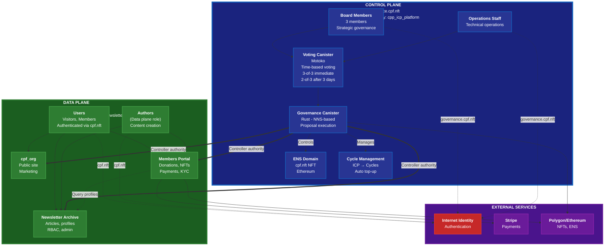

---

## Control Plane Architecture (THIS REPO)

### Purpose
The control plane manages **infrastructure, governance, and strategic operations**. This is the primary focus of the `cpp_icp_platform` repository.

### Control Plane Canisters

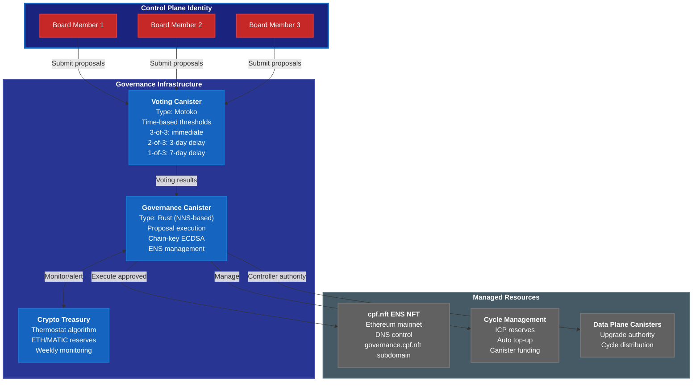

### Control Plane Operations

| Operation | Tier | Approval | Time Delay | Example |
|-----------|------|----------|------------|---------|
| **Data plane upgrade** | Tier 0 | 3-of-3 immediate, 2-of-3 after 3 days | Upgrade newsletter backend |
| **Control plane upgrade** | Tier 0 | 3-of-3 immediate, 2-of-3 after 3 days | Upgrade governance canister |
| **ENS DNS update** | Tier 0 | 3-of-3 immediate, 2-of-3 after 3 days | Point cpf.nft to new canister |
| **Financial (>€2k)** | Tier 0 | 3-of-3 immediate, 2-of-3 after 3 days | Purchase €5k ETH for gas |
| **Cycle top-up (>100T)** | Tier 0 | 3-of-3 immediate, 2-of-3 after 3 days | Emergency cycle funding |
| **Cycle top-up (<100T)** | Tier 3 | Treasurer (operational) | None | Weekly cycle management |
| **ETH purchase (<€2k)** | Tier 3 | Treasurer (thermostat) | None | Weekly gas reserve top-up |

**Key Point:** Governance canister is **controller** of all data plane canisters, enabling upgrade/cycle management via proposals.

**See [architectural_decisions.md § AD-008](./architectural_decisions.md) for time-based voting details**

---

## Data Plane Architecture (OTHER REPOS)

### Purpose
The data plane handles **user-facing operations, content, and business logic**. This is distributed across multiple repositories.

### Data Plane Canisters

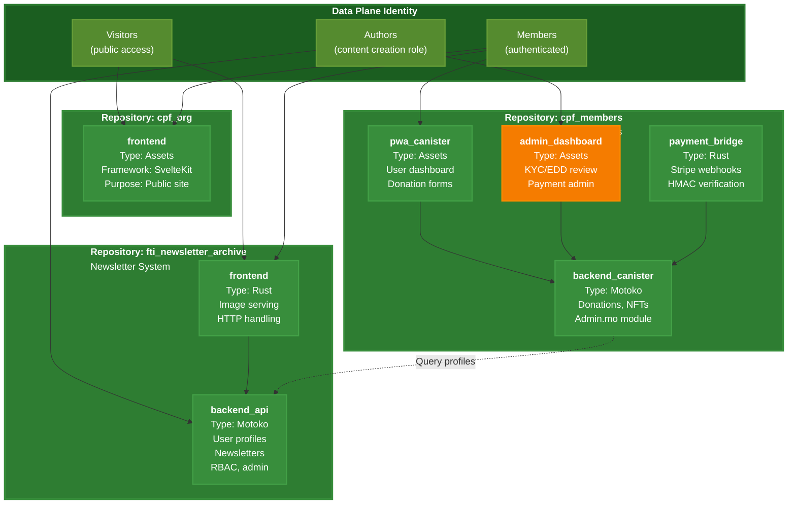

### Data Plane Canister Inventory

| Repository | Canister | Type | Purpose | Domain |
|------------|----------|------|---------|--------|
| **cpf_org** | frontend | Assets | Public marketing site | coolplanet-foundation.org |
| **fti_newsletter_archive** | backend_api | Motoko | User profiles, newsletters, RBAC | newsletters.* |
| **fti_newsletter_archive** | frontend | Rust | Dynamic images, HTTP serving | newsletters.* |
| **cpf_members** | pwa_canister | Assets | User dashboard, donations | members.* |
| **cpf_members** | admin_dashboard | Assets | KYC/EDD review, admin | members.*/admin |
| **cpf_members** | payment_bridge | Rust | Stripe webhook verification | (backend only) |
| **cpf_members** | backend_canister | Motoko | Business logic, Admin.mo | (backend only) |

**Total Data Plane Canisters:** 7 (across 3 repositories)

---

## Identity & Authentication Architecture

### Two Derivation Origins = Two Identity Spaces

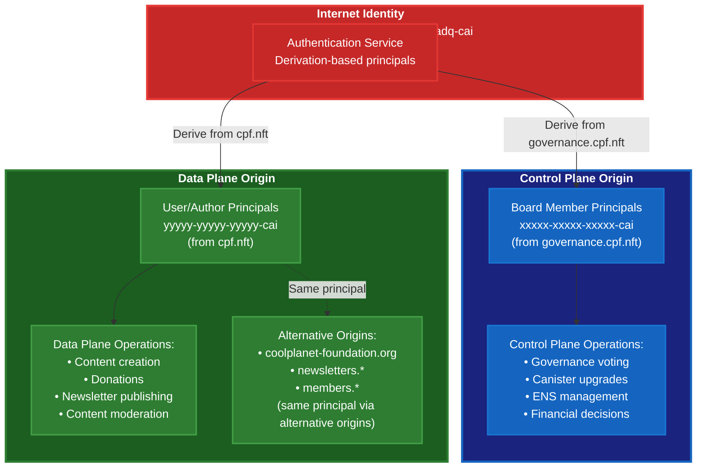

### Author Dual Identity Example

**Alice is a board member AND newsletter author:**

```typescript
// CONTROL PLANE: Alice votes on governance
// Login to governance.cpf.nft
await authClient.login({
  derivationOrigin: "https://governance.cpf.nft"  // Control plane
});
// Alice's principal: "abc123-control-principal-cai"
// Can: Vote on proposals, upgrade canisters, manage ENS

// ═══════════════════════════════════════════════════════

// DATA PLANE: Alice creates newsletter content
// Login to cpf.nft
await authClient.login({
  derivationOrigin: "https://cpf.nft"  // Data plane
});
// Alice's principal: "xyz789-data-principal-cai"
// Can: Create articles, moderate comments, manage users
```

**Key Point:** Alice has **TWO DIFFERENT principals** - one for each plane.

---

## Inter-Plane Communication

### Control → Data: Canister Lifecycle Management

**Critical:** The control plane has **controller authority** over all data plane canisters, enabling infrastructure governance.

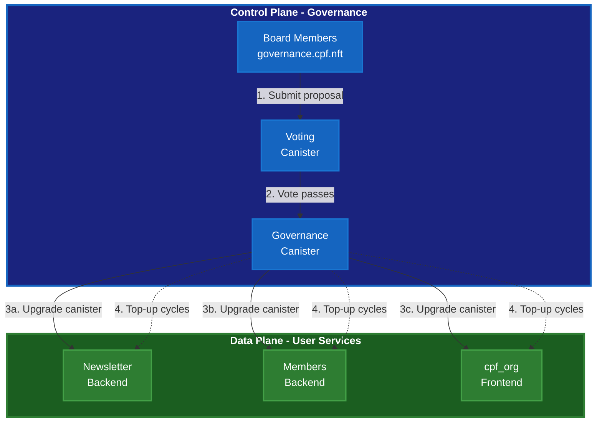

**Governance canister is controller of all data plane canisters:**
- Can upgrade canister code (via proposals)
- Can manage cycles (top-up, monitoring)
- Can update canister settings
- Can add/remove other controllers

**Upgrade Flow Example:**
```
1. Developer prepares new backend_api.wasm
2. Board member submits proposal: "Upgrade newsletter backend"
3. Board votes (3-of-3 immediate, or 2-of-3 after 3 days)
4. Governance canister executes: install_code(backend_api, new_wasm)
5. Newsletter backend upgraded automatically
```

### Data → Data: Business Logic

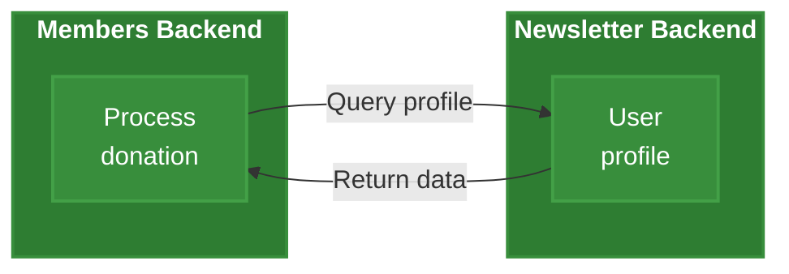

### Data → External: Integrations

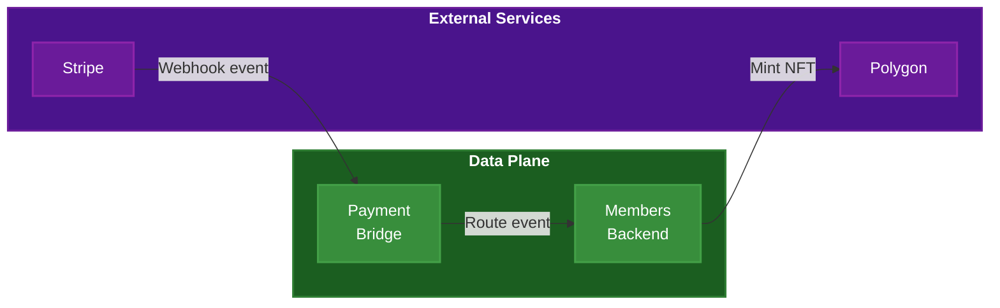

---

## Bootstrap Sequence

### Phase 0: ENS Acquisition (Day 0)

**Goal:** Acquire cpf.nft ENS domain

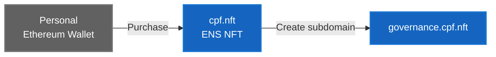

**See [ens-dns-setup.md](./ens-dns-setup.md) § Phase 0**

---

### Phase 1: Control Plane Deployment (Week 0-1)

**Goal:** Deploy governance infrastructure

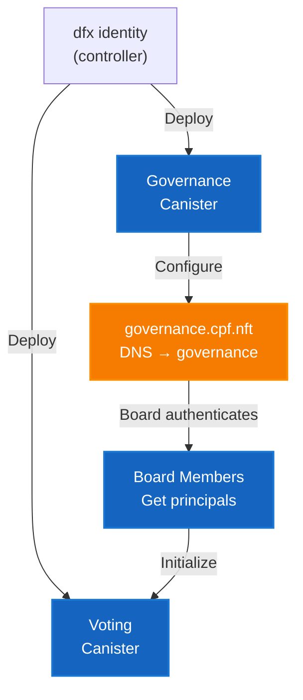

**Steps:**
1. Deploy voting_canister
2. Deploy governance_canister
3. Configure governance.cpf.nft DNS → governance_canister
4. Board members authenticate with governance.cpf.nft
5. Initialize board member principals in voting canister

**See [ens-dns-setup.md](./ens-dns-setup.md) § Phase 1-2**

---

### Phase 2: Data Plane Deployment (Week 1-2)

**Goal:** Deploy user-facing canisters

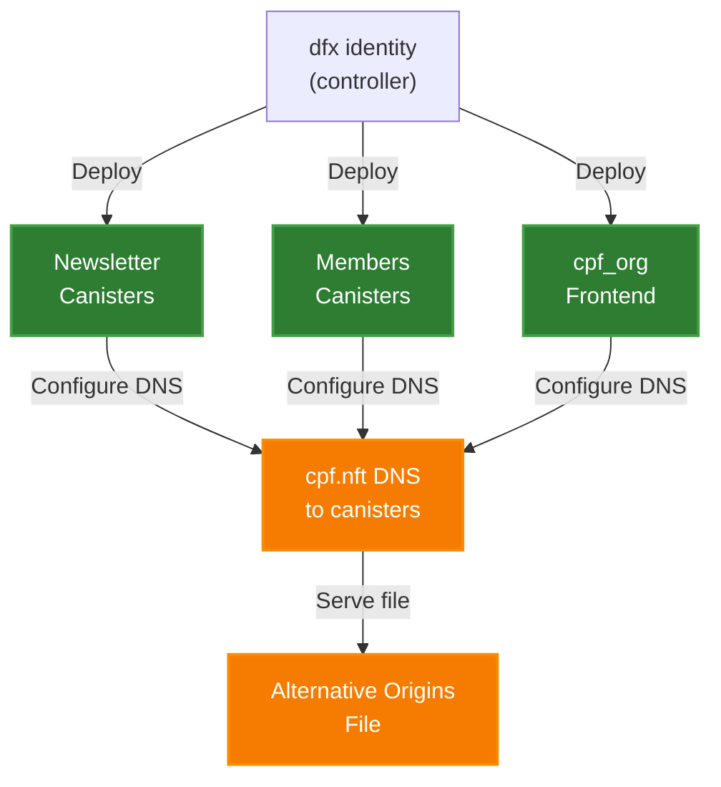

**Steps:**
1. Deploy newsletter backend_api & frontend
2. Deploy members backend, payment_bridge, PWA
3. Deploy cpf_org frontend
4. Configure cpf.nft DNS → cpf_nft_canister
5. Deploy .well-known/ii-alternative-origins
6. Register all domains with IC

**State After Phase 2:**
- ✅ All data plane canisters deployed
- ✅ DNS configured and domains registered
- ⚠️ Still controlled by personal dfx identity (not governance yet)
- ⚠️ Next: Transfer controller authority in Phase 3

**See [ens-dns-setup.md](./ens-dns-setup.md) § Phase 4-5**

---

### Phase 3: Transfer Controller Authority (Week 1-2)

**Goal:** Transfer canister control from personal dfx identity to governance canister

**This is the critical handoff where data plane moves under control plane governance.**

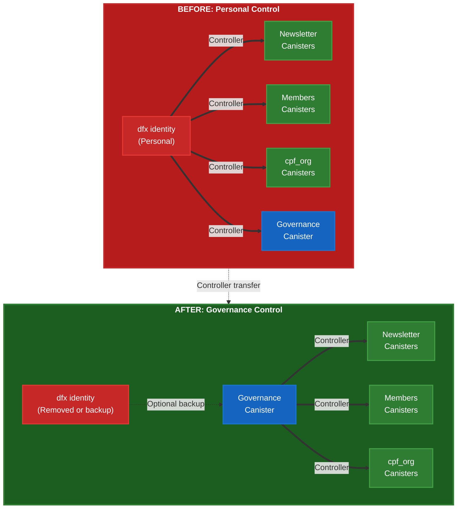

**Controller Transfer Steps:**

```bash
# Step 1: Verify current controllers
dfx canister info backend_api --network ic
# Shows: Controllers: xxxxx-xxxxx-xxxxx-cai (your dfx identity)

# Step 2: Add governance canister as controller
GOV_ID=$(dfx canister id governance_canister --network ic)

dfx canister update-settings backend_api \
  --add-controller $GOV_ID \
  --network ic

# Step 3: Verify governance was added
dfx canister info backend_api --network ic
# Shows: Controllers: xxxxx-xxxxx (dfx), yyyyy-yyyyy (governance)

# Step 4: Test governance can control (important!)
# Submit a test proposal via governance to verify it works

# Step 5: Remove personal controller (CAREFUL - irreversible!)
dfx canister update-settings backend_api \
  --remove-controller $(dfx identity get-principal) \
  --network ic

# Step 6: Verify final state
dfx canister info backend_api --network ic
# Shows: Controllers: yyyyy-yyyyy (governance only)

# Step 7: Repeat for ALL data plane canisters
# - newsletter/backend_api
# - newsletter/frontend
# - members/backend_canister
# - members/payment_bridge
# - members/pwa_canister
# - members/admin_dashboard
# - cpf_org/frontend
```

**⚠️ Critical Warnings:**

1. **Test first:** Add governance as controller WITHOUT removing yourself initially
2. **Verify governance works:** Submit a test proposal to confirm governance can actually control the canister
3. **Keep backup controller:** Consider keeping your dfx identity as backup controller for emergency
4. **Irreversible:** Once you remove yourself as controller, only governance can make changes
5. **Board must be ready:** Ensure board members are authenticated and can vote before removing yourself

**State After Phase 3:**
- ✅ All data plane canisters controlled by governance canister
- ✅ Board can upgrade canisters via proposals
- ✅ Board can manage cycles via proposals
- ✅ Personal dfx identity optionally kept as emergency backup
- ✅ Control plane now manages data plane infrastructure

---

### Phase 4: Transfer ENS Control (Week 2)

**Goal:** Transfer ENS NFT to ICP governance

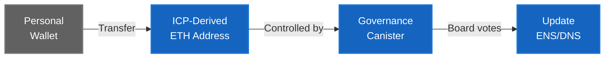

**Steps:**
1. Governance canister derives Ethereum address (chain-key ECDSA)
2. Fund ICP-derived address with ETH for gas
3. Transfer cpf.nft ENS NFT to ICP-derived address
4. Board can now update ENS via governance proposals

**State After Phase 4:**
- ✅ ENS NFT controlled by governance canister
- ✅ Board can update DNS via proposals
- ✅ Complete governance control (IC + ENS)

**See [ens-dns-setup.md](./ens-dns-setup.md) § Phase 3**

---

### Bootstrap Summary: Controller Handoff Flow

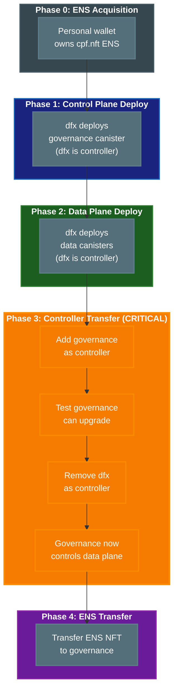

**Key Takeaway:** Phase 3 is the critical handoff where control moves from personal dfx identity to board-governed control plane. After this, all infrastructure changes require board approval via governance proposals.

---

## Production Migration Strategy

### Overview: Progressive Rollout with Fallbacks

**Critical Context:**
1. **Wix ONLY manages main marketing site** (coolplanet-foundation.org) - NOT subdomains
2. **Subdomains are greenfield on ICP** (newsletters.*, members.*) - not migrating from Wix
3. **No traffic splitting between Wix/ICP** - full cutover with fast rollback via DNS
4. **Question:** When does ICP version with enhanced functionality replace Wix main site?

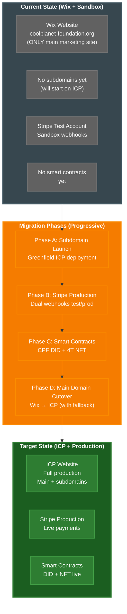

---

### Phase A: Subdomain Launch (Greenfield ICP Deployment)

**Goal:** Launch ICP subdomains using cpf.nft ENS domain (NOT migrating from Wix)

**Current DNS:**
```
coolplanet-foundation.org → Wix (ONLY this domain managed by Wix)
cpf.nft → ENS domain (ready for ICP canisters)
```

**Key Insight:** Subdomains have never existed on Wix, so this is a **greenfield launch** using the cpf.nft ENS infrastructure.

**Migration Step 1: Test with cpf.nft or test.cpf.nft**
```bash
# Option A: Use cpf.nft directly for initial testing
cpf.nft → ICP canister (cpf_org frontend)
# ENS DNS records:
# cpf.nft A record → ICP boundary node IP
# Or: cpf.nft CNAME → cpf.nft.icp1.io

# Option B: Use test.cpf.nft subdomain for safer testing
test.cpf.nft → ICP canister (cpf_org frontend)
# ENS subdomain configuration via ENS manager

# Benefit: Uses existing ENS infrastructure, consistent with architecture
# Data plane authentication via cpf.nft already planned
```

**Migration Step 2: Beta testing on cpf.nft**
```
Week 1: Internal testing (board members, staff on test.cpf.nft or cpf.nft)
Week 2: Small group beta testers (10-20 people)
Week 3: Extended beta (100 people, newsletter subscribers)
Week 4: Prepare for production .org subdomain launch
```

**Migration Step 3: Launch production .org subdomains**
```bash
# Launch newsletters subdomain (GREENFIELD - never existed before)
newsletters.coolplanet-foundation.org CNAME newsletters.coolplanet-foundation.org.icp1.io
_canister-id.newsletters.coolplanet-foundation.org TXT "newsletter_frontend_id"
_acme-challenge.newsletters.coolplanet-foundation.org CNAME _acme-challenge.newsletters.coolplanet-foundation.org.icp2.io

# Launch members subdomain (GREENFIELD - never existed before)
members.coolplanet-foundation.org CNAME members.coolplanet-foundation.org.icp1.io
_canister-id.members.coolplanet-foundation.org TXT "members_pwa_id"
_acme-challenge.members.coolplanet-foundation.org CNAME _acme-challenge.members.coolplanet-foundation.org.icp2.io

# Wix main site UNCHANGED
coolplanet-foundation.org → Wix (continues serving marketing content)

# cpf.nft continues serving as alternative origin for data plane
cpf.nft → ICP canisters (same as .org subdomains via alternative origins)
```

**Alternative Origins Configuration:**
```json
{
  "alternativeOrigins": [
    "https://cpf.nft",
    "https://newsletters.coolplanet-foundation.org",
    "https://members.coolplanet-foundation.org",
    "https://coolplanet-foundation.org"
  ]
}
```

**Rollback:** N/A - subdomains are new, nothing to roll back to. If issues occur, disable subdomain DNS or show maintenance page.

**Success Criteria:**
- ✅ cpf.nft (or test.cpf.nft) loads correctly
- ✅ Authentication works (Internet Identity with cpf.nft derivation origin)
- ✅ All features functional on ENS domain
- ✅ Performance acceptable (< 2s load time)
- ✅ Production .org subdomains launched successfully
- ✅ Alternative origins working (same II principal across all domains)
- ✅ No critical bugs reported during beta

---

### Phase B: Stripe Production Account Migration

**Goal:** Switch from Stripe test account to production account with fallback

**Current State:**
```
Stripe Test Account
  ↓ webhook: https://payment_bridge_canister.icp0.io/webhook
  ↓ secret: whsec_test_xxxxx (sandbox)
  ↓ events: payment_intent.succeeded (test mode)
```

**Migration Step 1: Set up production Stripe**
```bash
# 1. Create Stripe production account (CPF organization)
# 2. Complete KYC/verification
# 3. Set up bank account for payouts
# 4. Configure tax settings
```

**Migration Step 2: Dual webhook configuration**
```bash
# Configure BOTH test and production webhooks (parallel)

# Test webhook (existing):
https://bd3sg-teaaa-aaaaa-qaaba-cai.icp0.io/webhook/test
Secret: whsec_test_xxxxx

# Production webhook (new):
https://bd3sg-teaaa-aaaaa-qaaba-cai.icp0.io/webhook/prod
Secret: whsec_xxxxx (production)
```

**Migration Step 3: Update payment_bridge canister**
```rust
// payment_bridge supports BOTH test and production
#[update]
async fn handle_stripe_webhook(
    payload: String,
    signature: String,
    mode: StripeMode  // Test or Production
) -> Result<(), String> {
    let secret = match mode {
        StripeMode::Test => get_test_secret(),
        StripeMode::Production => get_prod_secret(),
    };

    verify_stripe_signature(&payload, &signature, &secret)?;

    // Process payment...
}
```

**Migration Step 4: Progressive rollout**
```
Week 1: Production webhook configured but not used (test only)
Week 2: Single test payment via production webhook ($1 donation)
Week 3: Staff donations via production webhook ($10-100)
Week 4: Limited public beta (first 10 donors)
Week 5: Full production (all donations)
```

**Rollback:** Keep test webhook active, switch frontend back to test mode.

**Success Criteria:**
- ✅ Production webhook receives events
- ✅ HMAC signature verification works
- ✅ Payments process correctly
- ✅ Funds arrive in CPF bank account
- ✅ Refunds work if needed

---

### Phase C: Smart Contract Integration (CPF DID + 4T NFT)

**Goal:** Connect CPF-owned DID smart contract with 4T NFT smart contract

**Current State:**
```
No smart contracts deployed yet
NFT minting done via manual process or centralized service
```

**Background:**
- **CPF DID contract:** CPF-owned smart contract for decentralized identifiers
- **4T NFT contract:** NFT smart contract (Polygon or Ethereum)
- **Integration:** CPF DID → 4T NFT for donation-based NFT issuance

**Migration Step 1: Deploy CPF DID contract**
```bash
# Deploy CPF DID smart contract to Polygon/Ethereum
# Controlled by governance canister via chain-key ECDSA

# Contract address: 0xCPF_DID_ADDRESS
# Owner: ICP-derived Ethereum address (governance canister)
```

**Migration Step 2: Connect to 4T NFT contract**
```solidity
// CPF DID contract calls 4T NFT contract
interface I4TNFT {
    function mint(address recipient, uint256 tokenId) external;
    function setApprovedMinter(address minter) external;
}

contract CPF_DID {
    I4TNFT public nftContract;

    function setNFTContract(address _nftContract) external onlyOwner {
        nftContract = I4TNFT(_nftContract);
    }

    function issueDonationNFT(address recipient, uint256 donationAmount) external {
        // Verify donation via ICP canister
        // Mint NFT via 4T contract
        nftContract.mint(recipient, nextTokenId++);
    }
}
```

**Migration Step 3: Test on testnet first**
```
Week 1: Deploy to Polygon Mumbai testnet
Week 2: Test minting flow with test donations
Week 3: Verify NFTs appear in wallets (MetaMask, OpenSea testnet)
Week 4: Deploy to Polygon mainnet
Week 5: Limited production testing (first 5 NFTs)
```

**Migration Step 4: Progressive rollout**
```
Week 1: Manual verification (board approves each NFT)
Week 2: Automated for small donations (<$100)
Week 3: Automated for all donations
Week 4: Full production
```

**Rollback:** Disable NFT minting in frontend, return to centralized minting process.

**Success Criteria:**
- ✅ Smart contracts deployed and verified
- ✅ Governance canister can call contracts
- ✅ NFTs mint correctly on donation
- ✅ NFTs appear in user wallets
- ✅ Gas costs within budget (< 5% of donation)

---

### Phase D: Main Domain Cutover (Wix → ICP)

**Goal:** Replace Wix main marketing site with ICP version

**Key Question:** When does the ICP canister version replace the Wix main site?

**Multiple Decision Milestones:**

There are **three potential cutover points**, each representing a different level of functionality:

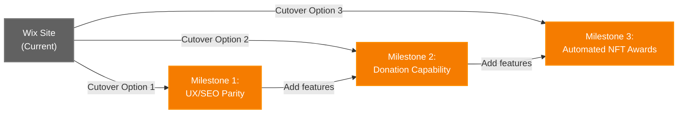

**Milestone 1: UX/SEO Parity (Minimal Viable Cutover)**
- ✅ All Wix marketing content replicated on ICP
- ✅ Equivalent or better UX (design, performance, accessibility)
- ✅ SEO preserved (meta tags, structured data, sitemap)
- ✅ Links to existing subdomains (newsletters.*, members.*)
- ❌ No donation capability yet
- ❌ No NFT functionality yet
- **Risk:** Low - just marketing content replacement
- **Benefit:** Removes Wix dependency quickly

**Milestone 2: Donation Capability (Revenue Enabled)**
- ✅ All Milestone 1 criteria met
- ✅ Stripe production account integrated (Phase B complete)
- ✅ Donation forms functional on main site
- ✅ Payment processing live
- ❌ No automated NFT awards yet (manual process or disabled)
- **Risk:** Medium - live payment processing
- **Benefit:** Full donation flow from main site, no subdomain redirect

**Milestone 3: Automated NFT Awards (Full Feature Parity+)**
- ✅ All Milestone 2 criteria met
- ✅ Smart contracts deployed (Phase C complete)
- ✅ Automated NFT minting on donation
- ✅ NFTs appear in user wallets
- ✅ Complete end-to-end flow
- **Risk:** Higher - complex smart contract integration
- **Benefit:** Full platform functionality, exceeds Wix capabilities

**Board Decision Point:** Which milestone triggers the cutover?

| Milestone | When Ready | Strategic Consideration |
|-----------|-----------|------------------------|
| **1. UX/SEO Parity** | After Phase A | Conservative: Minimize Wix costs quickly, low risk |
| **2. Donation Capability** | After Phase B | Balanced: Wait for core revenue functionality |
| **3. Automated NFT Awards** | After Phase C | Bold: Launch with full feature set, maximum impact |

**Recommendation:** Board votes on cutover milestone based on:
- Risk tolerance
- Wix hosting costs vs ICP cycle costs
- Marketing timeline (any major campaigns planned?)
- Technical readiness and confidence level
- User feedback from subdomain deployments

**Context:**
- Subdomains (newsletters.*, members.*) already launched on ICP in Phase A
- Wix ONLY manages coolplanet-foundation.org (main marketing site)
- No easy traffic splitting - this is a **full DNS cutover with fast rollback**
- Can bridge ICP capabilities back to Wix if waiting past Milestone 1

**Migration Step 1: Prepare ICP main site**
```bash
# Ensure cpf_org frontend canister has equivalent (or better) marketing content
# - All pages from Wix main site replicated
# - Enhanced with new ICP-specific features (donations, NFTs, members portal links)
# - Performance tested and optimized
# - SEO metadata preserved (titles, descriptions, structured data)
```

**Migration Step 2: DNS TTL preparation (critical for fast rollback)**
```bash
# BEFORE cutover: Lower TTL to allow fast rollback
# Do this 24-48 hours before cutover to ensure propagation

coolplanet-foundation.org TTL 300 (5 minutes)
# Current: CNAME sites.wix.com (or A record to Wix IP)

# Wait for TTL to propagate (existing 1-hour TTL expires)
```

**Migration Step 3: DNS cutover (CAREFUL - full production switch)**
```bash
# Save current Wix DNS settings for emergency rollback
# Old: coolplanet-foundation.org CNAME sites.wix.com

# Execute cutover
coolplanet-foundation.org CNAME coolplanet-foundation.org.icp1.io
_canister-id.coolplanet-foundation.org TXT "cpf_org_frontend_id"
_acme-challenge.coolplanet-foundation.org CNAME _acme-challenge.coolplanet-foundation.org.icp2.io

# TTL still 300 (5 minutes) for fast rollback if needed
```

**Migration Step 4: Monitor closely**
```bash
# First 1 hour: Continuous monitoring
# - Error rates via IC dashboard
# - User reports via support channels
# - Analytics traffic patterns
# - SSL certificate status
# - Page load times (< 2s target)

# First 24 hours: Active monitoring
# - Check error logs every 2 hours
# - Review user feedback
# - Compare analytics to Wix baseline

# First week: Regular monitoring
# - Daily checks
# - Weekly board update
```

**Migration Step 5: Stabilize and increase TTL**
```bash
# After 7 days of stable operation:
coolplanet-foundation.org TTL 3600 (1 hour)

# After 30 days: Consider longer TTL
coolplanet-foundation.org TTL 86400 (24 hours)
```

**Rollback Strategy:**
```bash
# Emergency rollback (if ICP site fails)
# Change DNS back to Wix (5 minute TTL = fast recovery)

coolplanet-foundation.org CNAME sites.wix.com
# OR original A record to Wix IP

# Rollback time: 5-15 minutes (depending on DNS propagation)
# Wix site must remain configured and active during first 30 days for rollback option
```

**Optional: Capability Bridging to Wix**

**Question:** Should we temporarily bridge new ICP capabilities back to Wix during transition?

This decision is **milestone-dependent**:

**Scenario 1: Cutover at Milestone 1 (UX/SEO Parity)**
- Wix cutover happens BEFORE donations/NFTs are ready
- ICP main site launches with just marketing content
- **Bridging needed:** Yes - link from ICP main site to subdomain features as they launch
- Example: "Donate" button on coolplanet-foundation.org → members.coolplanet-foundation.org
- Users get new features on subdomains while main site is simple

**Scenario 2: Cutover at Milestone 2 (Donation Capability)**
- Wix cutover happens AFTER donations ready, BEFORE NFTs ready
- ICP main site launches with donation capability
- **Bridging optional:** NFT features can be disabled or manual until Phase C completes
- Simpler than Scenario 1, most core functionality already integrated

**Scenario 3: Cutover at Milestone 3 (Full Feature Parity+)**
- Wix cutover happens AFTER everything is ready
- ICP main site launches with complete functionality
- **Bridging not needed:** Clean cutover, no missing features
- Highest confidence, lowest complexity

**Reverse Bridging (Wix → ICP subdomains):**
- If staying on Wix past Milestone 1, bridge NEW capabilities back to Wix temporarily
- Example: Add "Donate" button on Wix → members.coolplanet-foundation.org (ICP)
- Allows users to access new features before main domain cutover
- Requires Wix site updates

**Recommendation:**
- **If cutting over at M1:** Plan for forward bridging (ICP → subdomains)
- **If cutting over at M2/M3:** No bridging needed, cleaner architecture
- **If delaying cutover:** Use reverse bridging (Wix → ICP subdomains) to unlock features early

**Success Criteria:**
- ✅ DNS propagates correctly (check via dig/nslookup from multiple locations)
- ✅ SSL certificates issued automatically (Let's Encrypt via IC)
- ✅ Site accessible from multiple locations (US, EU, Asia)
- ✅ All pages from Wix replicated on ICP
- ✅ No broken links or missing content
- ✅ Error rate < 0.1%
- ✅ Performance equal or better than Wix (< 2s page load)
- ✅ SEO preserved (Google Search Console shows no issues)
- ✅ Analytics tracking functional (if using GA or similar)

---

### Progressive Confidence Building

**Confidence Ladder:**

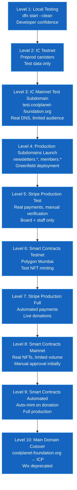

**Fallback Options at Each Level:**

| Level | Primary System | Fallback Option | Rollback Time |
|-------|---------------|-----------------|---------------|
| 1-2 | Local/Testnet | Just development, no impact | N/A |
| 3 | ICP test subdomain | Nothing (test only) | N/A (disable DNS) |
| 4 | Production subdomains (ICP) | Maintenance page | 5 min (disable DNS) |
| 5 | Stripe production (limited) | Stripe test mode | Instant (frontend config) |
| 6 | Smart contracts testnet | No NFT minting | Instant (disable feature) |
| 7 | Stripe production (full) | Stripe test mode | Instant (frontend config) |
| 8 | Smart contracts mainnet | Manual NFT minting | Instant (disable auto-mint) |
| 9 | Smart contracts automated | Manual approval | Instant (feature flag) |
| 10 | ICP main domain | Emergency Wix restore | 5-15 min (DNS rollback) |

**Key Principles:**
1. **Never burn bridges:** Keep Wix account active for 90 days after cutover
2. **Low TTL during migration:** Fast rollback via DNS (5-minute TTL)
3. **Monitor everything:** Error rates, performance, user feedback
4. **Board approval gates:** Major steps require board vote
5. **Full cutover approach:** No traffic splitting - leverage fast DNS rollback instead

---

## Deployment Topology

### Local Development

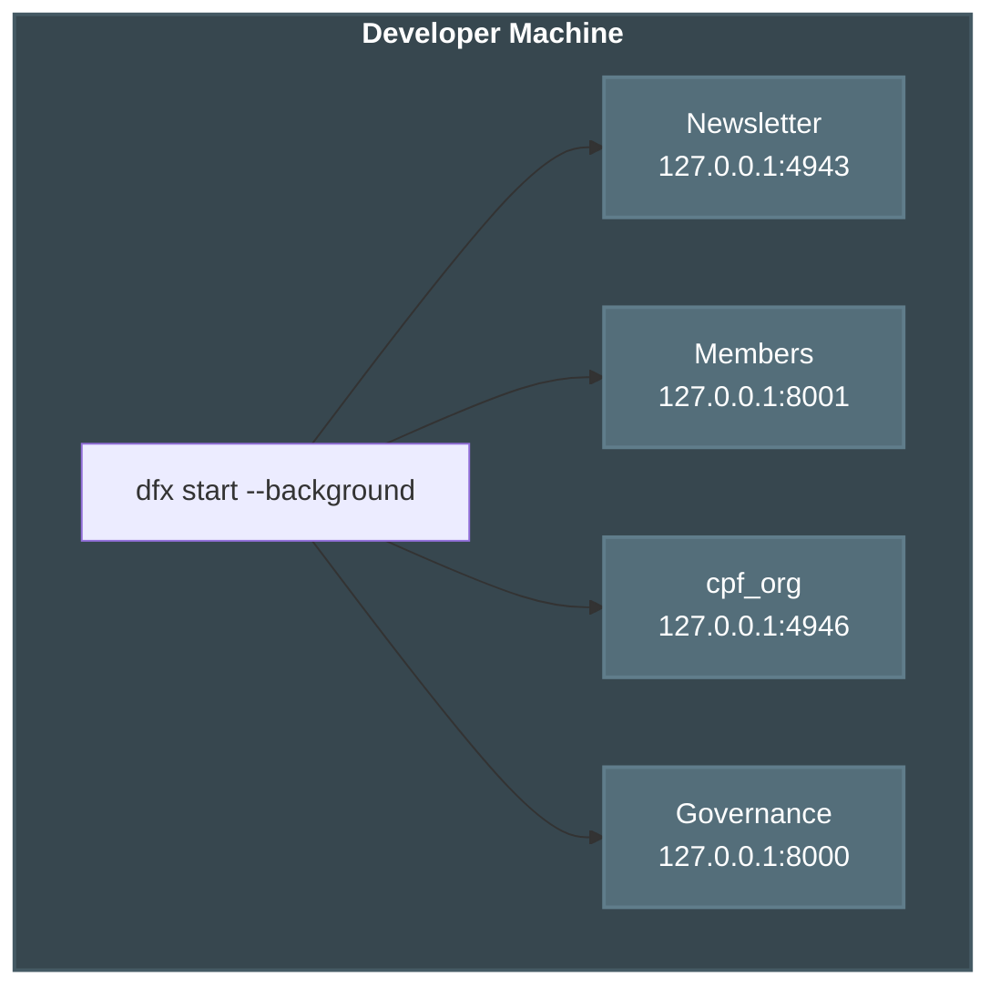

**Ports:**
- Newsletter: 4943
- Members: 8001
- cpf_org: 4946
- Governance: 8000

---

### Production (IC Mainnet)

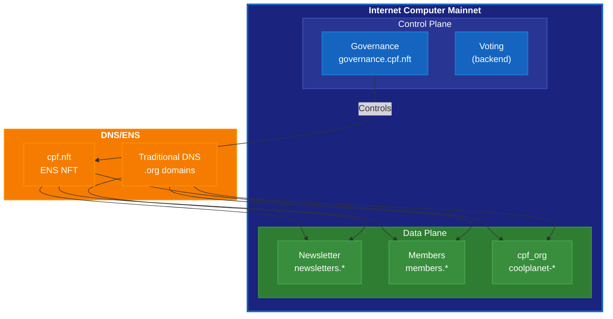

---

## Summary

### Canister Count by Plane

| Plane | Canisters | Purpose |
|-------|-----------|---------|
| **Control Plane** (this repo) | 2 | Governance (voting, execution) |
| **Data Plane** (other repos) | 7 | User-facing operations |
| **Shared** | 1 | Internet Identity |
| **Total** | **10** | Full platform |

### Repository Ownership

| Repository | Plane | Canisters | Purpose | Controlled By |
|------------|-------|-----------|---------|---------------|
| **cpp_icp_platform** | Control | voting_canister, governance_canister | Infrastructure, governance | Self-governance |
| **cpf_org** | Data | frontend | Public site | Governance canister |
| **fti_newsletter_archive** | Data | backend_api, frontend | Newsletters, profiles | Governance canister |
| **cpf_members** | Data | pwa, admin_dashboard, payment_bridge, backend | Donations, NFTs | Governance canister |

**Critical:** All data plane canisters are **controlled** by the governance canister, enabling board-approved upgrades and cycle management.

### Identity Summary

| Origin | Who | Purpose | Principals |
|--------|-----|---------|------------|
| **governance.cpf.nft** | Board, operations | Control plane | Governance principals |
| **cpf.nft** | Users, authors (data role) | Data plane | User principals |

### Key Documentation

- **This file:** Architecture overview, control/data plane separation
- [architectural_decisions.md](./architectural_decisions.md): Decision rationale, time-based voting
- [ens-dns-setup.md](./ens-dns-setup.md): ENS/DNS bootstrap sequence
- [governance-policy.md](./governance-policy.md): Governance structure, approval tiers
- [crypto_funding.md](./crypto_funding.md): Thermostat algorithm for gas management

---

**Last Updated:** 2025-11-14
**Version:** 2.0.0 (Reorganized for control/data plane clarity)
**Status:** Active - updated with each deployment
**Next Review:** Before production launch
