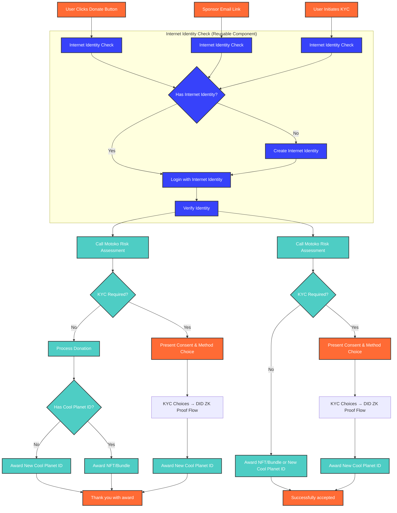

# Frontend Architecture for CPP Platform (TypeScript/Azle Canisters)

## Overview

This document outlines the **frontend and integration canister architecture** implemented in **TypeScript/Azle** for the Cool Planet Platform (CPP). These canisters handle user interfaces, external integrations, and provide the bridge between users and the consolidated **Core User Management Canister** (Motoko).

## Architecture Overview

### **Consolidated Canister Architecture**

The CPP platform uses a **consolidated canister approach** where all user-related operations (KYC, wallet cache, risk assessment, audit trail, ZK proof generation) are handled by a single **Core User Management Canister** (Motoko), while frontend interactions and external integrations are managed by **TypeScript/Azle canisters**.

### **Canister Separation Strategy**

| Canister Type            | Language        | Responsibilities                                                                | Data Storage                                     |
| ------------------------ | --------------- | ------------------------------------------------------------------------------- | ------------------------------------------------ |
| **Core User Management** | Motoko          | KYC processing, wallet cache, risk assessment, audit trail, ZK proof generation | User data, KYC records, wallet cache, audit logs |
| **Frontend Interface**   | TypeScript/Azle | User interfaces, form handling, UI state management                             | UI state, session data                           |
| **External Integration** | TypeScript/Azle | Provider APIs, webhooks, external service communication                         | Integration state, webhook data                  |
| **Notification System**  | TypeScript/Azle | Real-time notifications, event broadcasting                                     | Notification queues, user preferences            |

## Basic Donation Flow



## Real-Time Updates and Notifications

### **Event-Driven Architecture**

The frontend uses an **event-driven architecture** to handle real-time updates from the Core User Management Canister and Polygon blockchain events.

```typescript
// Event types for real-time updates
type FrontendEvent = 
  | { type: 'WALLET_CACHE_UPDATED'; data: WalletCacheUpdate }
  | { type: 'KYC_STATUS_CHANGED'; data: KYCStatusUpdate }
  | { type: 'NFT_AWARDED'; data: NFTAwardEvent }
  | { type: 'SPONSORSHIP_COMPLETED'; data: SponsorshipEvent }
  | { type: 'POLYGON_EVENT_PROCESSED'; data: PolygonEvent }
  | { type: 'ERROR_OCCURRED'; data: ErrorEvent };

// Real-time update handling
class RealTimeUpdateManager {
  private eventSource: EventSource;
  private listeners: Map<string, Function[]> = new Map();

  constructor() {
    this.eventSource = new EventSource('/api/events');
    this.setupEventListeners();
  }

  private setupEventListeners() {
    this.eventSource.onmessage = (event) => {
      const frontendEvent: FrontendEvent = JSON.parse(event.data);
      this.notifyListeners(frontendEvent);
    };
  }

  public subscribe(eventType: string, callback: Function) {
    if (!this.listeners.has(eventType)) {
      this.listeners.set(eventType, []);
    }
    this.listeners.get(eventType)!.push(callback);
  }

  private notifyListeners(event: FrontendEvent) {
    const callbacks = this.listeners.get(event.type) || [];
    callbacks.forEach(callback => callback(event.data));
  }
}
```

### **Polygon Event Processing**

The frontend receives real-time updates when Polygon events are processed by the Core User Management Canister:

```typescript
// Polygon event processing integration
class PolygonEventProcessor {
  private updateManager: RealTimeUpdateManager;

  constructor(updateManager: RealTimeUpdateManager) {
    this.updateManager = updateManager;
    this.setupPolygonEventHandlers();
  }

  private setupPolygonEventHandlers() {
    this.updateManager.subscribe('POLYGON_EVENT_PROCESSED', (event: PolygonEvent) => {
      switch (event.event_type) {
        case 'award':
          this.handleAwardEvent(event);
          break;
        case 'digital_asset_price_updated':
          this.handlePriceUpdate(event);
          break;
        case 'donation_config_set':
          this.handleConfigUpdate(event);
          break;
      }
    });
  }

  private handleAwardEvent(event: PolygonEvent) {
    // Update UI to reflect new NFT/bundle award
    this.updateWalletDisplay(event.did);
    this.showNotification(`New NFT awarded to ${event.did}`);
  }

  private handlePriceUpdate(event: PolygonEvent) {
    // Update price displays across the application
    this.updatePriceDisplays(event.newPrice);
  }

  private handleConfigUpdate(event: PolygonEvent) {
    // Update donation configuration displays
    this.updateDonationConfig(event);
  }
}
```

### **Async Event Handling**

The frontend handles asynchronous operations with proper loading states and error handling:

```typescript
// Async operation management
class AsyncOperationManager {
  private operations: Map<string, Promise<any>> = new Map();
  private loadingStates: Map<string, boolean> = new Map();

  public async executeOperation<T>(
    operationId: string, 
    operation: () => Promise<T>,
    onProgress?: (progress: number) => void
  ): Promise<T> {
    this.setLoadingState(operationId, true);
    
    try {
      const result = await operation();
      this.setLoadingState(operationId, false);
      return result;
    } catch (error) {
      this.setLoadingState(operationId, false);
      this.handleError(operationId, error);
      throw error;
    }
  }

  private setLoadingState(operationId: string, loading: boolean) {
    this.loadingStates.set(operationId, loading);
    this.notifyLoadingStateChange(operationId, loading);
  }

  private handleError(operationId: string, error: any) {
    // Log error and notify user
    console.error(`Operation ${operationId} failed:`, error);
    this.showErrorNotification(operationId, error);
  }

  public isOperationLoading(operationId: string): boolean {
    return this.loadingStates.get(operationId) || false;
  }
}
```

## Inter-Canister Communication Patterns

### **Synchronous Calls**

For immediate responses, the frontend makes synchronous calls to the Core User Management Canister:

```typescript
// Synchronous communication patterns
class CoreUserManagementClient {
  private canister: CoreUserManagementCanister;

  constructor(canister: CoreUserManagementCanister) {
    this.canister = canister;
  }

  // Immediate risk assessment
  public async assessRisk(donationAmount: number, jurisdiction: string): Promise<RiskAssessment> {
    return await this.canister.assessRisk({
      amount: donationAmount,
      jurisdiction: jurisdiction,
      timestamp: Date.now()
    });
  }

  // Check existing Cool Planet ID
  public async checkExistingCoolPlanetID(userDID: string): Promise<CoolPlanetIDStatus> {
    return await this.canister.checkExistingCoolPlanetID(userDID);
  }

  // Get wallet cache
  public async getWalletCache(userDID: string): Promise<WalletCache> {
    return await this.canister.getWalletCache(userDID);
  }
}
```

### **Asynchronous Event Processing**

For long-running operations, the frontend subscribes to events:

```typescript
// Asynchronous event processing
class AsyncEventProcessor {
  private eventManager: RealTimeUpdateManager;
  private operationManager: AsyncOperationManager;

  constructor(eventManager: RealTimeUpdateManager, operationManager: AsyncOperationManager) {
    this.eventManager = eventManager;
    this.operationManager = operationManager;
    this.setupEventHandlers();
  }

  private setupEventHandlers() {
    // Handle KYC status changes
    this.eventManager.subscribe('KYC_STATUS_CHANGED', (update: KYCStatusUpdate) => {
      this.updateKYCStatusDisplay(update);
      this.checkKYCCompletion(update);
    });

    // Handle wallet cache updates
    this.eventManager.subscribe('WALLET_CACHE_UPDATED', (update: WalletCacheUpdate) => {
      this.updateWalletDisplay(update);
      this.checkSponsorshipLimits(update);
    });

    // Handle NFT awards
    this.eventManager.subscribe('NFT_AWARDED', (event: NFTAwardEvent) => {
      this.showAwardNotification(event);
      this.updatePortfolioDisplay(event);
    });
  }

  private updateKYCStatusDisplay(update: KYCStatusUpdate) {
    // Update UI to reflect current KYC status
    const statusElement = document.getElementById('kyc-status');
    if (statusElement) {
      statusElement.textContent = update.status;
      statusElement.className = `kyc-status-${update.status.toLowerCase()}`;
    }
  }

  private checkKYCCompletion(update: KYCStatusUpdate) {
    if (update.status === 'COMPLETED') {
      this.showSuccessNotification('KYC verification completed successfully!');
      this.enableDonationFlow();
    }
  }

  private updateWalletDisplay(update: WalletCacheUpdate) {
    // Update wallet dashboard with latest holdings and sponsorships
    this.updateHoldingsDisplay(update.holdings);
    this.updateSponsorshipDisplay(update.sponsored);
    this.updateSponsorshipLimits(update.sponsorship_limit, update.sponsorship_used);
  }

  private checkSponsorshipLimits(update: WalletCacheUpdate) {
    const remaining = update.sponsorship_limit - update.sponsorship_used;
    if (remaining <= 0) {
      this.disableSponsorshipFeatures();
      this.showWarningNotification('You have reached your sponsorship limit');
    }
  }
}
```

## Implementation Timeline

### **Phase 1: Core Architecture (Weeks 1-2)**
- [ ] Set up consolidated canister architecture
- [ ] Implement basic inter-canister communication
- [ ] Create real-time event system
- [ ] Set up async operation management

### **Phase 2: User Flows (Weeks 3-4)**
- [ ] Implement donation flow integration
- [ ] Implement KYC flow integration
- [ ] Implement sponsor flow integration
- [ ] Add error handling and validation

### **Phase 3: Real-Time Features (Weeks 5-6)**
- [ ] Implement Polygon event processing
- [ ] Add wallet cache integration
- [ ] Implement notification system
- [ ] Add loading states and progress indicators

### **Phase 4: Advanced Features (Weeks 7-8)**
- [ ] Implement advanced error recovery
- [ ] Add offline support
- [ ] Optimize performance
- [ ] Add comprehensive testing

## Integration with Other Components

### **Core User Management Canister**
- **Primary Interface**: All user operations route through this canister
- **Event Source**: Provides real-time updates for all user state changes
- **Data Consistency**: Ensures atomic operations across KYC, wallet, and audit systems

### **External Integration Canister**
- **Provider Communication**: Handles all external KYC provider interactions
- **Webhook Management**: Processes provider callbacks and updates
- **Integration State**: Maintains state for ongoing external operations

### **Notification System Canister**
- **Event Broadcasting**: Distributes real-time updates to all connected clients
- **User Preferences**: Manages notification preferences and delivery methods
- **Delivery Guarantees**: Ensures reliable delivery of critical notifications 