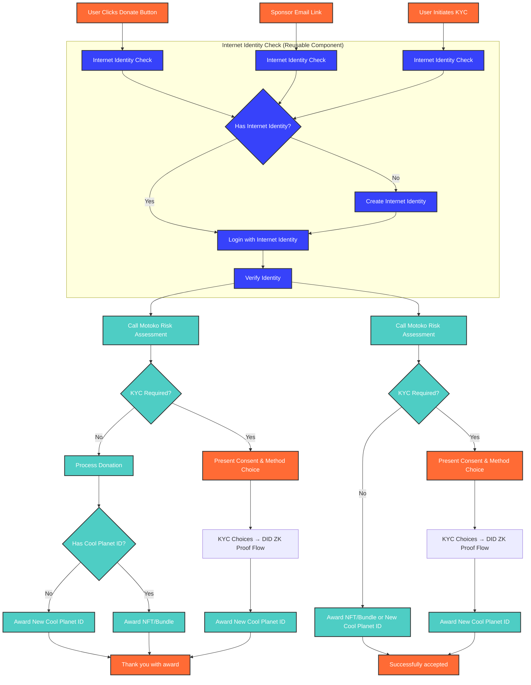

# Frontend Architecture: Crypto-Native Donation Flow

## Overview

This document describes the **crypto-native donation flow** where users donate directly to CPF using cryptocurrency (not via Stripe). This alternative path requires **CPF to own the entire KYC process** rather than relying on Stripe's compliance infrastructure.

**Key Distinction:**
- **Current Implementation (cpf_members):** Fiat → Stripe → CPF (Stripe handles payment processing)
- **This Document:** Crypto → CPF Direct (CPF handles KYC and compliance end-to-end)

**Status:** This represents an alternative donation path for future implementation when crypto-native donors want to contribute directly without fiat currency conversion or Stripe intermediation.

**Value:** Describes the architecture patterns for CPF-owned KYC, wallet integration, and crypto donation processing.

## Architecture Overview

### **Consolidated Canister Architecture**

The crypto-native donation flow uses a **consolidated canister approach** where all user-related operations (KYC, wallet cache, risk assessment, audit trail, ZK proof generation) are handled by backend canisters, while frontend interfaces provide the user experience.

### **Canister Separation Strategy**

| Canister Type            | Responsibilities                                                                | Data Storage                                     |
| ------------------------ | ------------------------------------------------------------------------------- | ------------------------------------------------ |
| **Core User Management** | KYC processing, wallet cache, risk assessment, audit trail, ZK proof generation | User data, KYC records, wallet cache, audit logs |
| **Frontend Interface**   | User interfaces, form handling, UI state management                             | UI state, session data                           |
| **External Integration** | Provider APIs, webhooks, external service communication                         | Integration state, webhook data                  |
| **Notification System**  | Real-time notifications, event broadcasting                                     | Notification queues, user preferences            |

## Basic Donation Flow

## Real-Time Updates and Notifications

### **Event-Driven Architecture**

The frontend uses an **event-driven architecture** to handle real-time updates from the backend canisters and Polygon blockchain events.

**Event Types for Real-Time Updates:**
- `WALLET_CACHE_UPDATED` - Crypto wallet balance or holdings changed
- `KYC_STATUS_CHANGED` - KYC verification status updated
- `NFT_AWARDED` - New NFT minted and awarded to user
- `SPONSORSHIP_COMPLETED` - Sponsorship transaction completed
- `POLYGON_EVENT_PROCESSED` - Blockchain event processed
- `ERROR_OCCURRED` - Error during processing

**Pattern:** Subscribe to event streams from backend canisters, maintain local state, and update UI reactively.

### **Polygon Event Processing**

The frontend receives real-time updates when Polygon events are processed by the backend:

**Handled Event Types:**
- `award` - NFT/bundle awarded to user (update wallet display, show notification)
- `digital_asset_price_updated` - Crypto price changed (update price displays)
- `donation_config_set` - Donation configuration updated (refresh settings)

### **Async Event Handling**

The frontend handles asynchronous operations with proper loading states and error handling:

**Pattern:**
1. Set loading state when operation starts
2. Execute async operation (canister call)
3. Clear loading state on completion
4. Handle errors gracefully with user notifications
5. Track operation status for UI feedback

## Inter-Canister Communication Patterns

### **Synchronous Calls**

For immediate responses, the frontend makes synchronous calls to backend canisters:

**Immediate Operations:**
- `assessRisk(donationAmount, jurisdiction)` - Check if KYC required for crypto donation
- `checkExistingCoolPlanetID(userDID)` - Verify if user already has CPF ID
- `getWalletCache(userDID)` - Retrieve user's crypto wallet holdings and NFT portfolio

**Pattern:** Request → Response (2-5 seconds typical)

### **Asynchronous Event Processing**

For long-running operations, the frontend subscribes to events:

**Long-Running Operations:**
- KYC verification via external provider (2-10 minutes)
- Polygon blockchain transaction confirmation (30 seconds - 5 minutes)
- NFT minting and metadata upload to IPFS (1-3 minutes)
- Cross-chain bridge operations (varies by chain)

**Event Subscription Pattern:**
1. Subscribe to specific event types
2. Handle status updates in real-time
3. Update UI progressively as operation proceeds
4. Notify user on completion or errors

**Example Event Handlers:**
- `KYC_STATUS_CHANGED` → Update status display, enable donation flow when completed
- `WALLET_CACHE_UPDATED` → Update holdings display, check sponsorship limits
- `NFT_AWARDED` → Show award notification, update portfolio display

## Implementation Timeline

### **Phase 1: Core Architecture (Weeks 1-2)**
- [ ] Set up consolidated canister architecture
- [ ] Implement basic inter-canister communication
- [ ] Create real-time event system
- [ ] Set up async operation management

### **Phase 2: User Flows (Weeks 3-4)**
- [ ] Implement donation flow integration
- [ ] Implement KYC flow integration
- [ ] Implement sponsor flow integration
- [ ] Add error handling and validation

### **Phase 3: Real-Time Features (Weeks 5-6)**
- [ ] Implement Polygon event processing
- [ ] Add wallet cache integration
- [ ] Implement notification system
- [ ] Add loading states and progress indicators

### **Phase 4: Advanced Features (Weeks 7-8)**
- [ ] Implement advanced error recovery
- [ ] Add offline support
- [ ] Optimize performance
- [ ] Add comprehensive testing

## Integration with Other Components

### **Core User Management Canister**
- **Primary Interface**: All user operations route through this canister
- **Event Source**: Provides real-time updates for all user state changes
- **Data Consistency**: Ensures atomic operations across KYC, wallet, and audit systems

### **External Integration Canister**
- **Provider Communication**: Handles all external KYC provider interactions
- **Webhook Management**: Processes provider callbacks and updates
- **Integration State**: Maintains state for ongoing external operations

### **Notification System Canister**
- **Event Broadcasting**: Distributes real-time updates to all connected clients
- **User Preferences**: Manages notification preferences and delivery methods
- **Delivery Guarantees**: Ensures reliable delivery of critical notifications 