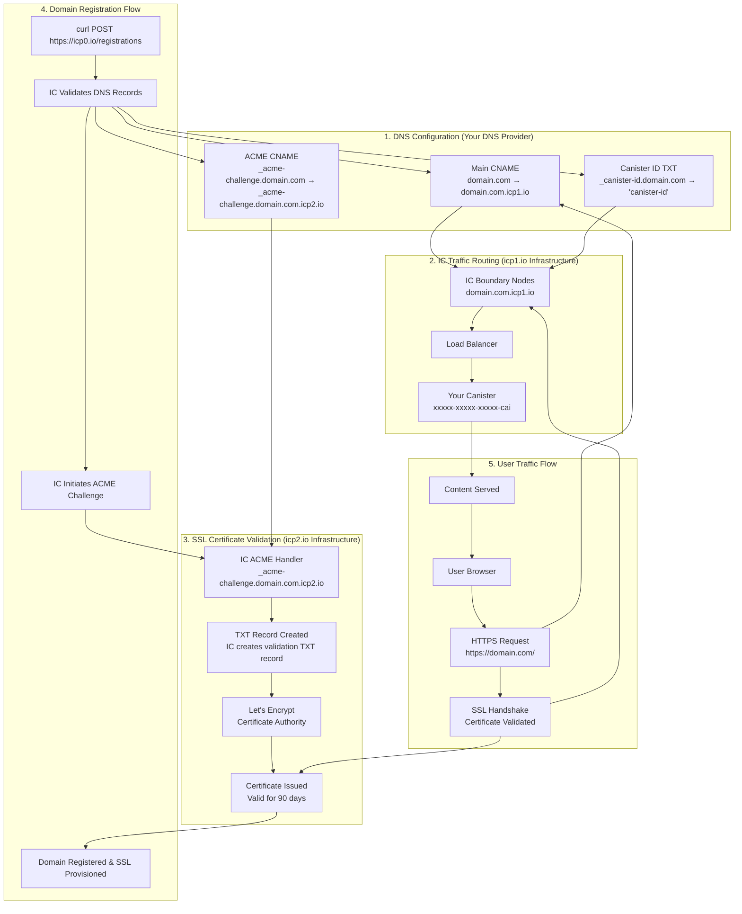

# Internet Computer Custom Domain Setup

**Date:** 2025-11-14
**Purpose:** Generic guide for configuring custom domains on Internet Computer
**Scope:** Domain-agnostic IC DNS configuration (ENS, traditional DNS providers)
**Source:** Extracted from fti_newsletter_archive/docs/DNS_SETUP.md

**Cross-Reference:**
- [ens-dns-setup.md](./ens-dns-setup.md) - ENS-specific setup (cpf.nft)
- [derivation-origins-integration.md](./derivation-origins-integration.md) - Cross-domain identity

---

## Executive Summary

This document covers the **technical DNS configuration** required to point **any custom domain** (ENS, traditional DNS, etc.) to Internet Computer canisters with SSL certificates.

**Key Requirements:**
- 3 DNS records (CNAME, TXT, CNAME for ACME)
- `.well-known/ic-domains` file served from canister
- Registration via IC API

**Applies To:**
- ✅ ENS authors.cpf.nft (control plane - governance, infrastructure)
- ✅ ENS cpf.nft (data plane - user operations)
- ✅ Traditional domains (coolplanet-foundation.org, newsletters.coolplanet-foundation.org)
- ✅ Any domain pointing to IC canisters

---

## Quick Reference: Required DNS Records

**You need exactly 3 DNS records for custom domain SSL:**

| # | Record Name | Type | Target/Value | Purpose |
|---|------------|------|--------------|---------|
| 1 | `your-domain.com` | **CNAME** | `your-domain.com.icp1.io` | Traffic routing to IC |
| 2 | `_acme-challenge.your-domain.com` | **CNAME** | `_acme-challenge.your-domain.com.icp2.io` | SSL certificate validation |
| 3 | `_canister-id.your-domain.com` | **TXT** | `"your-canister-id"` | Canister identification |

**⚠️ CRITICAL:** Record #2 (ACME challenge) is a **CNAME**, NOT a TXT record. IC creates the TXT records for you on the `icp2.io` infrastructure.

---

## DNS and SSL Flow Overview



### **Flow Explanation:**

**1. DNS Configuration (One-time Setup)**
- You configure 3 DNS records in your domain registrar (or ENS Manager)
- Main CNAME routes traffic to IC infrastructure (icp1.io)
- ACME CNAME delegates SSL validation to IC (icp2.io)
- Canister ID TXT tells IC which canister serves your domain

**2. Traffic Routing (Every User Request)**
- User visits `https://your-domain.com`
- DNS resolves to `your-domain.com.icp1.io`
- IC boundary nodes route to your canister via TXT record lookup
- Content served from your canister

**3. SSL Certificate Validation (Automatic, Every 60-90 Days)**
- Let's Encrypt initiates ACME challenge
- Follows your CNAME to IC's `icp2.io` infrastructure
- IC creates temporary TXT records for validation
- Certificate issued and installed automatically

**4. Domain Registration (One-time via API)**
- You call `curl POST https://icp0.io/registrations` with domain name
- IC validates all 3 DNS records are correct
- IC initiates ACME challenge with Let's Encrypt
- Domain registered and SSL certificate provisioned (~5-15 minutes)

**5. End-to-End User Flow**
- User requests HTTPS URL
- Browser validates SSL certificate (from step 3)
- DNS routes to IC infrastructure (from step 1)
- IC boundary nodes serve content from your canister (from step 2)

---

## Why Two Different Domains? (icp1.io vs icp2.io)

IC uses **separate infrastructure domains** for different purposes:

- **`icp1.io`** - Traffic routing infrastructure
  - Handles all HTTP/HTTPS traffic to your canister
  - Routes requests to IC boundary nodes
  - Serves your application content

- **`icp2.io`** - ACME challenge infrastructure
  - Dedicated to SSL certificate validation only
  - Isolated from traffic routing for security
  - Let's Encrypt validates certificates here

**Why separate?**
- **Security isolation**: Certificate validation infrastructure is isolated from production traffic
- **Operational independence**: SSL certificate operations don't affect traffic routing
- **Clean architecture**: Each infrastructure domain has a single, well-defined purpose

Think of it like this:
- `icp1.io` = Your application's front door (visitors enter here)
- `icp2.io` = Your application's certificate authority (SSL validation happens here)

---

## IC Custom Domain Infrastructure Evolution

### **Timeline**

**Early 2020s - Legacy Approach:**
- Direct A records to specific boundary node IPs (e.g., `89.117.14.86`)
- Geographic routing issues and 503 errors for distant users
- Manual IP management required

**Mid 2020s - boundary.dfinity.network Era:**
- Introduction of `boundary.dfinity.network` CNAME target
- Improved global load balancing
- Generic `_acme-challenge.ic0.app` for SSL (caused TXT record conflicts)

**Current (2024-2025) - icp1.io/icp2.io Infrastructure:**
- **`icp1.io`**: Dedicated traffic routing infrastructure with domain-specific endpoints
- **`icp2.io`**: Dedicated ACME challenge infrastructure with domain-specific endpoints
- **Domain-specific endpoints**: Each domain gets its own subdomain under `.icp1.io` and `.icp2.io`
- **Separation of concerns**: Traffic routing (icp1) is isolated from certificate validation (icp2)
- **Eliminates conflicts**: No more TXT record collisions from shared ACME endpoints

### **Why the Evolution Matters**

**Old Approach Issues:**
```dns
# ❌ OLD - Caused SSL provisioning failures
newsletters.example.com CNAME boundary.dfinity.network
_acme-challenge.newsletters.example.com CNAME _acme-challenge.ic0.app
# Problem: _acme-challenge.ic0.app → boundary.dfinity.network → TXT "v=spf1 -all"
# IC registration sees existing TXT record and refuses to proceed
```

**Current Approach Benefits:**
```dns
# ✅ CURRENT - Clean separation, no conflicts
newsletters.example.com CNAME newsletters.example.com.icp1.io
_acme-challenge.newsletters.example.com CNAME _acme-challenge.newsletters.example.com.icp2.io
# Benefit: Domain-specific icp2.io endpoint has NO pre-existing TXT records
# IC can create ACME challenge TXT records without conflicts
```

### **Key Improvements:**
- ✅ **Domain-specific endpoints**: Each domain isolated in IC infrastructure
- ✅ **No TXT conflicts**: ACME challenges work reliably
- ✅ **Better routing**: `icp1.io` provides optimized traffic distribution
- ✅ **Cleaner architecture**: Separation between traffic (icp1.io) and certificates (icp2.io)
- ✅ **Future-proof**: IC can update infrastructure without DNS changes

---

## DNS Configuration (Step-by-Step)

### **Step 1: Configure DNS Records**

**For ENS domains (using ENS Manager):**
```bash
# Visit: https://app.ens.domains/your-domain.nft
# Go to "Records" tab

# Add CNAME record
# Type: CNAME
# Name: @
# Value: your-domain.nft.icp1.io

# Add TXT record
# Type: TXT
# Name: _canister-id
# Value: [your-canister-id from dfx canister id --network ic]

# Add CNAME for ACME challenge
# Type: CNAME
# Name: _acme-challenge
# Value: _acme-challenge.your-domain.nft.icp2.io

# Save changes (Ethereum transaction required for ENS)
```

**For traditional DNS providers (GoDaddy, Cloudflare, Route53, etc.):**
```dns
# Record 1: Main domain CNAME (for traffic routing to icp1.io)
your-domain.com CNAME your-domain.com.icp1.io

# Record 2: ACME Challenge CNAME (for SSL certificate validation via icp2.io)
# ⚠️ IMPORTANT: This is a CNAME record, NOT a TXT record
_acme-challenge.your-domain.com CNAME _acme-challenge.your-domain.com.icp2.io

# Record 3: Canister ID TXT (for canister identification)
_canister-id.your-domain.com TXT "xxxxx-xxxxx-xxxxx-xxxxx-cai"
```

### **Step 2: Serve .well-known/ic-domains from Canister**

**In Rust canisters:**
```rust
#[query]
fn http_request(req: HttpRequest) -> HttpResponse {
    if req.url == "/.well-known/ic-domains" {
        return HttpResponse {
            status_code: 200,
            headers: vec![(\"Content-Type\".to_string(), \"text/plain\".to_string())],
            body: b\"your-domain.com\".to_vec(),
        };
    }
    // ... rest of HTTP handling
}
```

**In Motoko canisters:**
```motoko
public query func http_request(request: HttpRequest): async HttpResponse {
    if (request.url == "/.well-known/ic-domains") {
        return {
            status_code = 200;
            headers = [(\"Content-Type\", \"text/plain\")];
            body = Text.encodeUtf8(\"your-domain.com\");
        };
    };
    // ... rest of HTTP handling
};
```

**For assets canisters:**
```bash
# Create file in your source directory
mkdir -p public/.well-known
echo "your-domain.com" > public/.well-known/ic-domains

# Build and deploy
npm run build  # Copies to dist/.well-known/ic-domains
dfx deploy --network ic
```

**For multiple domains:**
```
# public/.well-known/ic-domains
your-domain.com
subdomain.your-domain.com
another-domain.org
newsletters.example.com
```

### **Step 3: Register Domain with IC**

```bash
# Register domain with IC for SSL certificate
curl -X POST "https://icp0.io/registrations" \
  -H "Content-Type: application/json" \
  -d '{"name": "your-domain.com"}'

# Successful response (registration initiated):
# "existing dns txt challenge record at _acme-challenge.your-domain.com"

# Wait 5-15 minutes for SSL certificate generation
# Check status:
curl -s "https://icp0.io/registrations" | grep -i "your-domain.com"
```

### **Step 4: Verify**

```bash
# Test that domain resolves to canister
curl https://your-domain.com

# Should return content from canister
# If not, check:
# - DNS propagation (dig your-domain.com)
# - Canister serves .well-known/ic-domains
# - TXT record _canister-id is correct
# - Domain is registered with IC

# Check SSL certificate
openssl s_client -connect your-domain.com:443 -servername your-domain.com < /dev/null 2>/dev/null | openssl x509 -noout -text | grep "Subject:"
# Should show: Subject: CN=your-domain.com
# If shows: Subject: CN=ai.icpex.org, domain is not registered
```

---

## Common Mistakes

### **🚨 CRITICAL: Use Domain-Specific Endpoints**

**COMMON MISTAKES - Legacy Formats Will Fail:**
```dns
# ❌ WRONG - Legacy boundary.dfinity.network (old infrastructure)
your-domain.com CNAME boundary.dfinity.network

# ❌ WRONG - Generic ic0.app endpoint (causes TXT record conflicts)
_acme-challenge.your-domain.com CNAME _acme-challenge.ic0.app

# ✅ CORRECT - Domain-specific icp1.io/icp2.io endpoints (current infrastructure)
your-domain.com CNAME your-domain.com.icp1.io
_acme-challenge.your-domain.com CNAME _acme-challenge.your-domain.com.icp2.io
```

**Why This Matters:**
- **Legacy endpoints**: `boundary.dfinity.network` and `_acme-challenge.ic0.app` are from older IC infrastructure
- **TXT record conflicts**: Generic `_acme-challenge.ic0.app` chains to `boundary.dfinity.network` which has SPF TXT record
- **IC registration fails**: Sees existing TXT record and returns "existing dns txt challenge record" error
- **Domain-specific isolation**: Current `icp1.io`/`icp2.io` infrastructure provides clean, conflict-free endpoints

**Symptoms of Using Legacy Endpoints:**
- Domain registration returns HTTP 400: "existing dns txt challenge record"
- SSL certificate shows `CN=ai.icpex.org` instead of your domain
- Registration appears stuck indefinitely
- HTTPS access fails with certificate name mismatch error

### **ACME Challenge CNAME Warning**

The ACME challenge record is a **CNAME record**, NOT a TXT record:

```dns
# ✅ CORRECT - CNAME record
_acme-challenge.your-domain.com CNAME _acme-challenge.your-domain.com.icp2.io

# ❌ WRONG - Do NOT create a TXT record
_acme-challenge.your-domain.com TXT "anything"
```

**How ACME Validation Works:**
1. **You create**: A CNAME record pointing to `_acme-challenge.DOMAIN.icp2.io`
2. **IC creates**: TXT records on the `icp2.io` infrastructure during validation
3. **Let's Encrypt checks**: Follows your CNAME and finds IC's TXT records
4. **Result**: SSL certificate issued

**Common DNS UI Warning:**

Some DNS management UIs may show a warning when you create the ACME challenge CNAME:

```
⚠️ Warning: This CNAME record will point _acme-challenge.your-domain.com
to _acme-challenge.your-domain.com.icp2.io
```

**✅ This Warning is Safe to Ignore:**
- The CNAME record is **correctly formatted**
- The target `_acme-challenge.your-domain.com.icp2.io` is the **correct IC ACME endpoint**
- The warning is a **false positive** from overly cautious DNS UIs
- **Proceed with creating the CNAME record** despite the warning

---

## Troubleshooting

### **DNS Not Resolving**

**Symptom:** `curl https://your-domain.com` fails or times out

**Possible Causes:**
1. DNS not propagated yet (can take 24-48 hours)
2. Wrong CNAME target
3. Missing TXT record

**Fix:**
```bash
# Check DNS propagation
dig your-domain.com

# Verify CNAME points to IC boundary nodes
# Should show: your-domain.com.icp1.io or similar

# Verify TXT record exists
dig _canister-id.your-domain.com TXT

# If missing, add in DNS provider (or ENS Manager)
```

### **Canister Not Serving .well-known Files**

**Symptom:** `curl https://your-domain.com/.well-known/ic-domains` returns 404

**Possible Causes:**
1. Canister doesn't handle this route
2. Wrong HTTP request handler

**Fix:**
```rust
// In canister code, ensure http_request handles .well-known

#[query]
fn http_request(req: HttpRequest) -> HttpResponse {
    match req.url.as_str() {
        "/.well-known/ic-domains" => HttpResponse {
            status_code: 200,
            headers: vec![(\"Content-Type\".to_string(), \"text/plain\".to_string())],
            body: b\"your-domain.com\".to_vec(),
        },
        // ... other routes
    }
}

// Redeploy canister
dfx deploy --network ic
```

### **Domain Registration Issues (SSL Certificate Mismatch)**

**Symptom:** SSL certificate shows `CN=ai.icpex.org` instead of your domain

**Root Cause:** Domain registration with IC's SSL certificate system was lost/expired

**Fix:**
```bash
# Check if domain is registered with IC
curl -s "https://icp0.io/registrations" | grep -i "your-domain.com"
# Should return the domain if registered, empty if not

# Check SSL certificate details
openssl s_client -connect your-domain.com:443 -servername your-domain.com < /dev/null 2>/dev/null | openssl x509 -noout -text | grep "Subject:"
# Should show: Subject: CN=your-domain.com
# If shows: Subject: CN=ai.icpex.org, domain is not registered

# Re-register domain
curl -X POST "https://icp0.io/registrations" \
  -H "Content-Type: application/json" \
  -d '{"name": "your-domain.com"}'

# Wait 5-15 minutes for SSL certificate generation
# Test domain access - should work immediately after certificate is ready
```

---

## Domain Health Monitoring

### **Regular DNS Checks**

```bash
# Check CNAME record (should point to icp1.io infrastructure)
dig your-domain.com CNAME +short
# Expected: your-domain.com.icp1.io.

# Check canister ID TXT record
dig _canister-id.your-domain.com TXT +short
# Expected: "xxxxx-xxxxx-xxxxx-xxxxx-cai"

# Check ACME challenge CNAME record
dig _acme-challenge.your-domain.com CNAME +short
# Expected: _acme-challenge.your-domain.com.icp2.io.
```

### **IC Domain Registration Status**

```bash
# Check if domain is registered with IC
curl -s "https://icp0.io/registrations" | grep -i "your-domain.com"
# Should return the domain if registered, empty if not

# Check SSL certificate details
openssl s_client -connect your-domain.com:443 -servername your-domain.com < /dev/null 2>/dev/null | openssl x509 -noout -text | grep -A 5 "Subject:"
# Should show: Subject: CN=your-domain.com
# If shows: Subject: CN=ai.icpex.org, domain is not registered
```

### **Domain Accessibility Test**

```bash
# Test domain access
curl -I https://your-domain.com/
# Should return 200 OK, not SSL certificate errors

# Test canister .well-known/ic-domains
curl -s "https://xxxxx-xxxxx-xxxxx-cai.icp0.io/.well-known/ic-domains" | grep "your-domain.com"
# Should return the domain name
```

### **Automated Health Check Script**

For a comprehensive health check script, see fti_newsletter_archive/scripts/domain-health-check.sh

---

## Summary Checklist

### **DNS Configuration**
- [ ] CNAME record: `your-domain.com` → `your-domain.com.icp1.io`
- [ ] TXT record: `_canister-id.your-domain.com` → `"canister-id"`
- [ ] CNAME record: `_acme-challenge.your-domain.com` → `_acme-challenge.your-domain.com.icp2.io`
- [ ] DNS propagation complete (24-48 hours)

### **Canister Configuration**
- [ ] Canister serves `.well-known/ic-domains`
- [ ] Domain listed in `.well-known/ic-domains` file
- [ ] Canister deployed and accessible

### **IC Registration**
- [ ] Domain registered via `curl POST https://icp0.io/registrations`
- [ ] SSL certificate issued (5-15 minutes)
- [ ] Domain returns 200 OK (not 400 Unknown Domain)
- [ ] SSL certificate subject matches domain (not `ai.icpex.org`)

### **Verification**
- [ ] `https://your-domain.com` accessible
- [ ] SSL certificate valid
- [ ] Content served from canister

---

**Last Updated:** 2025-11-14
**Version:** 1.0.0
**Status:** Complete Guide
**Source:** Extracted from fti_newsletter_archive/docs/DNS_SETUP.md

**Cross-References:**
- [ens-dns-setup.md](./ens-dns-setup.md) - ENS-specific setup for cpf.nft
- [derivation-origins-integration.md](./derivation-origins-integration.md) - Cross-domain identity
- fti_newsletter_archive/docs/DNS_SETUP.md - Original detailed documentation
- fti_newsletter_archive/scripts/domain-health-check.sh - Automated health checks
