# Identity Verification & KYC Integration for CPP Platform

## Overview

This document outlines the **identity verification and KYC integration architecture** for the Cool Planet Platform (CPP), including user verification flows, external provider integration, and consent management.

**Note:** This architecture leverages **Internet Identity (II) Enterprise SSO** instead of custom IdP, with optional external wallet association for ENS control. See [Wallet Association](wallet-association.md) for detailed wallet integration patterns.

## Core KYC Flow Architecture

### **Reusable KYC Component**

The KYC flow is implemented as a reusable component that can be invoked from multiple entry points:

```mermaid
graph TD
    %% KYC Choices → DID ZK Proof Flow (Reusable Component)
    subgraph "KYC Choices → DID ZK Proof Flow (Reusable Component)"
        KYC_START[Start KYC Process] --> CONSENT[Present Consent & Method Choice]
        
        CONSENT --> METHOD_CHOICE{User Chooses Verification Method}
        
        METHOD_CHOICE -->|No KYC Required| ZK_GENERATE[Generate ZK Proof]
        METHOD_CHOICE -->|Full KYC| FULL_KYC[Initialize Full KYC Session]
        METHOD_CHOICE -->|LinkedIn OAuth| LINKEDIN_OAUTH[Initialize LinkedIn OAuth]
        METHOD_CHOICE -->|Gravatar| GRAVATAR[Initialize Gravatar Verification]
        
        %% Full KYC Path
        FULL_KYC --> PROVIDER_CALL[Call External Provider]
        PROVIDER_CALL --> DOC_SUBMIT[User Submits Documents via Provider Interface]
        DOC_SUBMIT --> PROVIDER_VERIFY[Provider Verification Processing]
        PROVIDER_VERIFY --> VERIFY_RESULT{Verification Result}
        VERIFY_RESULT -->|Success| ZK_GENERATE
        VERIFY_RESULT -->|Failure| KYC_ERROR[KYC Verification Failed]
        
        %% LinkedIn OAuth Path
        LINKEDIN_OAUTH --> LINKEDIN_REDIRECT[Redirect to LinkedIn OAuth]
        LINKEDIN_REDIRECT --> LINKEDIN_AUTH[User Authorizes Cool Planet PWA]
        LINKEDIN_AUTH --> LINKEDIN_RETURN[LinkedIn Returns User Data]
        LINKEDIN_RETURN --> LINKEDIN_VERIFY[Process LinkedIn Data]
        LINKEDIN_VERIFY --> ZK_GENERATE
        
        %% Gravatar Path
        GRAVATAR --> GRAVATAR_API[Call Gravatar API]
        GRAVATAR_API --> GRAVATAR_VERIFY[Verify Gravatar Data]
        GRAVATAR_VERIFY --> ZK_GENERATE
        
        %% ZK Proof Generation
        ZK_GENERATE --> DID_CHECK{User Has DID?}
        DID_CHECK -->|Yes| DID_UPDATE[Update DID with ZK Proof]
        DID_CHECK -->|No| TEMP_STORAGE[Store KYC Result Temporarily]
        TEMP_STORAGE --> NFT_ISSUANCE[Issue NFT & Create DID]
        NFT_ISSUANCE --> DID_UPDATE
        DID_UPDATE --> WALLET_CHECK{Has Wallet Association?}
        WALLET_CHECK -->|No| WALLET_OPTION[Offer Wallet Association]
        WALLET_OPTION --> WALLET_CHOICE{User Choice}
        WALLET_CHOICE -->|Associate External| WALLET_ASSOCIATE[Associate External Wallet]
        WALLET_CHOICE -->|Use II-Managed| II_MANAGED[Generate II-Managed Wallet]
        WALLET_CHOICE -->|Skip for Now| KYC_COMPLETE
        WALLET_ASSOCIATE --> KYC_COMPLETE
        II_MANAGED --> KYC_COMPLETE
        WALLET_CHECK -->|Yes| KYC_COMPLETE[KYC Process Complete]
        
        %% Color Coding for New Nodes
        class DID_CHECK,TEMP_STORAGE,NFT_ISSUANCE,DID_UPDATE,WALLET_CHECK,WALLET_OPTION,WALLET_CHOICE,WALLET_ASSOCIATE,II_MANAGED motoko
        
        %% Error Handling
        KYC_ERROR --> ERROR_RETRY[Retry or Choose Alternative Method]
        ERROR_RETRY --> CONSENT
    end
    
    %% Color Coding
    classDef azle fill:#ff6b35,stroke:#333,stroke-width:2px,color:#fff
    classDef motoko fill:#4ecdc4,stroke:#333,stroke-width:2px,color:#fff
    classDef external fill:#ff4757,stroke:#333,stroke-width:2px,color:#fff
    
    class KYC_START,CONSENT,METHOD_CHOICE,LINKEDIN_OAUTH,LINKEDIN_REDIRECT,LINKEDIN_AUTH,LINKEDIN_RETURN,GRAVATAR,GRAVATAR_API,ERROR_RETRY azle
    class ZK_GENERATE,DID_UPDATE,KYC_COMPLETE motoko
    class PROVIDER_CALL,DOC_SUBMIT,PROVIDER_VERIFY,VERIFY_RESULT,KYC_ERROR,LINKEDIN_VERIFY,GRAVATAR_VERIFY external
```



## Consent Management & Method Choice

### **Legal Basis and Required Elements**

Before any KYC method is invoked, users must provide explicit consent:

```typescript
// Consent record structure
type ConsentRecord = {
  user_did: string;
  legal_basis: 'CONTRACT' | 'LEGITIMATE_INTEREST' | 'CONSENT';
  purpose: string;
  data_retention_period: number; // days
  third_party_sharing: boolean;
  user_rights: string[];
  timestamp: number;
  ip_address: string;
  user_agent: string;
};

// Consent management
class ConsentManager {
  public async collectConsent(
    userDID: string,
    kycMethod: KYCMethod,
    riskLevel: RiskLevel
  ): Promise<ConsentRecord> {
    const consentRecord: ConsentRecord = {
      user_did: userDID,
      legal_basis: this.determineLegalBasis(riskLevel),
      purpose: this.getPurpose(kycMethod),
      data_retention_period: this.getRetentionPeriod(riskLevel),
      third_party_sharing: this.requiresThirdPartySharing(kycMethod),
      user_rights: this.getUserRights(),
      timestamp: Date.now(),
      ip_address: await this.getUserIP(),
      user_agent: navigator.userAgent
    };

    // Store consent record
    await this.storeConsentRecord(consentRecord);
    
    return consentRecord;
  }

  private determineLegalBasis(riskLevel: RiskLevel): 'CONTRACT' | 'LEGITIMATE_INTEREST' | 'CONSENT' {
    switch (riskLevel) {
      case 'LOW':
        return 'CONSENT';
      case 'MEDIUM':
        return 'LEGITIMATE_INTEREST';
      case 'HIGH':
        return 'CONTRACT';
      default:
        return 'CONSENT';
    }
  }

  private getUserRights(): string[] {
    return [
      'Right to access personal data',
      'Right to rectification',
      'Right to erasure (Right to be Forgotten)',
      'Right to data portability',
      'Right to object to processing',
      'Right to withdraw consent'
    ];
  }
}
```

### **User Choice in KYC Methods**

Users can choose alternative verification methods that satisfy the required risk level:

```typescript
// KYC method recommendation and choice
class KYCMethodManager {
  public async recommendVerificationMethod(
    riskLevel: RiskLevel,
    jurisdiction: string,
    userPreferences: UserPreferences
  ): Promise<KYCRecommendation> {
    const availableMethods = await this.getAvailableMethods(riskLevel, jurisdiction);
    const recommended = this.selectRecommendedMethod(availableMethods, userPreferences);
    
    return {
      required_level: riskLevel,
      recommended_method: recommended,
      alternative_methods: availableMethods.filter(m => m.id !== recommended.id),
      estimated_duration: this.estimateDuration(recommended),
      success_rate: this.getSuccessRate(recommended)
    };
  }

  public async presentMethodChoice(
    recommendation: KYCRecommendation
  ): Promise<KYCMethodChoice> {
    // Present UI for method selection
    const choice = await this.showMethodSelectionUI(recommendation);
    
    // Validate choice satisfies risk level
    if (!this.satisfiesRiskLevel(choice.method, recommendation.required_level)) {
      throw new Error('Selected method does not satisfy required risk level');
    }
    
    return choice;
  }

  private satisfiesRiskLevel(method: KYCMethod, requiredLevel: RiskLevel): boolean {
    const methodLevel = this.getMethodRiskLevel(method);
    return this.isLevelSufficient(methodLevel, requiredLevel);
  }
}
```

## External Provider Integration

### **Provider Communication Architecture**

External KYC providers are integrated through a standardized interface:

```typescript
// Provider integration interface
interface KYCProvider {
  id: string;
  name: string;
  supported_jurisdictions: string[];
  supported_risk_levels: RiskLevel[];
  api_endpoint: string;
  webhook_endpoint: string;
  authentication: ProviderAuth;
}

// Provider communication
class ProviderIntegrationManager {
  private providers: Map<string, KYCProvider> = new Map();

  public async initializeKYC(
    providerId: string,
    userDID: string,
    riskLevel: RiskLevel
  ): Promise<KYCInitiationResult> {
    const provider = this.providers.get(providerId);
    if (!provider) {
      throw new Error(`Provider ${providerId} not found`);
    }

    // Create KYC session
    const session = await this.createKYCSession(provider, userDID, riskLevel);
    
    // Get provider interface URL
    const interfaceUrl = await this.getProviderInterface(provider, session);
    
    return {
      session_id: session.id,
      provider_interface_url: interfaceUrl,
      estimated_duration: provider.estimated_duration,
      webhook_secret: session.webhook_secret
    };
  }

  public async handleProviderWebhook(
    providerId: string,
    webhookData: any,
    signature: string
  ): Promise<void> {
    const provider = this.providers.get(providerId);
    if (!provider) {
      throw new Error(`Provider ${providerId} not found`);
    }

    // Verify webhook signature
    if (!this.verifyWebhookSignature(provider, webhookData, signature)) {
      throw new Error('Invalid webhook signature');
    }

    // Process webhook data
    const result = await this.processWebhookData(provider, webhookData);
    
    // Update KYC status in Core User Management Canister
    await this.updateKYCStatus(result);
  }

  private async updateKYCStatus(result: KYCWebhookResult): Promise<void> {
    // Call Core User Management Canister to update KYC status
    await this.coreUserManagement.updateKYCStatus({
      user_did: result.user_did,
      session_id: result.session_id,
      status: result.status,
      verification_data: result.verification_data,
      timestamp: Date.now()
    });
  }
}
```

### **Document Submission Approach**

Document submission is handled by provider-hosted interfaces:

```typescript
// Document submission flow
class DocumentSubmissionManager {
  public async initiateDocumentSubmission(
    providerId: string,
    sessionId: string
  ): Promise<DocumentSubmissionResult> {
    const provider = this.getProvider(providerId);
    
    // Get document requirements from provider
    const requirements = await this.getDocumentRequirements(provider, sessionId);
    
    // Generate secure upload URL
    const uploadUrl = await this.generateUploadUrl(provider, sessionId);
    
    return {
      requirements: requirements,
      upload_url: uploadUrl,
      max_file_size: provider.max_file_size,
      supported_formats: provider.supported_formats,
      estimated_processing_time: provider.estimated_processing_time
    };
  }

  public async trackDocumentStatus(
    sessionId: string
  ): Promise<DocumentStatus> {
    // Query provider for document processing status
    const status = await this.queryDocumentStatus(sessionId);
    
    return {
      session_id: sessionId,
      status: status.status,
      progress: status.progress,
      estimated_completion: status.estimated_completion,
      issues: status.issues || []
    };
  }
}
```

## Light Verification Options

### **Gravatar Integration**

Gravatar serves as a lightweight verification option for low-risk scenarios:

```typescript
// Gravatar integration
class GravatarIntegration {
  public async verifyGravatar(
    userDID: string,
    email: string
  ): Promise<GravatarVerificationResult> {
    // Get email from Internet Identity (not Gravatar API)
    const iiEmail = await this.getEmailFromInternetIdentity(userDID);
    
    // Verify email matches Gravatar
    const gravatarData = await this.getGravatarData(email);
    
    if (!gravatarData || !gravatarData.verified) {
      throw new Error('Gravatar verification failed');
    }

    // Generate ZK proof for Gravatar verification
    const zkProof = await this.generateGravatarZKProof({
      user_did: userDID,
      email: email,
      gravatar_hash: gravatarData.hash,
      verification_timestamp: Date.now()
    });

    return {
      verified: true,
      email: email,
      gravatar_hash: gravatarData.hash,
      zk_proof: zkProof,
      verification_level: 'LIGHT'
    };
  }

  private async getGravatarData(email: string): Promise<GravatarData | null> {
    const hash = this.generateMD5Hash(email.toLowerCase().trim());
    const response = await fetch(`https://www.gravatar.com/${hash}.json`);
    
    if (!response.ok) {
      return null;
    }

    const data = await response.json();
    return {
      hash: hash,
      verified: data.verified || false,
      profile_data: data.entry?.[0] || null
    };
  }
}
```

### **LinkedIn OAuth Integration**

LinkedIn OAuth provides a streamlined verification option:

```typescript
// LinkedIn OAuth integration
class LinkedInOAuthIntegration {
  private clientId: string;
  private redirectUri: string;

  constructor(clientId: string, redirectUri: string) {
    this.clientId = clientId;
    this.redirectUri = redirectUri;
  }

  public async initiateLinkedInOAuth(
    userDID: string,
    sessionId: string
  ): Promise<LinkedInOAuthInitiation> {
    const state = this.generateState(userDID, sessionId);
    const scope = 'r_liteprofile r_emailaddress';
    
    const authUrl = `https://www.linkedin.com/oauth/v2/authorization?` +
      `response_type=code&` +
      `client_id=${this.clientId}&` +
      `redirect_uri=${encodeURIComponent(this.redirectUri)}&` +
      `state=${state}&` +
      `scope=${encodeURIComponent(scope)}`;

    return {
      auth_url: authUrl,
      state: state,
      session_id: sessionId
    };
  }

  public async handleLinkedInCallback(
    code: string,
    state: string
  ): Promise<LinkedInVerificationResult> {
    // Verify state
    const { userDID, sessionId } = this.verifyState(state);
    
    // Exchange code for access token
    const accessToken = await this.exchangeCodeForToken(code);
    
    // Get user profile data
    const profileData = await this.getLinkedInProfile(accessToken);
    
    // Generate ZK proof
    const zkProof = await this.generateLinkedInZKProof({
      user_did: userDID,
      linkedin_id: profileData.id,
      profile_data: profileData,
      verification_timestamp: Date.now()
    });

    return {
      verified: true,
      linkedin_id: profileData.id,
      profile_data: profileData,
      zk_proof: zkProof,
      verification_level: 'MEDIUM'
    };
  }

  private async getLinkedInProfile(accessToken: string): Promise<LinkedInProfile> {
    const response = await fetch('https://api.linkedin.com/v2/me', {
      headers: {
        'Authorization': `Bearer ${accessToken}`,
        'X-Restli-Protocol-Version': '2.0.0'
      }
    });

    if (!response.ok) {
      throw new Error('Failed to fetch LinkedIn profile');
    }

    return await response.json();
  }
}
```

## Verification Level Management

### **Risk-Based Verification Tiers**

The system supports multiple verification levels based on risk assessment:

```typescript
// Verification level management
class VerificationLevelManager {
  public async determineRequiredLevel(
    donationAmount: number,
    jurisdiction: string,
    userHistory: UserHistory
  ): Promise<RiskLevel> {
    const amountRisk = this.calculateAmountRisk(donationAmount);
    const jurisdictionRisk = this.getJurisdictionRisk(jurisdiction);
    const historyRisk = this.assessHistoryRisk(userHistory);
    
    const totalRisk = amountRisk + jurisdictionRisk + historyRisk;
    
    return this.mapRiskToLevel(totalRisk);
  }

  public async checkExistingVerification(
    userDID: string,
    requiredLevel: RiskLevel
  ): Promise<VerificationStatus> {
    const existingVerification = await this.getExistingVerification(userDID);
    
    if (!existingVerification) {
      return { sufficient: false, current_level: null };
    }

    const sufficient = this.isLevelSufficient(
      existingVerification.level,
      requiredLevel
    );

    return {
      sufficient: sufficient,
      current_level: existingVerification.level,
      verification_date: existingVerification.date
    };
  }

  private isLevelSufficient(current: RiskLevel, required: RiskLevel): boolean {
    const levelHierarchy = ['LOW', 'MEDIUM', 'HIGH'];
    const currentIndex = levelHierarchy.indexOf(current);
    const requiredIndex = levelHierarchy.indexOf(required);
    
    return currentIndex >= requiredIndex;
  }
}
```

## Temporary KYC Storage & DID Creation

### **KYC Result Storage Strategy**

The KYC process must culminate in NFT issuance and ZK proof storage, requiring a temporary storage mechanism for users without existing DIDs:

```typescript
// Temporary KYC storage interface
interface TemporaryKYCStorage {
  session_id: string;
  ii_principal: string;
  kyc_result: KYCVerificationResult;
  zk_proof: string;
  created_date: number;
  expiry_date: number; // 24 hours
  status: 'PENDING_NFT' | 'NFT_ISSUED' | 'EXPIRED';
}

// KYC completion with temporary storage
class KYCCompletionManager {
  public async completeKYC(
    ii_principal: string,
    kycResult: KYCVerificationResult,
    zkProof: string
  ): Promise<KYCCompletionResult> {
    // Check if user has existing DID
    const existingDID = await this.getExistingDID(ii_principal);
    
    if (existingDID) {
      // Update existing DID with ZK proof
      await this.updateDIDWithZKProof(existingDID, zkProof);
      return {
        type: 'DID_UPDATED',
        did: existingDID,
        action: 'UPDATE_EXISTING_DID'
      };
    } else {
      // Store KYC result temporarily
      const tempStorage = await this.storeTemporaryKYC({
        session_id: this.generateSessionId(),
        ii_principal: ii_principal,
        kyc_result: kycResult,
        zk_proof: zkProof,
        created_date: Date.now(),
        expiry_date: Date.now() + (24 * 60 * 60 * 1000), // 24 hours
        status: 'PENDING_NFT'
      });
      
      return {
        type: 'TEMP_STORED',
        session_id: tempStorage.session_id,
        action: 'ISSUE_NFT_AND_CREATE_DID'
      };
    }
  }

  public async issueNFTAndCreateDID(
    sessionId: string,
    walletAddress: string
  ): Promise<DIDCreationResult> {
    // Retrieve temporary KYC storage
    const tempStorage = await this.getTemporaryKYC(sessionId);
    
    if (!tempStorage || tempStorage.status !== 'PENDING_NFT') {
      throw new Error("Invalid or expired KYC session");
    }
    
    // Issue NFT on Polygon
    const nftResult = await this.issueNFTOnPolygon({
      wallet_address: walletAddress,
      kyc_result: tempStorage.kyc_result,
      zk_proof: tempStorage.zk_proof
    });
    
    // Create DID with ZK proof
    const did = await this.createDIDWithZKProof({
      wallet_address: walletAddress,
      zk_proof: tempStorage.zk_proof,
      nft_token_id: nftResult.token_id
    });
    
    // Update temporary storage status
    await this.updateTemporaryKYCStatus(sessionId, 'NFT_ISSUED');
    
    return {
      did: did,
      nft_token_id: nftResult.token_id,
      wallet_address: walletAddress
    };
  }

  private async storeTemporaryKYC(storage: TemporaryKYCStorage): Promise<TemporaryKYCStorage> {
    // Store in IC with encryption
    const encryptedStorage = await this.encryptTemporaryKYC(storage);
    
    await this.storeInIC({
      key: `temp_kyc_${storage.session_id}`,
      value: encryptedStorage,
      expiry: storage.expiry_date
    });
    
    return storage;
  }

  private async getTemporaryKYC(sessionId: string): Promise<TemporaryKYCStorage | null> {
    const encryptedStorage = await this.getFromIC(`temp_kyc_${sessionId}`);
    
    if (!encryptedStorage) {
      return null;
    }
    
    return await this.decryptTemporaryKYC(encryptedStorage);
  }
}
```

### **Temporary Storage Security**

```typescript
// Security considerations for temporary KYC storage
interface TemporaryStorageSecurity {
  encryption: 'AES_256_GCM';           // Encrypt all temporary data
  expiry: '24_HOURS';                  // Automatic expiry
  access_control: 'II_PRINCIPAL_ONLY'; // Only accessible by II principal
  audit_trail: 'COMPREHENSIVE';        // Track all access
  cleanup: 'AUTOMATIC';                // Automatic cleanup on expiry
}

// Security implementation
class TemporaryStorageSecurityManager {
  public async encryptTemporaryKYC(storage: TemporaryKYCStorage): Promise<string> {
    const encryptionKey = await this.getEncryptionKey();
    const iv = crypto.getRandomValues(new Uint8Array(12));
    
    const encrypted = await crypto.subtle.encrypt(
      { name: 'AES-GCM', iv: iv },
      encryptionKey,
      new TextEncoder().encode(JSON.stringify(storage))
    );
    
    return JSON.stringify({
      encrypted: Array.from(new Uint8Array(encrypted)),
      iv: Array.from(iv)
    });
  }

  public async validateAccess(
    sessionId: string,
    iiPrincipal: string
  ): Promise<boolean> {
    const tempStorage = await this.getTemporaryKYC(sessionId);
    
    if (!tempStorage) {
      return false;
    }
    
    // Verify II principal matches
    return tempStorage.ii_principal === iiPrincipal;
  }
}
```

## Integration with Core User Management

### **Data Flow**
1. **Frontend** presents consent and method choice
2. **External Integration Canister** handles provider communication
3. **Core User Management Canister** stores verification results and generates ZK proofs
4. **Wallet Association Canister** manages wallet associations (see [wallet-association.md](wallet-association.md))
5. **Frontend** receives real-time updates on verification status

### **Cross-References**
- **[Wallet Association](wallet-association.md)**: Detailed wallet association verification
- **[User Identity States](user-identity-states.md)**: User identity state management
- **[Core User Management](kyc.md)**: Consolidated backend functions

### **Security Considerations**
- All provider communication is encrypted
- Webhook signatures are verified
- ZK proofs are generated securely
- User consent is explicitly recorded
- Verification data is stored with appropriate encryption levels 