# KYC Provider Integration Architecture

## Overview

This document details the integration with external KYC providers (Jumio, Onfido, Coinbase) for the Cool Planet Platform (CPP). It covers webhook handling, API integrations, provider-specific workflows, and the routing between TypeScript/Azle and Motoko canisters.

## Provider Integration Architecture

### **Integration Flow**

```mermaid
graph TD
    A[User Submits KYC Documents] --> B[TypeScript/Azle Provider Integration Canister]
    B --> C[Select Optimal Provider]
    C --> D[Prepare Provider-Specific Request]
    D --> E[Send to External Provider]
    E --> F[Provider Processes Verification]
    F --> G[Provider Sends Webhook]
    G --> H[TypeScript/Azle Webhook Handler]
    H --> I[Validate Webhook Signature]
    I --> J[Process Verification Result]
    J --> K[Route to Motoko KYC Storage]
    K --> L[Generate ZK Proof]
    L --> M[Store in Polygon DID]
    M --> N[Create Cool Planet ID]
    N --> O[Award NFT/Bundle]
    
    %% Color coding
    style A fill:#e67e22,stroke:#d35400,stroke-width:1px,color:#ffffff
    style B fill:#e67e22,stroke:#d35400,stroke-width:1px,color:#ffffff
    style C fill:#e67e22,stroke:#d35400,stroke-width:1px,color:#ffffff
    style D fill:#e67e22,stroke:#d35400,stroke-width:1px,color:#ffffff
    style E fill:#e67e22,stroke:#d35400,stroke-width:1px,color:#ffffff
    style H fill:#e67e22,stroke:#d35400,stroke-width:1px,color:#ffffff
    style I fill:#e67e22,stroke:#d35400,stroke-width:1px,color:#ffffff
    style J fill:#e67e22,stroke:#d35400,stroke-width:1px,color:#ffffff
    style K fill:#e67e22,stroke:#d35400,stroke-width:1px,color:#ffffff
    style O fill:#e67e22,stroke:#d35400,stroke-width:1px,color:#ffffff
    
    style L fill:#2980b9,stroke:#1f4e79,stroke-width:1px,color:#ffffff
    style M fill:#2980b9,stroke:#1f4e79,stroke-width:1px,color:#ffffff
    style N fill:#2980b9,stroke:#1f4e79,stroke-width:1px,color:#ffffff
    
    style F fill:#c0392b,stroke:#922b21,stroke-width:1px,color:#ffffff
    style G fill:#c0392b,stroke:#922b21,stroke-width:1px,color:#ffffff
```



### **Canister Implementation Legend**

- **🟠 Orange (TypeScript/Azle)**: Provider integration, webhook handling, API management
- **🔵 Blue (Motoko)**: Core KYC processing, ZK proof generation, blockchain operations
- **🔴 Red (External)**: Third-party KYC provider services

## Supported KYC Providers

### **1. Jumio Integration**

#### **Provider Selection Criteria**
- **Jurisdiction**: Global coverage
- **Risk Level**: Standard to Enhanced
- **Document Types**: Government ID, Proof of Address, Selfie
- **Processing Time**: 2-5 minutes
- **Success Rate**: 95%+

#### **API Integration**
```typescript
// Jumio API Configuration
type JumioConfig = {
    apiKey: string;
    apiSecret: string;
    baseUrl: string;
    webhookUrl: string;
    supportedCountries: string[];
    documentTypes: string[];
    verificationLevels: string[];
};

// Jumio Request Format
type JumioRequest = {
    customerId: string;
    userReference: string;
    country: string;
    documentType: string;
    callbackUrl: string;
    verificationLevel: string;
    metadata: {
        sessionId: string;
        userDID: string;
        jurisdiction: string;
    };
};

// Jumio Response Format
type JumioResponse = {
    transactionId: string;
    status: 'PENDING' | 'APPROVED' | 'DENIED' | 'ERROR';
    verificationLevel: string;
    confidence: number;
    documentData: {
        documentType: string;
        issuingCountry: string;
        documentNumber: string;
        expiryDate: string;
    };
    identityData: {
        firstName: string;
        lastName: string;
        dateOfBirth: string;
        nationality: string;
    };
    addressData?: {
        street: string;
        city: string;
        postalCode: string;
        country: string;
    };
};
```

#### **Webhook Handling**
```typescript
// Jumio Webhook Handler
async function handleJumioWebhook(webhookData: JumioWebhook): Promise<boolean> {
    try {
        // 1. Verify webhook signature
        const isValid = await verifyJumioSignature(webhookData);
        if (!isValid) {
            await logWebhookError('JUMIO_SIGNATURE_INVALID', webhookData);
            return false;
        }
        
        // 2. Extract verification result
        const result = {
            sessionId: webhookData.metadata.sessionId,
            userDID: webhookData.metadata.userDID,
            verificationStatus: mapJumioStatus(webhookData.status),
            confidence: webhookData.confidence,
            providerData: {
                providerId: 'jumio',
                transactionId: webhookData.transactionId,
                documentData: webhookData.documentData,
                identityData: webhookData.identityData,
                addressData: webhookData.addressData,
                verificationLevel: webhookData.verificationLevel
            }
        };
        
        // 3. Route to Motoko canister for core processing
        const motokoResult = await kycStorageCanister.handleProviderVerificationResult(
            result.sessionId,
            result.verificationStatus,
            result.confidence,
            result.userDID,
            result.providerData
        );
        
        return motokoResult.success;
        
    } catch (error) {
        await logWebhookError('JUMIO_PROCESSING_ERROR', error);
        return false;
    }
}

function mapJumioStatus(jumioStatus: string): string {
    switch (jumioStatus) {
        case 'APPROVED': return 'verified';
        case 'DENIED': return 'rejected';
        case 'ERROR': return 'error';
        default: return 'pending';
    }
}
```

### **2. Onfido Integration**

#### **Provider Selection Criteria**
- **Jurisdiction**: EU, UK, US, Canada, Australia
- **Risk Level**: Enhanced to Comprehensive
- **Document Types**: Government ID, Proof of Address, Video Verification
- **Processing Time**: 5-15 minutes
- **Success Rate**: 92%+

#### **API Integration**
```typescript
// Onfido API Configuration
type OnfidoConfig = {
    apiToken: string;
    baseUrl: string;
    webhookUrl: string;
    supportedCountries: string[];
    documentTypes: string[];
    verificationLevels: string[];
};

// Onfido Request Format
type OnfidoRequest = {
    applicantId: string;
    checkType: string;
    documentTypes: string[];
    reportNames: string[];
    tags: string[];
    metadata: {
        sessionId: string;
        userDID: string;
        jurisdiction: string;
    };
};

// Onfido Response Format
type OnfidoResponse = {
    checkId: string;
    status: 'PENDING' | 'COMPLETE' | 'WITHDRAWN' | 'PAUSED';
    result: 'CLEAR' | 'CONSIDER' | 'REJECT';
    reportIds: string[];
    createdAt: string;
    completedAt?: string;
};
```

#### **Webhook Handling**
```typescript
// Onfido Webhook Handler
async function handleOnfidoWebhook(webhookData: OnfidoWebhook): Promise<boolean> {
    try {
        // 1. Verify webhook signature
        const isValid = await verifyOnfidoSignature(webhookData);
        if (!isValid) {
            await logWebhookError('ONFIDO_SIGNATURE_INVALID', webhookData);
            return false;
        }
        
        // 2. Get detailed check results
        const checkDetails = await getOnfidoCheckDetails(webhookData.payload.check_id);
        
        // 3. Extract verification result
        const result = {
            sessionId: webhookData.payload.metadata.sessionId,
            userDID: webhookData.payload.metadata.userDID,
            verificationStatus: mapOnfidoResult(checkDetails.result),
            confidence: calculateOnfidoConfidence(checkDetails),
            providerData: {
                providerId: 'onfido',
                checkId: webhookData.payload.check_id,
                reportIds: checkDetails.reportIds,
                result: checkDetails.result,
                completedAt: checkDetails.completedAt
            }
        };
        
        // 4. Route to Motoko canister for core processing
        const motokoResult = await kycStorageCanister.handleProviderVerificationResult(
            result.sessionId,
            result.verificationStatus,
            result.confidence,
            result.userDID,
            result.providerData
        );
        
        return motokoResult.success;
        
    } catch (error) {
        await logWebhookError('ONFIDO_PROCESSING_ERROR', error);
        return false;
    }
}

function mapOnfidoResult(onfidoResult: string): string {
    switch (onfidoResult) {
        case 'CLEAR': return 'verified';
        case 'CONSIDER': return 'manual_review';
        case 'REJECT': return 'rejected';
        default: return 'pending';
    }
}
```

### **3. Coinbase Integration**

#### **Provider Selection Criteria**
- **Jurisdiction**: US, Canada, UK, EU
- **Risk Level**: Comprehensive to Maximum
- **Document Types**: Government ID, Proof of Address, Enhanced Due Diligence
- **Processing Time**: 15-60 minutes
- **Success Rate**: 90%+

#### **API Integration**
```typescript
// Coinbase API Configuration
type CoinbaseConfig = {
    apiKey: string;
    apiSecret: string;
    baseUrl: string;
    webhookUrl: string;
    supportedCountries: string[];
    documentTypes: string[];
    verificationLevels: string[];
};

// Coinbase Request Format
type CoinbaseRequest = {
    userId: string;
    verificationType: string;
    documents: {
        type: string;
        country: string;
        documentNumber?: string;
    }[];
    enhancedChecks: boolean;
    metadata: {
        sessionId: string;
        userDID: string;
        jurisdiction: string;
    };
};

// Coinbase Response Format
type CoinbaseResponse = {
    verificationId: string;
    status: 'PENDING' | 'APPROVED' | 'REJECTED' | 'REQUIRES_ADDITIONAL_INFO';
    verificationLevel: string;
    riskScore: number;
    enhancedChecks: {
        required: boolean;
        completed: boolean;
        results?: any;
    };
};
```

#### **Webhook Handling**
```typescript
// Coinbase Webhook Handler
async function handleCoinbaseWebhook(webhookData: CoinbaseWebhook): Promise<boolean> {
    try {
        // 1. Verify webhook signature
        const isValid = await verifyCoinbaseSignature(webhookData);
        if (!isValid) {
            await logWebhookError('COINBASE_SIGNATURE_INVALID', webhookData);
            return false;
        }
        
        // 2. Extract verification result
        const result = {
            sessionId: webhookData.metadata.sessionId,
            userDID: webhookData.metadata.userDID,
            verificationStatus: mapCoinbaseStatus(webhookData.status),
            confidence: calculateCoinbaseConfidence(webhookData.riskScore),
            providerData: {
                providerId: 'coinbase',
                verificationId: webhookData.verificationId,
                riskScore: webhookData.riskScore,
                enhancedChecks: webhookData.enhancedChecks,
                verificationLevel: webhookData.verificationLevel
            }
        };
        
        // 3. Route to Motoko canister for core processing
        const motokoResult = await kycStorageCanister.handleProviderVerificationResult(
            result.sessionId,
            result.verificationStatus,
            result.confidence,
            result.userDID,
            result.providerData
        );
        
        return motokoResult.success;
        
    } catch (error) {
        await logWebhookError('COINBASE_PROCESSING_ERROR', error);
        return false;
    }
}

function mapCoinbaseStatus(coinbaseStatus: string): string {
    switch (coinbaseStatus) {
        case 'APPROVED': return 'verified';
        case 'REJECTED': return 'rejected';
        case 'REQUIRES_ADDITIONAL_INFO': return 'manual_review';
        default: return 'pending';
    }
}
```

## Provider Selection Logic

### **Optimal Provider Selection**

```typescript
// Provider Selection Engine
async function selectOptimalProvider(jurisdiction: string, riskLevel: string, donationAmount: number): Promise<ProviderConfig> {
    const providers = await getAvailableProviders();
    const eligibleProviders = providers.filter(provider => 
        provider.supportedCountries.includes(jurisdiction) &&
        provider.verificationLevels.includes(riskLevel)
    );
    
    if (eligibleProviders.length === 0) {
        throw new Error(`No providers available for jurisdiction: ${jurisdiction}, risk level: ${riskLevel}`);
    }
    
    // Score providers based on multiple factors
    const scoredProviders = eligibleProviders.map(provider => ({
        provider,
        score: calculateProviderScore(provider, jurisdiction, riskLevel, donationAmount)
    }));
    
    // Sort by score and return the best provider
    scoredProviders.sort((a, b) => b.score - a.score);
    return scoredProviders[0].provider;
}

function calculateProviderScore(provider: ProviderConfig, jurisdiction: string, riskLevel: string, donationAmount: number): number {
    let score = 0;
    
    // Base score from provider capabilities
    score += provider.successRate * 10;
    score += (100 - provider.averageProcessingTime) / 10;
    
    // Jurisdiction-specific scoring
    if (provider.jurisdictionSpecialties.includes(jurisdiction)) {
        score += 20;
    }
    
    // Risk level matching
    if (provider.optimalRiskLevels.includes(riskLevel)) {
        score += 15;
    }
    
    // Cost optimization for donation amount
    const costEfficiency = calculateCostEfficiency(provider, donationAmount);
    score += costEfficiency;
    
    // Current availability and load
    const availability = getProviderAvailability(provider.id);
    score += availability * 10;
    
    return score;
}
```

## Webhook Security

### **Signature Verification**

```typescript
// Generic webhook signature verification
async function verifyWebhookSignature(providerId: string, webhookData: any): Promise<boolean> {
    const providerConfig = await getProviderConfig(providerId);
    
    switch (providerId) {
        case 'jumio':
            return verifyJumioSignature(webhookData, providerConfig.webhookSecret);
        case 'onfido':
            return verifyOnfidoSignature(webhookData, providerConfig.webhookSecret);
        case 'coinbase':
            return verifyCoinbaseSignature(webhookData, providerConfig.webhookSecret);
        default:
            throw new Error(`Unknown provider: ${providerId}`);
    }
}

// Jumio signature verification
function verifyJumioSignature(webhookData: any, secret: string): boolean {
    const signature = webhookData.headers['authorization'];
    const payload = JSON.stringify(webhookData.body);
    const expectedSignature = crypto
        .createHmac('sha256', secret)
        .update(payload)
        .digest('hex');
    
    return signature === `Bearer ${expectedSignature}`;
}

// Onfido signature verification
function verifyOnfidoSignature(webhookData: any, secret: string): boolean {
    const signature = webhookData.headers['x-sf-signature'];
    const payload = webhookData.body;
    const expectedSignature = crypto
        .createHmac('sha256', secret)
        .update(payload)
        .digest('hex');
    
    return signature === expectedSignature;
}

// Coinbase signature verification
function verifyCoinbaseSignature(webhookData: any, secret: string): boolean {
    const signature = webhookData.headers['x-cc-webhook-signature'];
    const payload = webhookData.body;
    const expectedSignature = crypto
        .createHmac('sha256', secret)
        .update(payload)
        .digest('hex');
    
    return signature === expectedSignature;
}
```

## Error Handling and Retry Logic

### **Provider Failure Handling**

```typescript
// Provider failure handling with fallback
async function handleProviderFailure(originalProvider: string, sessionId: string, userData: any): Promise<boolean> {
    try {
        // 1. Log the failure
        await logProviderFailure(originalProvider, sessionId);
        
        // 2. Select fallback provider
        const fallbackProvider = await selectFallbackProvider(originalProvider, userData.jurisdiction, userData.riskLevel);
        
        // 3. Retry with fallback provider
        const retryResult = await initiateVerificationWithProvider(fallbackProvider, sessionId, userData);
        
        // 4. Update session with fallback information
        await updateSessionWithFallback(sessionId, fallbackProvider, retryResult);
        
        return retryResult.success;
        
    } catch (error) {
        // If fallback also fails, mark session for manual review
        await markSessionForManualReview(sessionId, error);
        return false;
    }
}

// Fallback provider selection
async function selectFallbackProvider(failedProvider: string, jurisdiction: string, riskLevel: string): Promise<string> {
    const availableProviders = await getAvailableProviders();
    const fallbackProviders = availableProviders.filter(provider => 
        provider.id !== failedProvider &&
        provider.supportedCountries.includes(jurisdiction) &&
        provider.verificationLevels.includes(riskLevel)
    );
    
    if (fallbackProviders.length === 0) {
        throw new Error('No fallback providers available');
    }
    
    // Select the next best provider
    return fallbackProviders[0].id;
}
```

## Implementation Timeline

### **Phase 1: Core Provider Integration (Weeks 1-4)**
- [ ] Implement Jumio integration (primary provider)
- [ ] Set up webhook handling infrastructure
- [ ] Implement signature verification
- [ ] Create provider selection logic
- [ ] Set up error handling and retry mechanisms

### **Phase 2: Additional Providers (Weeks 5-8)**
- [ ] Implement Onfido integration
- [ ] Implement Coinbase integration
- [ ] Create provider fallback logic
- [ ] Implement provider performance monitoring
- [ ] Set up provider-specific testing

### **Phase 3: Optimization and Monitoring (Weeks 9-12)**
- [ ] Implement provider performance analytics
- [ ] Create provider health monitoring
- [ ] Optimize provider selection algorithms
- [ ] Implement automated provider switching
- [ ] Set up comprehensive error tracking

## Performance Metrics

### **Provider-Specific Metrics**
- **Success Rate**: Target >90% for all providers
- **Processing Time**: Target <10 minutes average
- **Webhook Reliability**: Target >99% webhook delivery success
- **Fallback Success Rate**: Target >80% when primary provider fails
- **Error Recovery Time**: Target <5 minutes for automatic fallback

### **Integration Metrics**
- **API Response Time**: Target <2 seconds for provider API calls
- **Webhook Processing Time**: Target <1 second for webhook handling
- **Provider Selection Time**: Target <500ms for optimal provider selection
- **Signature Verification Time**: Target <100ms for webhook signature verification

## Conclusion

This provider integration architecture ensures reliable, secure, and efficient KYC processing through multiple external providers. The TypeScript/Azle canisters handle the integration complexity while routing critical operations to high-performance Motoko canisters for core KYC processing.

For core KYC functionality and data storage, see the companion document on Motoko canister implementation. 