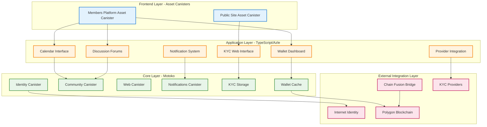
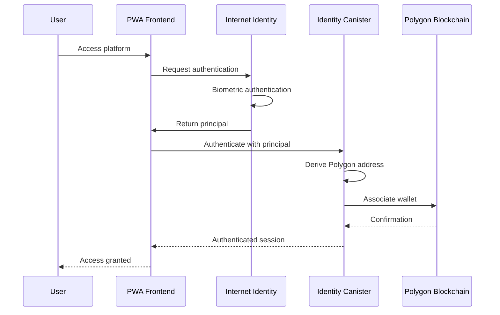
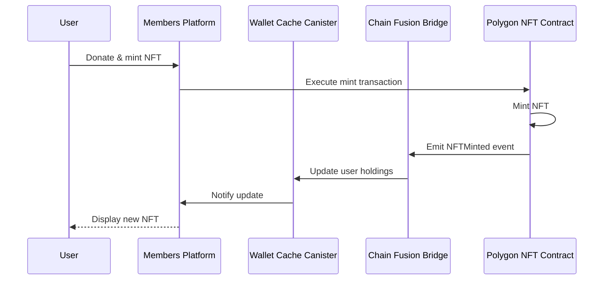

# CPP System Architecture Overview

**Date:** 2025-11-13
**Purpose:** Comprehensive overview of Cool Planet Platform architecture across all repos/microservices
**Context:** Multi-repository platform with ICP orchestration, Ethereum/Polygon integration, and distributed governance
**Scope:** System architecture, connections, bootstrap, security, and key governance

## Executive Summary

The Cool Planet Platform (CPP) is a **distributed hybrid architecture** combining Internet Computer (IC) orchestration with Ethereum/Polygon standards compliance. The platform spans multiple repositories and microservices, unified by common identity derivation origins and distributed key governance.

**Key Architecture Decisions:**
- **Derivation Origin Strategy**: Single domain approach using path-based routing for same-origin authentication (see [origins.md](./origins.md))
- **Key Governance**: Multi-sig ENS domain control for cpf.nft as the canonical derivation origin
- **Canister Architecture**: Asset canisters for SSL + Motoko/Azle backend canisters for business logic
- **Cross-Chain Integration**: Chain Fusion bridge for ICP-Polygon coordination
- **Security Model**: Externalized secrets with comprehensive open source transparency

## Repository & Microservice Architecture

### **1. Core Repositories**

```
CPP Ecosystem
├── cpf_org/                   # Public marketing website (to be renamed cpf_nft)
│   ├── Framework: SvelteKit with static adapter
│   ├── Domain: coolplanet-foundation.org
│   ├── Canister: IC assets canister
│   └── Purpose: Public site, join page, donation entry point
│
├── fti_newsletter_archive/    # Newsletter system (where ICP groundwork was established)
│   ├── Frontend: React + TypeScript, Rust canister for dynamic images
│   ├── Backend: Motoko with RBAC system
│   ├── Domain: newsletters.coolplanet-foundation.org
│   ├── Purpose: Newsletter archive, blog comments, user profiles (Gravatar)
│   └── Features: CPF ID (II based) for read, Gravatar profile for write
│
├── cpf_members/               # Member portal & donation workflows
│   ├── Frontend: Svelte PWA + Stripe widgets
│   ├── Backend: Motoko for business logic
│   ├── Payment Bridge: Rust canister with HMAC-SHA256 webhook verification
│   ├── Domain: members.coolplanet-foundation.org
│   ├── Purpose: Membership, donations, payment processing
│   └── Integration: Cross-canister with newsletter for Gravatar profiles
│
├── network_privacy/           # Contact & privacy management (outside CPP proper)
│   ├── Purpose: FTI network contacts, KYC coordination
│   ├── Classifications: F/R/I/P/A/T/C_XXXX with graduated consent
│   ├── Integration: MailerLite, Einstein DID KYC, Cloudflare storage
│   └── Use Case: Managing people outside CPP who we want to bring in
│
├── cpp_icp_platform/          # ICP orchestration architecture (this repo)
│   ├── Platform services
│   ├── Community features
│   ├── Authentication
│   └── Architecture documentation
│
└── einstein_solidity/         # Ethereum/Polygon integration
    ├── ERC721 contracts
    ├── DID registry
    ├── Chain Fusion bridge (Ethereum-side)
    └── JavaScript/TypeScript SDK
```

**Repository Relationships:**
- **cpf_org** → Entry point for anonymous users, links to cpf_members for donations
- **fti_newsletter_archive** → User identity foundation (CPF ID + Gravatar profiles)
- **cpf_members** → Handles donations, KYC, payment processing
- **network_privacy** → Pre-CPP contact management, KYC coordination
- **cpp_icp_platform** → Overall architecture coordination and planning
- **einstein_solidity** → NFT minting, DID registry, blockchain integration

### **2. ICP Canister Architecture (cpp_icp_platform)**



**Canister Manifest (dfx.json):**
```json
{
  "canisters": {
    "notifications": {
      "type": "motoko",
      "main": "canisters/notifications/main.mo"
    },
    "identity": {
      "type": "motoko",
      "main": "canisters/identity/main.mo"
    },
    "community": {
      "type": "motoko",
      "main": "canisters/community/main.mo"
    },
    "web": {
      "type": "motoko",
      "main": "canisters/web/main.mo"
    }
  }
}
```

### **3. Ethereum/Polygon Architecture (einstein_solidity)**

```
einstein_solidity/
├── contracts/
│   ├── NFT.sol                    # ERC721 implementation
│   ├── DIDRegistry.sol            # W3C DID registry
│   ├── BundleSponsorship.sol      # Bundle holder logic
│   └── ChainFusionBridge.sol      # Ethereum-side bridge
├── sdk/
│   ├── js/                        # JavaScript SDK
│   └── ts/                        # TypeScript SDK
└── scripts/
    └── deploy/                    # Deployment automation
```

## Cross-Repository Integration Points

### **1. Chain Fusion Bridge**

The Chain Fusion bridge coordinates between ICP and Ethereum/Polygon:

**ICP Side (cpp_icp_platform):**
```motoko
// In bridge canister
actor ChainFusionBridge {
    // Monitor Polygon events
    public func syncNFTMint(tokenId: Nat, owner: Text) : async Result<(), Text> {
        // Update wallet cache
        await WalletCache.updateHoldings(owner, tokenId);
        // Trigger notifications
        await Notifications.notifyMint(owner, tokenId);
    };
}
```

**Polygon Side (einstein_solidity):**
```solidity
// In ChainFusionBridge.sol
contract ChainFusionBridge {
    event NFTMinted(uint256 indexed tokenId, address indexed owner);

    // IC bridge monitors this event
    function notifyICPBridge(uint256 tokenId, address owner) external {
        emit NFTMinted(tokenId, owner);
        // ICP bridge picks this up via chain-key integration
    }
}
```

### **2. Identity & Authentication Flow**



### **3. NFT Minting & Wallet Cache Update**



## Domain & Derivation Origin Strategy

### **Critical Decision: Single Domain Approach**

Based on the analysis in [origins.md](./origins.md), CPP uses a **single domain approach** with path-based routing to ensure:
- Same-origin authentication for all canisters
- Shared Internet Identity delegation
- No CORS complexity
- Simplified security model

**Domain Architecture:**

```
coolplanet-foundation.org (PRIMARY DOMAIN)
├── /                              → Public Site Asset Canister
├── /members/                      → Members Platform Asset Canister
├── /api/                          → Backend Canister APIs
└── /.well-known/
    ├── ic-domains                 → "coolplanet-foundation.org"
    └── ii-alternative-origins     → Alternative domains (if needed)

cpf.nft (ENS MIRROR - Canonical Derivation Origin)
├── Same structure as coolplanet-foundation.org
├── Provides ICANN independence
└── Controlled by multi-sig governance
```

**Derivation Origin Configuration:**

```typescript
// AuthClient configuration
const auth = await AuthClient.create();
await auth.login({
  identityProvider: "https://identity.ic0.app",
  derivationOrigin: "https://cpf.nft" // Canonical derivation origin
});
```

**Alternative Origins (if using subdomains):**

If the architecture evolves to use subdomains, configure alternative origins:

```
# Served from https://cpf.nft/.well-known/ii-alternative-origins
https://coolplanet-foundation.org
https://members.coolplanet-foundation.org
https://api.coolplanet-foundation.org
```

### **Why cpf.nft as Derivation Origin?**

1. **ICANN Independence**: ENS domain not subject to ICANN control
2. **Decentralized Governance**: Controlled by DAO multi-sig
3. **Permanent Canonical Identity**: Cannot be revoked by traditional authorities
4. **Brand Alignment**: "Cool Planet Foundation" (.cpf)
5. **NFT Ecosystem Integration**: Natural fit for NFT-based platform

## Key Governance & Critical Infrastructure

### **1. ENS Domain Management (cpf.nft)**

**Threat Model:**
- **Single Point of Failure**: Loss of ENS domain = loss of all user identities
- **Key Compromise**: Unauthorized transfer could break entire platform
- **Regulatory Seizure**: Traditional domain registrars subject to government control
- **Operational Continuity**: Domain management must survive organizational changes

**Multi-Sig Governance Architecture:**

```
cpf.nft ENS Domain
├── Owner: Gnosis Safe Multi-Sig (3-of-5)
│   ├── Signer 1: Foundation Board Member
│   ├── Signer 2: Technical Lead
│   ├── Signer 3: Community Representative
│   ├── Signer 4: Legal Counsel
│   └── Signer 5: Security Auditor
│
├── Subdomain Management
│   ├── members.cpf.nft → Members platform
│   ├── cpp1.members.cpf.nft → NFT bundle 1
│   ├── cpp2.members.cpf.nft → NFT bundle 2
│   └── ... (up to 2.9M bundle subdomains)
│
└── DNS Records
    ├── TXT _canister-id → ICP canister IDs
    └── CNAME → ICP boundary nodes
```

**Gnosis Safe Configuration:**
```solidity
// Multi-sig contract for cpf.nft management
address[] memory owners = [
    0x..., // Foundation Board
    0x..., // Technical Lead
    0x..., // Community Rep
    0x..., // Legal Counsel
    0x...  // Security Auditor
];
uint256 threshold = 3; // 3-of-5 required

GnosisSafe cpfDomainController = new GnosisSafe(owners, threshold);
```

### **2. ICP Canister Controller Management**

**Threat Model:**
- **Canister Upgrade Authority**: Compromised controller can deploy malicious code
- **Data Access**: Controller can read canister stable storage
- **Service Disruption**: Controller can stop/delete canisters
- **Regulatory Compliance**: Swiss jurisdiction for data sovereignty

**Controller Architecture:**

```
Canister Controllers (Hierarchical)
├── Root Controller: Foundation Multi-Sig (NNS-based)
│   ├── Can upgrade all canisters
│   ├── Can add/remove sub-controllers
│   └── Requires 3-of-5 signatures
│
├── Operations Controller: CI/CD System
│   ├── Can deploy routine updates
│   ├── Limited to pre-approved changes
│   └── Monitored by root controller
│
└── Emergency Controller: Incident Response Team
    ├── Can pause/resume canisters
    ├── Can trigger emergency procedures
    └── All actions logged and audited
```

**NNS-Based Multi-Sig:**
```bash
# Root controller is an NNS-based multi-sig
dfx canister --network ic update-settings \
  --add-controller <multi-sig-principal> \
  <canister-name>
```

### **3. Secrets & Encryption Key Management**

**Threat Model:**
- **Key Compromise**: Loss of encryption keys = data breach
- **Key Loss**: Lost keys = permanent data loss
- **Insider Threats**: Malicious or negligent key access
- **Regulatory Access**: Lawful access requirements

**Key Management Architecture:**

```
Key Hierarchy
├── Master Key: Hardware Security Module (HSM)
│   ├── Stored: AWS KMS / Azure Key Vault
│   ├── Access: 3-of-5 multi-sig required
│   └── Used for: Deriving all other keys
│
├── Data Encryption Keys (DEKs)
│   ├── Per-Service Keys: Rotated monthly
│   ├── Derived from Master Key
│   └── Stored: Environment variables (encrypted)
│
├── API Keys & Service Credentials
│   ├── External Provider Keys: KYC, IPFS, Modal
│   ├── Rotation: 90-day cycle
│   └── Stored: Secret management service
│
└── User Wallet Keys
    ├── Derived from Internet Identity
    ├── Chain-key cryptography
    └── Never directly stored
```

**Secret Distribution:**

```bash
# Environment variable template
# CRITICAL: These are NOT committed to git

# Master Encryption
MASTER_ENCRYPTION_KEY=<HSM-derived>

# Data Encryption (rotated monthly)
DATA_ENCRYPTION_KEY=<monthly-rotation>
KYC_ENCRYPTION_KEY=<monthly-rotation>
WALLET_ENCRYPTION_KEY=<monthly-rotation>

# Chain Integration
POLYGON_SECRET_KEY=<chain-key-derived>
IC_CHAIN_KEY_SECRET=<canister-derived>

# External Services (rotated quarterly)
MODAL_API_KEY=<provider-key>
LIGHTHOUSE_API_KEY=<provider-key>
JUMIO_API_SECRET=<provider-key>
ONFIDO_API_TOKEN=<provider-key>

# Infrastructure
INTERNET_IDENTITY_SECRET=<ii-integration>
TRANSACTION_SIGNING_KEY=<hardware-backed>
```

### **4. DNS & TLS Certificate Management**

**Threat Model:**
- **Domain Hijacking**: DNS compromise could redirect users
- **Certificate Expiry**: Expired certs break HTTPS access
- **Man-in-the-Middle**: Invalid certs enable MITM attacks
- **Subdomain Takeover**: Dangling DNS records

**DNS Architecture:**

```
DNS Management
├── Primary Domain: coolplanet-foundation.org
│   ├── Registrar: [Swiss-based registrar]
│   ├── DNS Provider: ICP Boundary Nodes
│   └── DNSSEC: Enabled
│
├── ENS Domain: cpf.nft
│   ├── Registry: Ethereum ENS
│   ├── Controller: Multi-sig contract
│   └── Records: Pointing to IC canisters
│
└── Certificate Management
    ├── Provider: IC Boundary Nodes (automatic)
    ├── Type: Let's Encrypt via .well-known/ic-domains
    └── Renewal: Automatic via IC infrastructure
```

**TLS Configuration:**

```bash
# .well-known/ic-domains file in asset canister
echo "coolplanet-foundation.org" > public/.well-known/ic-domains
echo "cpf.nft" >> public/.well-known/ic-domains

# DNS TXT records (automatic SSL provisioning)
# coolplanet-foundation.org TXT "icp-canister=<FRONTEND_CANISTER_ID>"
# _canister-id.coolplanet-foundation.org TXT "<FRONTEND_CANISTER_ID>"
```

## Bootstrap & Deployment Process

### **1. Initial Platform Bootstrap**

**Prerequisites:**
- [ ] ENS domain cpf.nft registered and controlled by multi-sig
- [ ] Traditional domain coolplanet-foundation.org registered
- [ ] ICP cycles wallet funded for canister deployment
- [ ] Gnosis Safe multi-sig deployed and configured
- [ ] Secrets management infrastructure deployed (HSM/KMS)

**Bootstrap Sequence:**

```bash
# Step 1: Deploy core identity infrastructure
dfx canister create identity --network ic
dfx canister create notifications --network ic
dfx canister create community --network ic
dfx canister create web --network ic

# Step 2: Configure multi-sig controllers
dfx canister update-settings identity \
  --add-controller <multi-sig-principal> \
  --network ic

# Step 3: Deploy frontend asset canisters
dfx canister create public-site --network ic --type assets
dfx canister create members-platform --network ic --type assets

# Step 4: Configure DNS for custom domains
# Manual: Add TXT records to DNS provider
# _canister-id.coolplanet-foundation.org TXT "<PUBLIC_SITE_CANISTER_ID>"

# Step 5: Register custom domains with IC
curl -X POST "https://icp0.io/custom-domains/v1/coolplanet-foundation.org" \
  -H "Content-Type: application/json" \
  -d '{"canister_id": "<PUBLIC_SITE_CANISTER_ID>"}'

# Step 6: Deploy initial code
dfx deploy --network ic

# Step 7: Verify SSL certificates
curl -I "https://coolplanet-foundation.org/.well-known/ic-domains"
# Should return 200 OK with valid SSL certificate

# Step 8: Configure Internet Identity derivation origin
# Set derivationOrigin to "https://cpf.nft" in all auth clients
```

### **2. Continuous Deployment Pipeline**

```yaml
# .github/workflows/deploy.yml
name: Deploy to IC Mainnet

on:
  push:
    branches: [main]

jobs:
  deploy:
    runs-on: ubuntu-latest
    steps:
      - uses: actions/checkout@v3

      # Load secrets from GitHub Secrets (encrypted)
      - name: Configure secrets
        run: |
          echo "${{ secrets.DFX_IDENTITY }}" > ~/.config/dfx/identity/default/identity.pem

      # Deploy canisters
      - name: Deploy to IC
        run: |
          dfx deploy --network ic

      # Verify deployment
      - name: Verify deployment
        run: |
          curl -I "https://coolplanet-foundation.org"
          # Should return 200 OK
```

### **3. Disaster Recovery Bootstrap**

**Scenario: Complete Infrastructure Loss**

```bash
# Emergency Recovery Procedure

# Step 1: Restore from backup principals
# Use multi-sig to regain canister control
dfx canister update-settings <canister-id> \
  --add-controller <recovery-principal> \
  --network ic

# Step 2: Restore DNS configuration
# Point DNS back to IC boundary nodes
# TXT records from backup documentation

# Step 3: Re-register custom domains
# Re-submit domain registration to IC
curl -X POST "https://icp0.io/custom-domains/v1/coolplanet-foundation.org"

# Step 4: Restore secrets from HSM backup
# Load secrets from hardware security module
# Decrypt using recovery keys (3-of-5 multi-sig)

# Step 5: Verify platform functionality
# Test authentication flows
# Test NFT minting
# Test wallet cache sync
```

## Security Architecture by Threat Vector

### **1. Identity & Authentication Threats**

| Threat | Mitigation | Detection | Response |
|--------|-----------|-----------|----------|
| **Internet Identity Compromise** | Biometric auth, device-based keys | Monitor auth patterns | Revoke sessions, require re-auth |
| **Session Hijacking** | Short-lived tokens, HTTPS only | Anomalous IP/device patterns | Terminate session, alert user |
| **Phishing Attacks** | Domain verification, user education | Monitor domain typosquatting | Takedown requests, user warnings |
| **Sybil Attacks** | KYC verification, cost barriers | Pattern analysis of new accounts | Rate limiting, manual review |

**Implementation:**

```typescript
// Identity Canister - Session Management
actor Identity {
    // Short-lived sessions (2 hours)
    stable var sessions: HashMap<Principal, Session> = HashMap.init();

    public shared(msg) func authenticate(): async Result<SessionToken, Text> {
        let principal = msg.caller;

        // Verify Internet Identity delegation
        if (not await verifyIIDelegation(principal)) {
            return #err("Invalid Internet Identity delegation");
        };

        // Check for suspicious patterns
        if (await detectAnomalousAuth(principal)) {
            await logSecurityEvent("Suspicious auth pattern", principal);
            return #err("Authentication blocked - security review required");
        };

        // Create session with 2-hour expiry
        let session = {
            principal = principal;
            createdAt = Time.now();
            expiresAt = Time.now() + 7200_000_000_000; // 2 hours
            deviceId = await getDeviceFingerprint();
        };

        sessions.put(principal, session);
        #ok(generateSessionToken(session))
    };
}
```

### **2. Financial & Transaction Threats**

| Threat | Mitigation | Detection | Response |
|--------|-----------|-----------|----------|
| **Unauthorized Transfers** | Multi-sig for large amounts, chain-key signing | Monitor transaction patterns | Pause wallet, investigate |
| **Smart Contract Exploits** | Audited contracts, upgrade controls | Contract event monitoring | Emergency pause, patch deploy |
| **Bridge Attacks** | Chain Fusion security, threshold signatures | Monitor bridge state inconsistencies | Halt bridge, manual reconciliation |
| **Wallet Draining** | Transaction limits, confirmation delays | Rapid withdrawal detection | Freeze account, contact user |

**Implementation:**

```motoko
// Wallet Cache Canister - Transaction Monitoring
actor WalletCache {
    // Monitor for suspicious transaction patterns
    public func monitorTransaction(
        userId: Principal,
        amount: Nat,
        recipient: Text
    ): async Result<(), Text> {
        // Check transaction velocity
        let recentTxs = await getUserRecentTransactions(userId, 3600); // Last hour
        let totalAmount = Array.foldLeft<Transaction, Nat>(
            recentTxs,
            0,
            func(acc, tx) { acc + tx.amount }
        );

        // Alert if exceeds hourly limit
        if (totalAmount + amount > HOURLY_LIMIT) {
            await triggerSecurityAlert({
                severity = "HIGH";
                userId = userId;
                reason = "Transaction velocity exceeded";
                amount = totalAmount + amount;
            });
            return #err("Transaction limit exceeded - security review required");
        };

        #ok()
    };
}
```

### **3. Data Privacy & GDPR Threats**

| Threat | Mitigation | Detection | Response |
|--------|-----------|-----------|----------|
| **Unauthorized Data Access** | Encryption, access controls | Access log monitoring | Revoke access, audit logs |
| **Data Breach** | Encryption at rest, selective encryption | Anomalous data queries | Rotate keys, notify users |
| **Right to be Forgotten Violation** | Key rotation for deletion | GDPR request tracking | Immediate key rotation, audit |
| **Cross-Border Data Transfer** | Swiss jurisdiction, local processing | Data flow monitoring | Restrict transfers, compliance review |

**Implementation:**

```motoko
// KYC Storage Canister - Right to be Forgotten
actor KYCStorage {
    // Encrypted KYC data with per-user encryption keys
    stable var kycData: HashMap<Principal, EncryptedKYCData> = HashMap.init();
    stable var encryptionKeys: HashMap<Principal, EncryptionKey> = HashMap.init();

    // Right to be Forgotten implementation
    public shared(msg) func deleteUserData(): async Result<(), Text> {
        let userId = msg.caller;

        // Verify user request
        if (not await verifyUserRequest(userId)) {
            return #err("Unauthorized deletion request");
        };

        // Rotate encryption key (makes data unrecoverable)
        await rotateEncryptionKey(userId);

        // Log deletion for compliance
        await logGDPREvent({
            event = "RightToBeForgotten";
            userId = userId;
            timestamp = Time.now();
            dataTypes = ["KYC", "Profile", "Transactions"];
        });

        // Remove from active data structures
        kycData.delete(userId);
        encryptionKeys.delete(userId);

        #ok()
    };
}
```

### **4. Infrastructure & Availability Threats**

| Threat | Mitigation | Detection | Response |
|--------|-----------|-----------|----------|
| **DDoS Attacks** | IC rate limiting, boundary node filtering | Traffic pattern analysis | Temporary rate limits, block IPs |
| **Canister Exhaustion** | Cycle monitoring, auto-refill | Cycle balance alerts | Top-up cycles, investigate usage |
| **DNS Hijacking** | DNSSEC, ENS backup | DNS record monitoring | Revert DNS, use ENS fallback |
| **Certificate Expiry** | IC auto-renewal, monitoring | Certificate expiry alerts | Manual renewal if needed |

**Implementation:**

```motoko
// Canister Monitoring System
actor CanisterMonitor {
    // Monitor canister cycle balance
    public func monitorCycles(): async () {
        let balance = Cycles.balance();
        let threshold = 1_000_000_000_000; // 1T cycles

        if (balance < threshold) {
            await triggerAlert({
                severity = "CRITICAL";
                canister = "identity";
                message = "Low cycle balance: " # Nat.toText(balance);
                action = "Auto-refill initiated";
            });

            // Attempt auto-refill from reserve wallet
            await refillCycles();
        };
    };

    // Run monitoring every hour
    system func timer(setGlobalTimer : Nat64 -> ()) : async () {
        let next = Nat64.fromIntWrap(Time.now()) + 3_600_000_000_000; // 1 hour
        setGlobalTimer(next);
        await monitorCycles();
    };
}
```

### **5. Supply Chain & Dependency Threats**

| Threat | Mitigation | Detection | Response |
|--------|-----------|-----------|----------|
| **Compromised Dependencies** | Dependency pinning, hash verification | Automated security scans | Rollback, patch review |
| **Malicious Code Injection** | Code review, multi-sig deploys | PR review process, static analysis | Block deployment, investigate |
| **Build Pipeline Compromise** | Signed commits, protected branches | Build artifact verification | Audit pipeline, rotate keys |
| **Third-party Provider Breach** | Provider diversification, fallbacks | Provider health monitoring | Switch providers, incident response |

**Implementation:**

```json
// package.json - Dependency Pinning
{
  "dependencies": {
    "@dfinity/agent": "0.19.0",  // Exact version, not ^0.19.0
    "@dfinity/candid": "0.19.0",
    "@dfinity/principal": "0.19.0"
  },
  "resolutions": {
    // Force specific versions for transitive dependencies
    "lodash": "4.17.21"
  }
}
```

```bash
# .github/workflows/security.yml
name: Security Scan

on: [pull_request]

jobs:
  security:
    runs-on: ubuntu-latest
    steps:
      - uses: actions/checkout@v3

      # Dependency vulnerability scanning
      - name: Run npm audit
        run: npm audit --audit-level=high

      # Static code analysis
      - name: Run Snyk scan
        run: npx snyk test

      # Check for known malicious packages
      - name: Check dependencies
        run: npx @socketsecurity/cli scan
```

## Monitoring & Incident Response

### **1. Security Monitoring Dashboard**

```
Real-Time Monitoring
├── Authentication Events
│   ├── Failed login attempts (>5/hour = alert)
│   ├── New device authentications
│   └── Geographic anomalies
│
├── Financial Transactions
│   ├── Large transfers (>$10k)
│   ├── Rapid withdrawals
│   └── Smart contract interactions
│
├── Infrastructure Health
│   ├── Canister cycle balances
│   ├── Certificate expiry dates
│   └── DNS record integrity
│
└── Data Access Patterns
    ├── KYC data queries
    ├── Encryption key usage
    └── GDPR deletion requests
```

### **2. Incident Response Runbook**

**Incident Severity Levels:**

| Level | Criteria | Response Time | Escalation |
|-------|----------|---------------|------------|
| **P0 - Critical** | Platform down, data breach, key compromise | < 15 minutes | All hands, external audit |
| **P1 - High** | Service degradation, security vulnerability | < 1 hour | Security team, stakeholder notification |
| **P2 - Medium** | Non-critical bug, performance issue | < 24 hours | Engineering team |
| **P3 - Low** | Minor issue, enhancement | < 1 week | Normal development cycle |

**P0 Incident Response:**

```bash
# Immediate Actions (< 15 minutes)

# 1. Assess situation
echo "INCIDENT DETECTED"
echo "Time: $(date)"
echo "Type: [DATA_BREACH|KEY_COMPROMISE|PLATFORM_DOWN]"

# 2. Pause affected systems
dfx canister stop <affected-canister> --network ic

# 3. Alert multi-sig signers
# Send emergency notification to all 5 multi-sig holders

# 4. Begin incident log
cat > /tmp/incident-$(date +%s).log <<EOF
Incident Start: $(date)
Detected By: [AUTOMATED|MANUAL]
Initial Assessment: [DESCRIPTION]
EOF

# 5. Activate incident response team
# - Technical Lead
# - Security Auditor
# - Legal Counsel
# - Communications Lead

# Investigation Phase (< 1 hour)

# 6. Capture evidence
dfx canister logs <affected-canister> --network ic > /tmp/canister-logs.txt

# 7. Assess scope
# - Number of users affected
# - Data accessed/compromised
# - Financial impact

# 8. Determine root cause
# - Code vulnerability?
# - Key compromise?
# - Infrastructure issue?

# Containment Phase (< 2 hours)

# 9. Rotate compromised secrets
# Execute key rotation procedures

# 10. Deploy emergency patches
dfx deploy --network ic

# 11. Notify affected users
# Email/notification to all impacted users

# Recovery Phase (< 24 hours)

# 12. Restore normal operations
dfx canister start <affected-canister> --network ic

# 13. Verify system integrity
# Run comprehensive security audit

# 14. Post-incident review
# Document lessons learned
# Update security procedures
```

## Cross-Repository Development Workflow

### **1. Local Development Setup**

```bash
# Clone all repositories
git clone https://github.com/coolplanet/cpp_icp_platform.git
git clone https://github.com/coolplanet/einstein_solidity.git

# Setup ICP development environment
cd cpp_icp_platform
dfx start --background
npm install
dfx deploy

# Setup Ethereum development environment
cd ../einstein_solidity
npm install
npx hardhat node  # Local Ethereum node
npx hardhat deploy --network localhost

# Configure cross-chain communication
# ICP canisters point to local Hardhat node
# Hardhat contracts emit events for local ICP bridge
```

### **2. Integration Testing**

```bash
# Run cross-chain integration tests
cd cpp_icp_platform

# Test 1: NFT mint -> ICP wallet cache update
npm run test:integration -- --test="nft-minting"

# Test 2: Internet Identity -> Polygon wallet derivation
npm run test:integration -- --test="identity-wallet-derivation"

# Test 3: Chain Fusion bridge event sync
npm run test:integration -- --test="bridge-sync"

# Test 4: End-to-end user flow
npm run test:e2e -- --test="complete-user-journey"
```

## Conclusion & Next Steps

This architecture provides a **comprehensive, secure, and scalable foundation** for the Cool Planet Platform. Key strengths:

1. **Distributed Governance**: Multi-sig control prevents single points of failure
2. **Defense in Depth**: Multiple security layers across all threat vectors
3. **ICANN Independence**: ENS-based derivation origin ensures censorship resistance
4. **Operational Resilience**: Clear bootstrap and disaster recovery procedures
5. **Regulatory Compliance**: Swiss jurisdiction with GDPR/KYC compliance built-in

**Immediate Next Steps:**

- [ ] Deploy Gnosis Safe multi-sig for cpf.nft domain
- [ ] Register cpf.nft ENS domain
- [ ] Configure DNS for coolplanet-foundation.org
- [ ] Bootstrap ICP canisters with multi-sig controllers
- [ ] Deploy secrets management infrastructure (HSM/KMS)
- [ ] Implement monitoring and alerting systems
- [ ] Document operational runbooks
- [ ] Conduct security audit of critical paths
- [ ] Test disaster recovery procedures
- [ ] Train incident response team

**Related Documentation:**
- [origins.md](./origins.md) - Detailed derivation origin analysis
- [security.md](./security.md) - Security architecture details
- [frontend-technology-evaluation.md](./frontend-technology-evaluation.md) - Frontend architecture
- [README.md](./README.md) - Main architecture hub

---

**Last Updated:** 2025-11-13
**Version:** 1.0.0
**Status:** Active Development
**Review Cycle:** Monthly security audit
