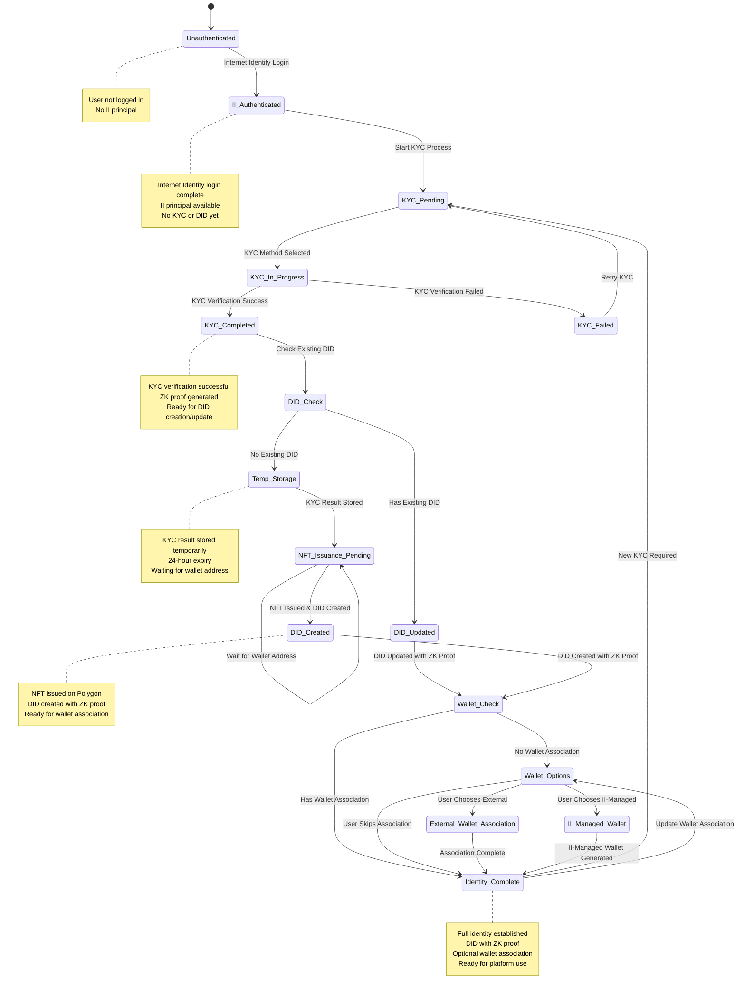

# User Identity State Management

## Overview

This document outlines the **user identity state management** for the Cool Planet Platform (CPP), including state transitions, event handling, and lifecycle management.

## User Identity State Diagram

The user identity progresses through various states during the KYC and wallet association process:



## State Transitions and Triggers

```typescript
// User identity state management
interface UserIdentityState {
  state: UserIdentityStateType;
  ii_principal?: string;
  did?: string;
  kyc_status?: KYCStatus;
  wallet_association?: WalletAssociationStatus;
  temp_kyc_session?: string;
  last_updated: number;
}

enum UserIdentityStateType {
  UNAUTHENTICATED = 'UNAUTHENTICATED',
  II_AUTHENTICATED = 'II_AUTHENTICATED',
  KYC_PENDING = 'KYC_PENDING',
  KYC_IN_PROGRESS = 'KYC_IN_PROGRESS',
  KYC_COMPLETED = 'KYC_COMPLETED',
  KYC_FAILED = 'KYC_FAILED',
  DID_CHECK = 'DID_CHECK',
  TEMP_STORAGE = 'TEMP_STORAGE',
  NFT_ISSUANCE_PENDING = 'NFT_ISSUANCE_PENDING',
  DID_CREATED = 'DID_CREATED',
  DID_UPDATED = 'DID_UPDATED',
  WALLET_CHECK = 'WALLET_CHECK',
  WALLET_OPTIONS = 'WALLET_OPTIONS',
  EXTERNAL_WALLET_ASSOCIATION = 'EXTERNAL_WALLET_ASSOCIATION',
  II_MANAGED_WALLET = 'II_MANAGED_WALLET',
  IDENTITY_COMPLETE = 'IDENTITY_COMPLETE'
}

// State transition manager
class UserIdentityStateManager {
  public async transitionState(
    currentState: UserIdentityState,
    event: IdentityEvent
  ): Promise<UserIdentityState> {
    const newState = await this.calculateNewState(currentState, event);
    await this.validateTransition(currentState.state, newState.state);
    await this.executeStateActions(newState, event);
    return newState;
  }

  private async calculateNewState(
    currentState: UserIdentityState,
    event: IdentityEvent
  ): Promise<UserIdentityState> {
    switch (currentState.state) {
      case UserIdentityStateType.UNAUTHENTICATED:
        if (event.type === 'II_LOGIN') {
          return {
            ...currentState,
            state: UserIdentityStateType.II_AUTHENTICATED,
            ii_principal: event.ii_principal,
            last_updated: Date.now()
          };
        }
        break;

      case UserIdentityStateType.II_AUTHENTICATED:
        if (event.type === 'START_KYC') {
          return {
            ...currentState,
            state: UserIdentityStateType.KYC_PENDING,
            last_updated: Date.now()
          };
        }
        break;

      case UserIdentityStateType.KYC_PENDING:
        if (event.type === 'KYC_METHOD_SELECTED') {
          return {
            ...currentState,
            state: UserIdentityStateType.KYC_IN_PROGRESS,
            last_updated: Date.now()
          };
        }
        break;

      case UserIdentityStateType.KYC_IN_PROGRESS:
        if (event.type === 'KYC_SUCCESS') {
          return {
            ...currentState,
            state: UserIdentityStateType.KYC_COMPLETED,
            kyc_status: event.kyc_status,
            last_updated: Date.now()
          };
        } else if (event.type === 'KYC_FAILED') {
          return {
            ...currentState,
            state: UserIdentityStateType.KYC_FAILED,
            last_updated: Date.now()
          };
        }
        break;

      case UserIdentityStateType.KYC_COMPLETED:
        if (event.type === 'CHECK_DID') {
          const hasExistingDID = await this.checkExistingDID(currentState.ii_principal!);
          return {
            ...currentState,
            state: hasExistingDID ? UserIdentityStateType.DID_UPDATED : UserIdentityStateType.TEMP_STORAGE,
            did: hasExistingDID ? event.existing_did : undefined,
            temp_kyc_session: !hasExistingDID ? event.temp_session_id : undefined,
            last_updated: Date.now()
          };
        }
        break;

      case UserIdentityStateType.TEMP_STORAGE:
        if (event.type === 'WALLET_ADDRESS_PROVIDED') {
          return {
            ...currentState,
            state: UserIdentityStateType.NFT_ISSUANCE_PENDING,
            last_updated: Date.now()
          };
        }
        break;

      case UserIdentityStateType.NFT_ISSUANCE_PENDING:
        if (event.type === 'NFT_ISSUED') {
          return {
            ...currentState,
            state: UserIdentityStateType.DID_CREATED,
            did: event.did,
            temp_kyc_session: undefined, // Clear temp session
            last_updated: Date.now()
          };
        }
        break;

      case UserIdentityStateType.DID_CREATED:
      case UserIdentityStateType.DID_UPDATED:
        if (event.type === 'CHECK_WALLET') {
          const hasWalletAssociation = await this.checkWalletAssociation(currentState.ii_principal!);
          return {
            ...currentState,
            state: hasWalletAssociation ? UserIdentityStateType.IDENTITY_COMPLETE : UserIdentityStateType.WALLET_OPTIONS,
            last_updated: Date.now()
          };
        }
        break;

      case UserIdentityStateType.WALLET_OPTIONS:
        if (event.type === 'WALLET_CHOICE') {
          switch (event.choice) {
            case 'EXTERNAL_WALLET':
              return {
                ...currentState,
                state: UserIdentityStateType.EXTERNAL_WALLET_ASSOCIATION,
                last_updated: Date.now()
              };
            case 'II_MANAGED_WALLET':
              return {
                ...currentState,
                state: UserIdentityStateType.II_MANAGED_WALLET,
                last_updated: Date.now()
              };
            case 'SKIP':
              return {
                ...currentState,
                state: UserIdentityStateType.IDENTITY_COMPLETE,
                last_updated: Date.now()
              };
          }
        }
        break;

      case UserIdentityStateType.EXTERNAL_WALLET_ASSOCIATION:
      case UserIdentityStateType.II_MANAGED_WALLET:
        if (event.type === 'WALLET_ASSOCIATION_COMPLETE') {
          return {
            ...currentState,
            state: UserIdentityStateType.IDENTITY_COMPLETE,
            wallet_association: event.wallet_association,
            last_updated: Date.now()
          };
        }
        break;

      case UserIdentityStateType.IDENTITY_COMPLETE:
        if (event.type === 'NEW_KYC_REQUIRED') {
          return {
            ...currentState,
            state: UserIdentityStateType.KYC_PENDING,
            kyc_status: undefined,
            last_updated: Date.now()
          };
        } else if (event.type === 'UPDATE_WALLET') {
          return {
            ...currentState,
            state: UserIdentityStateType.WALLET_OPTIONS,
            wallet_association: undefined,
            last_updated: Date.now()
          };
        }
        break;
    }

    // Invalid transition
    throw new Error(`Invalid state transition from ${currentState.state} with event ${event.type}`);
  }

  private async validateTransition(
    fromState: UserIdentityStateType,
    toState: UserIdentityStateType
  ): Promise<void> {
    const validTransitions = this.getValidTransitions();
    const transition = `${fromState} -> ${toState}`;
    
    if (!validTransitions.includes(transition)) {
      throw new Error(`Invalid state transition: ${transition}`);
    }
  }

  private async executeStateActions(
    newState: UserIdentityState,
    event: IdentityEvent
  ): Promise<void> {
    // Execute actions based on new state
    switch (newState.state) {
      case UserIdentityStateType.TEMP_STORAGE:
        await this.storeTemporaryKYC(newState.temp_kyc_session!, event.kyc_result);
        break;
      case UserIdentityStateType.DID_CREATED:
        await this.cleanupTemporaryKYC(newState.temp_kyc_session!);
        break;
      case UserIdentityStateType.IDENTITY_COMPLETE:
        await this.notifyIdentityComplete(newState);
        break;
    }
  }
}
```

## Implementation Timeline

### **Phase 1: State Management Foundation**
- [ ] Implement state transition logic
- [ ] Create state validation system
- [ ] Add state action execution
- [ ] Implement state persistence

### **Phase 2: Event Integration**
- [ ] Integrate with KYC flow events
- [ ] Add wallet association events
- [ ] Implement DID creation events
- [ ] Create state recovery mechanisms

### **Phase 3: Advanced Features**
- [ ] Add state analytics and monitoring
- [ ] Implement state rollback capabilities
- [ ] Create state migration tools
- [ ] Add comprehensive error handling

## Integration with Other Components

### **Cross-References**
- **[Identity Verification](identity-verification.md)**: KYC flow integration
- **[Wallet Association](wallet-association.md)**: Wallet association integration
- **[Core User Management](kyc.md)**: State persistence and management

### **Data Flow**
1. **Frontend** triggers state transitions via events
2. **State Manager** validates and executes transitions
3. **Core User Management** persists state changes
4. **Frontend** receives state updates and UI changes 