# CPP User Journey Funnel: Progressive Authentication & Access Gates

**Date:** 2025-11-13
**Audience:** Technical readers (developers, architects)
**Purpose:** Define the progressive user journey through CPP platform with authentication gates
**Context:** Maps user progression from anonymous visitor to full community member
**Cross-Reference:** See [origins.md](./origins.md) for derivation origin strategy

**For Board Members:** See [board-introduction.md](./board-introduction.md) for a plain-language version of the user journey and decision points.

## Executive Summary

The CPP platform uses a **progressive disclosure and authentication funnel** where users gradually gain access to deeper platform features as they pass through authentication and verification gates. Each gate requires specific credentials or actions, building trust and engagement progressively.

**Key Principle:** *Minimum friction for discovery, progressive authentication for deeper engagement*

**Color Coding - Progressive User Investment:**
- 🟢 **Light Green:** Minimal investment (analytics consent)
- 🔵 **Blue:** Email commitment
- 🟣 **Purple:** Identity verification (Internet Identity + Gravatar)
- 🟠 **Orange:** Financial investment (donations with KYC)
- 🔴 **Red:** Ownership commitment (NFT holder)
- ⚫ **Dark:** Full platform engagement

**Content Visibility:**
- 🌐 **SEO (Public):** Websites, Blogs, Newsletters - discoverable via search engines, no login required
- 📱 **Cool Planet App (Gated):** Requires Internet Identity - not indexed by search engines

## Funnel Overview

**Progressive User Investment Unlocks Progressive Content Access:**

```mermaid
%%{init: {'theme':'base', 'themeVariables': { 'edgeLabelBackground':'#ffffff', 'primaryColor':'#ffffff'}}}%%
graph TB
    subgraph Public["🌐 Public Content (SEO-indexed)"]
        AC["Analytics Consent"]
        W["Websites"]
        EA["Email Address"]
        N["Newsletter(s)"]

        subgraph App["📱 Cool Planet App (Requires Internet Identity)"]
            II["Internet Identity"]
            FB["Feedback<br/>(private to Authors)"]
            CAM["Camino (self-pace)"]

            subgraph Members["👥 Members (Donors & NFT Holders)"]
                KYC["KYC/AML Verification<br/>>$1K: KYC, >$15K: Enhanced"]
                D["CPF Donations"]
                WEB["Webinars + replays"]
                WO["Wallet Connection<br/>(optional: IC-derived)"]
                NFT["NFT"]
                CTM["Climbing the Mountain"]

                subgraph BA["✍️ Budding Authors (Content Contributors)"]
                    GRAV["+ Gravatar Profile"]
                    COM["Comments<br/>(public/visible to community)"]
                    COMP["Camino Completion"]
                    GDF["Gated Discussion Forums"]
                    FPA["Full Platform Access"]
                end
            end
        end
    end

    %% Flow cascade
    AC --> W
    W --> N
    EA --> N

    N --> II
    II --> FB
    II --> CAM

    II --> D
    KYC --> D
    D --> WEB

    D --> NFT
    WO --> NFT
    NFT --> CTM

    NFT --> GRAV
    GRAV --> COM
    CTM --> COMP
    COMP --> GDF
    GDF --> FPA

    %% Color coding by progressive investment
    style AC fill:#90EE90,stroke:#2d5016,color:#000
    style W fill:#90EE90,stroke:#2d5016,color:#000
    style EA fill:#87CEEB,stroke:#104e8b,color:#000
    style N fill:#87CEEB,stroke:#104e8b,color:#000
    style II fill:#DDA0DD,stroke:#4b0082,color:#000
    style GRAV fill:#DDA0DD,stroke:#4b0082,color:#000
    style KYC fill:#FFB366,stroke:#8b4500,color:#000
    style D fill:#FFB366,stroke:#8b4500,color:#000
    style WO fill:#FF6B6B,stroke:#8b0000,color:#fff
    style NFT fill:#FF6B6B,stroke:#8b0000,color:#fff
    style COMP fill:#404040,stroke:#000,color:#fff
    style GDF fill:#404040,stroke:#000,color:#fff
    style FPA fill:#404040,stroke:#000,color:#fff

    %% Content/features unlocked (blue)
    style FB fill:#0088cc,stroke:#003d5c,color:#fff
    style CAM fill:#0088cc,stroke:#003d5c,color:#fff
    style COM fill:#0088cc,stroke:#003d5c,color:#fff
    style WEB fill:#0088cc,stroke:#003d5c,color:#fff
    style CTM fill:#0088cc,stroke:#003d5c,color:#fff

    %% Subgraph styling - same hue, different saturation
    style Public fill:#f0f8ff,stroke:#4da6ff,stroke-width:3px
    style App fill:#d9ecff,stroke:#3385ff,stroke-width:3px
    style Members fill:#b3d9ff,stroke:#0066ff,stroke-width:3px
    style BA fill:#80bfff,stroke:#0052cc,stroke-width:3px

    %% Black arrows
    linkStyle default stroke:#000,stroke-width:2px
```



**Architecture - Concentric Circles:**
- **🌐 Public Content** (outermost): Websites and Newsletters - SEO-indexed, no login required
- **📱 Cool Planet App** (requires Internet Identity): Feedback (private), Camino (learning)
- **👥 Members** (Donors & NFT Holders): Donations, Webinars, NFT, Advanced Camino
- **✍️ Budding Authors** (innermost): Content Contributors - Comments, Forums, Full Platform Access

**Progressive Investment Journey:**
- 🟢 **Level 1 (Minimal):** Analytics consent → Browse website (Public)
- 🔵 **Level 2 (Email):** Email address → Newsletters + Blogs (Public)
- 🟣 **Level 3 (Identity):** Internet Identity → Enter Cool Planet App (Feedback to Authors, Camino, Donations)
- 🟠 **Level 4 (Financial):** Donations with KYC → Enter Members area (Webinars, advanced content)
- 🔴 **Level 5 (Ownership):** NFT holder → Climbing the Mountain (advanced Camino modules)
- ⚫ **Level 6a (Content Contributor):** NFT holder adds Gravatar → Public Comments (become Budding Author)
- ⚫ **Level 6b (Full Engagement):** Complete Camino modules → Gated Forums, Full Platform Access

**Key Principles:**
- Greater user investment unlocks deeper access within the platform (concentric progression)
- One Cool Planet App with progressive feature unlocks (not separate portals)
- **Consumer vs Contributor paths:**
  - **Consumer path:** II → Feedback (private) → Donations → NFT → Advanced content
  - **Contributor path:** NFT holder → Gravatar → Comments → Forums → Full Platform Access
- **Feedback vs Comments:** II enables private feedback to Authors; NFT + Gravatar enables public community comments
- **SEO Boundary:** Public content is searchable; everything inside Cool Planet App is gated and not indexed

## Detailed Gate Progression

### 🟢 **Gate 1: Websites → Newsletter(s)** (Level 1: Minimal Investment)

**Repository:** `cpf_org` (coolplanet-foundation.org)
**User Investment:** Analytics consent
**Purpose:** Public discovery and information gathering
**Content Type:** SEO-discoverable

**User Flow:**
1. User visits `coolplanet-foundation.org` (served by cpf_org asset canister)
2. Analytics consent banner appears (GDPR compliance)
3. User can browse public content without account
4. Call-to-action: "Subscribe to Newsletter" button

**Data Collected:**
- Analytics: Page views, time on site, referrers (with consent)
- No personal information required
- No authentication needed

**Network Privacy Integration:**
- Anonymous visitors may be in `T_XXXX` (Thought Leaders) or `C_XXXX` (Collaboration Partners) classifications in network_privacy repo
- Public LinkedIn/social media monitoring for potential collaboration (legitimate interest, no consent needed)

---

### 🔵 **Gate 2: Newsletter(s) → Newsletter/Blog Comments (CPF)** (Level 2: Email Commitment)

**Repository:** `fti_newsletter_archive` (newsletters.coolplanet-foundation.org)
**User Investment:** Email address
**Purpose:** Newsletter delivery and basic engagement

🌐 **Public Content:** Newsletters and blogs (SEO-indexed, no login required)

**User Flow:**
1. User submits email on `coolplanet-foundation.org`
2. Redirected to `newsletters.coolplanet-foundation.org` for subscription confirmation
3. Email added to MailerLite (via network_privacy integration)
4. User receives newsletters but cannot comment yet

**Data Collected:**
- Email address (required)
- Newsletter preferences (which topics)
- Consent timestamp (GDPR compliance)

**Network Privacy Integration:**
- User transitions from anonymous to `R_XXXX` (Research Contributors) or remains unclassified
- Email stored in MailerLite with appropriate segment (FTI_Newsletter_Subscribers)
- Privacy: Explicit consent for email communications, no KYC required

---

### 🟣 **Gate 3: Newsletter(s) → Cool Planet App** (Level 3: Identity Commitment)

**Repository:** `fti_newsletter_archive` + `cpf_members` (Cool Planet App)
**User Investment:** Internet Identity (required)

**Purpose:** Enable authenticated engagement and learning

📱 **App-Gated Content Unlocked (requires Internet Identity, not SEO-indexed):**
- **Feedback** - Private input on Blogs/Newsletters/Camino (only Authors see it)
- **Camino** - Self-paced educational platform
- **Donations** - Ability to financially support the platform

**User Flow:**
1. User clicks "Sign In" on newsletter or blog
2. Redirected to Internet Identity for authentication
3. Returns with principal (CPF ID created automatically)
4. Can now provide private Feedback to Authors on content
5. Can access Camino educational content
6. Can make donations to support the platform

**Data Collected:**
- Internet Identity principal (CPF ID)
- Feedback content (private) and timestamps
- User permissions (RBAC: Viewer, Author, Editor, Admin, Superadmin)

**Network Privacy Integration:**
- User may upgrade to `C_XXXX` (Collaboration Partners) if actively providing feedback
- Professional consent for networking (if appropriate)
- No KYC required at this stage

---

### 🟠 **Gate 4: Cool Planet App → CPF Donations** (Level 4: Financial Commitment)

**Repository:** `cpf_members` (Cool Planet App)
**User Investment:**
- **Internet Identity** (required for donations)
- **Donation with KYC/AML compliance**
- >$1,000: KYC verification required
- >$15,000: Enhanced KYC/KYB required

**Purpose:** Financial compliance and donation processing

📱 **App-Gated Content Unlocked (not SEO-indexed):**
- Webinars + on-demand replays

**User Flow:**
1. User clicks "Donate" on `coolplanet-foundation.org`
2. Redirected to `members.coolplanet-foundation.org`
3. Authenticated with same CPF ID (derivation origin: cpf.nft)
4. Enters donation amount:
   - **< $1,000:** Basic info (name, address) via Stripe
   - **> $1,000:** Einstein DID KYC verification required
   - **> $15,000:** Enhanced KYC/KYB (business verification if applicable)
5. Payment processed via Stripe webhook to payment_bridge canister
6. Donation recorded in backend
7. NFT minting triggered on Polygon (if applicable)

**Data Collected:**
- **< $1,000:** Name, email, address (Stripe)
- **> $1,000:** Full KYC (Einstein DID): Identity verification, document upload
- **> $15,000:** Enhanced KYC/KYB: Business verification, beneficial ownership
- Payment details (encrypted in Cloudflare storage per network_privacy)
- Donation amount and NFT allocation

**Network Privacy Integration:**
- **< $1,000:** May remain `C_XXXX` (Collaboration Partners) or upgrade to `I_XXXX` (Investment Network)
- **> $1,000:** Must upgrade to `I_XXXX` (Investment Network) - KYC required
- **> $15,000:** Upgrade to `P_XXXX` (Cool Planet People) - Enhanced KYC required
- Cloudflare storage for KYC compliance data (7-10 year retention)
- MailerLite segment updated to reflect donor status

**Side Path: Private Discussion Forum Invitation**
- **Trigger:** Donation of any amount + active community participation
- **Action:** Invite subset of donors to private discussion forum
- **Requirement:** Same CPF ID + Gravatar, no additional authentication
- **Purpose:** Deeper engagement with committed community members

---

### 🔴 **Gate 5: NFT → Gated Discussion Forum(s)** (Level 5: Ownership Commitment)

**Repository:** `cpf_members` (Cool Planet App) + `cpp_icp_platform`
**User Investment:** NFT ownership (received via donation)
- Wallet connection optional (can use IC-derived Polygon address)

**Purpose:** NFT ownership verification and portfolio management

📱 **App-Gated Content Unlocked (not SEO-indexed):**
- Climbing the Mountain (advanced Camino modules)

**User Flow:**
1. User receives NFT after donation (minted on Polygon)
2. NFT visible in `members.coolplanet-foundation.org/portfolio`
3. Wallet options:
   - **Option A:** Use IC-derived Polygon address (automatic, no wallet needed)
   - **Option B:** Connect external wallet (WalletConnect) for advanced features
4. NFT ownership tracked in Wallet Cache canister
5. Can view portfolio, sponsorship patterns, and NFT metadata

**Data Collected:**
- NFT token IDs and metadata
- Polygon address (derived or external)
- Sponsorship patterns (if bundle holder)
- Portfolio analytics

**Network Privacy Integration:**
- User remains `I_XXXX` or `P_XXXX` depending on donation amount
- NFT ownership recorded in Cloudflare storage (audit trail)
- MailerLite segment: CPF_NFT_Holders

**Side Path: Full Camino Launch**
- **Trigger:** NFT ownership
- **Action:** Access to full Camino educational content platform
- **Benefit:** Can sponsor special NFTs to mentees (bundle holder feature)
- **Requirement:** NFT ownership verified, no additional authentication

---

### ⚫ **Gate 6: NFT → Budding Authors** (Level 6: Content Contributors)

**Repository:** `cpp_icp_platform` (community canisters) + `cpf_members` (Cool Planet App)
**User Investment:** NFT ownership + Gravatar Profile (for public contribution) + Camino completion (for full access)
**Purpose:** Become a content contributor and access full community engagement

📱 **App-Gated Content Unlocked (not SEO-indexed):**

**Level 6a - Adding Gravatar (Content Contributor):**
- **Public Comments** - Visible to community on Blogs/Newsletters/Camino
- Transition from consumer to contributor

**Level 6b - Camino Completion (Full Platform Access):**
- **Gated Discussion Forums** - Advanced community discussions
- **Full Platform Access** - All features, governance participation

**User Flow:**

**Level 6a - Becoming a Content Contributor:**
1. User is an NFT holder (Member)
2. User chooses to add Gravatar profile
3. Links Gravatar email to CPF ID
4. Can now write public Comments visible to entire community
5. Becomes a "Budding Author" (content contributor)

**Level 6b - Achieving Full Platform Access:**
1. User (Budding Author) completes Camino educational modules
2. Achievement NFTs unlocked (on-chain credentials)
3. Gains access to gated discussion forums (subset by bundle or achievement)
4. Can participate in governance (voting, proposals)
5. Full platform benefits (conference access, advanced features, etc.)

**Data Collected:**
- Gravatar email (for profile picture and public identity)
- Comment content (public) and timestamps
- Camino module progress and completions
- Achievement NFT ownership
- Forum participation and contributions
- Governance voting history

**Network Privacy Integration:**
- User fully transitioned to `P_XXXX` (Cool Planet People)
- Full profile with comprehensive engagement history
- MailerLite segment: CPF_Budding_Authors (Level 6a), CPF_Full_Members (Level 6b)
- Enhanced features and VIP access

## Cross-Repository Authentication Flow

### **Shared Derivation Origin: cpf.nft**

All repositories use the **same derivation origin** (`cpf.nft`) to ensure users have the **same Internet Identity principal** across all CPP services.

**Why This Matters:**
- User authenticates **once** with Internet Identity
- Same principal used across **all CPP services**
- Seamless transitions between repositories
- No separate logins for different domains
- Shared user profile and permissions

### **Domain Routing Strategy**

**Note: Routing decision pending** - Subdomain vs. path-based routing still under consideration.

Based on [architectural_decisions.md § OQ-001](./architectural_decisions.md) and [origins.md](./origins.md), the current architecture plan uses **subdomain-based routing with alternative origins** (subject to final decision):

**Potential Subdomain Approach:**
```
# User-Facing Domains
cpf.nft                                    → cpf_org (public site) [ENS domain]
newsletters.coolplanet-foundation.org      → fti_newsletter_archive
coolplanet-app.coolplanet-foundation.org   → cpf_members (Cool Planet App)
  OR
members.coolplanet-foundation.org          → cpf_members (Cool Planet App)

# Governance Domain (board voting and platform management)
governance.cpf.nft                            → governance_canister [ENS subdomain]
```

**Potential Path-Based Alternative:**
```
# User-Facing Domain
cpf.nft or coolplanet-foundation.org       → All content served from single domain
  /newsletters                             → fti_newsletter_archive
  /app or /members                         → cpf_members (Cool Planet App)

# Governance Domain (board voting and platform management)
governance.cpf.nft                            → governance_canister [ENS subdomain]
```

**Alternative Origins Configuration:**

All user-facing domains serve the same canisters and share Internet Identity principals via alternative origins configuration. This allows users to seamlessly access all CPP services with a single login across:
- cpf.nft
- newsletters.coolplanet-foundation.org
- members.coolplanet-foundation.org
- coolplanet-foundation.org

**Key Benefits:**
- Same Internet Identity principal across all user-facing domains
- Subdomain isolation for security (different canisters)
- ENS domain (cpf.nft) as canonical derivation origin
- Traditional .org domains for user familiarity

**See Also:**
- [canister-architecture-diagram.md § Production Migration](./canister-architecture-diagram.md) for Wix → ICP migration strategy
- [ens-dns-setup.md](./ens-dns-setup.md) for ENS/DNS configuration details

## Network Privacy Classification Progression

As users progress through the funnel, their **network_privacy classification** evolves:

| Funnel Stage | network_privacy Class | KYC Required | MailerLite Segment | Data Sensitivity |
|--------------|----------------------|--------------|-------------------|------------------|
| Website visitor | `T_XXXX` (Thought Leader) or unclassified | No | None | Minimal (public info) |
| Newsletter subscriber | `R_XXXX` (Research) or `C_XXXX` (Collab) | No | FTI_Newsletter_Subscribers | Low (email only) |
| Blog commenter | `C_XXXX` (Collaboration Partners) | No | FTI_Active_Community | Low-Medium (CPF ID + Gravatar) |
| Donor < $1K | `C_XXXX` or `I_XXXX` (Investment) | No | FTI_Donors_Basic | Medium (payment info) |
| Donor > $1K | `I_XXXX` (Investment Network) | **Yes** (Einstein DID) | FTI_Donors_KYC | High (KYC data) |
| Donor > $15K | `P_XXXX` (Cool Planet People) | **Yes** (Enhanced KYC/KYB) | FTI_Major_Donors | Very High (full KYC/KYB) |
| Full member | `P_XXXX` (Cool Planet People) | Yes (already completed) | FTI_Full_Members | Very High (comprehensive) |

## Privacy & Compliance Considerations

### **GDPR Compliance by Stage**

**Analytics Consent (Gate 1):**
- Legal Basis: Consent
- Retention: Until consent withdrawal
- Right to Deletion: Immediate (no personal data)

**Email Subscription (Gate 2):**
- Legal Basis: Explicit consent for marketing
- Retention: Until unsubscribe + audit period
- Right to Deletion: MailerLite deletion + network_privacy cleanup

**CPF ID & Comments (Gate 3):**
- Legal Basis: Contractual (service usage)
- Retention: Account lifecycle + required audit period
- Right to Deletion: Key rotation (makes data unrecoverable per [security.md](./security.md))

**Donations & KYC (Gate 4):**
- Legal Basis: Regulatory requirement (AML/KYC laws)
- Retention: 7-10 years (financial regulation compliance)
- Right to Deletion: Cannot delete (legal requirement), but encrypt and restrict access

**NFT & Community (Gates 5-6):**
- Legal Basis: Contractual (NFT ownership) + Explicit consent (community features)
- Retention: Blockchain immutable, community data deletable
- Right to Deletion: Community data via key rotation, blockchain data immutable (disclosed to user)

### **Cross-Border Data Transfers**

Per network_privacy architecture:
- **Cloudflare Storage:** Jurisdiction-aware data residency (EU, US, UK, CA, SG)
- **MailerLite:** Lithuania-based (EU GDPR compliant)
- **IC Canisters:** Swiss jurisdiction for data sovereignty
- **Polygon Blockchain:** Public blockchain (appropriate disclosures required)

## Implementation Checklist

**Note:** This checklist focuses on user-facing features. For governance deployment (board voting, platform management), see [canister-architecture-diagram.md § Bootstrap Sequence](./canister-architecture-diagram.md).

**Production Migration Strategy:** See [canister-architecture-diagram.md § Production Migration](./canister-architecture-diagram.md) for phased rollout plan including:
- Phase A: Subdomain Launch (newsletters.*, members.* on ICP)
- Phase B: Stripe Production Account Migration
- Phase C: Smart Contract Integration (CPF DID + 4T NFT)
- Phase D: Main Domain Cutover (Wix → ICP) with three milestone options

### **Phase 1: Foundation** (Weeks 1-8)
- [ ] Deploy cpf_org to `cpf.nft` (ENS domain)
- [ ] Configure Internet Identity with derivation origin `cpf.nft`
- [ ] Set up alternative origins for coolplanet-foundation.org
- [ ] Integrate fti_newsletter_archive for CPF ID + Gravatar
- [ ] Set up MailerLite integration via network_privacy
- [ ] Implement analytics consent (GDPR)
- [ ] Launch test.cpf.nft for beta testing

### **Phase 2: Donations & KYC** (Weeks 9-16)
- [ ] Deploy cpf_members to `members.coolplanet-foundation.org`
- [ ] Integrate Stripe webhooks via payment_bridge (Rust canister)
- [ ] Implement Einstein DID KYC for >$1K donations
- [ ] Configure Enhanced KYC/KYB for >$15K
- [ ] Set up Cloudflare storage for KYC compliance data

### **Phase 3: NFTs & Portfolio** (Weeks 17-24)
- [ ] Integrate Polygon NFT minting via Chain Fusion bridge
- [ ] Implement Wallet Cache for NFT holdings
- [ ] Build portfolio dashboard in cpf_members
- [ ] Enable IC-derived Polygon addresses (chain-key)
- [ ] Support external wallet connections (WalletConnect)

### **Phase 4: Community & Governance** (Weeks 25-32)
- [ ] Deploy Camino educational content platform
- [ ] Implement achievement NFT system
- [ ] Build gated discussion forums
- [ ] Integrate governance voting
- [ ] Launch full member benefits

## Related Documentation

**Architecture Overview:**
- [canister-architecture-diagram.md](./canister-architecture-diagram.md) - **CRITICAL** - System architecture, production migration strategy
- [architectural_decisions.md](./architectural_decisions.md) - Decision log including domain routing strategy (OQ-001)
- [system-architecture-overview.md](./system-architecture-overview.md) - Overall system architecture

**Identity & Domains:**
- [origins.md](./origins.md) - Detailed derivation origin analysis and domain strategy
- [ens-dns-setup.md](./ens-dns-setup.md) - ENS/DNS configuration and bootstrap sequence

**Governance & Operations:**
- [governance-policy.md](./governance-policy.md) - Board governance structure and approval tiers
- [admin-architecture.md](./admin-architecture.md) - Governance platform security and bootstrap patterns
- [crypto_funding.md](./crypto_funding.md) - Thermostat algorithm for crypto treasury management

**Security & Privacy:**
- [security.md](./security.md) - Security architecture and data protection
- [network_privacy/README.md](/Users/john/git/network_privacy/README.md) - Privacy-first contact management

---

**Last Updated:** 2025-11-16
**Version:** 1.5.0 (Restructured with Gravatar/Comments in Budding Authors - distinguishes Consumer vs Contributor paths, NFT holders can become content contributors)
**Status:** Active Development
**Review Cycle:** Update with each new gate implementation
