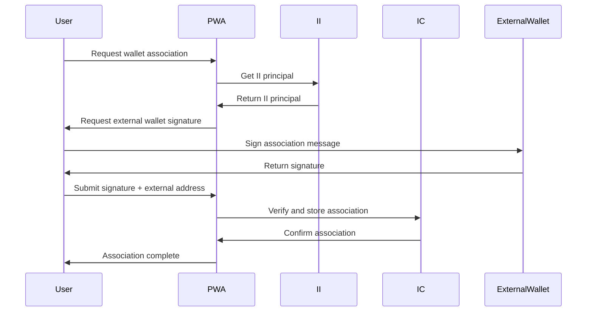
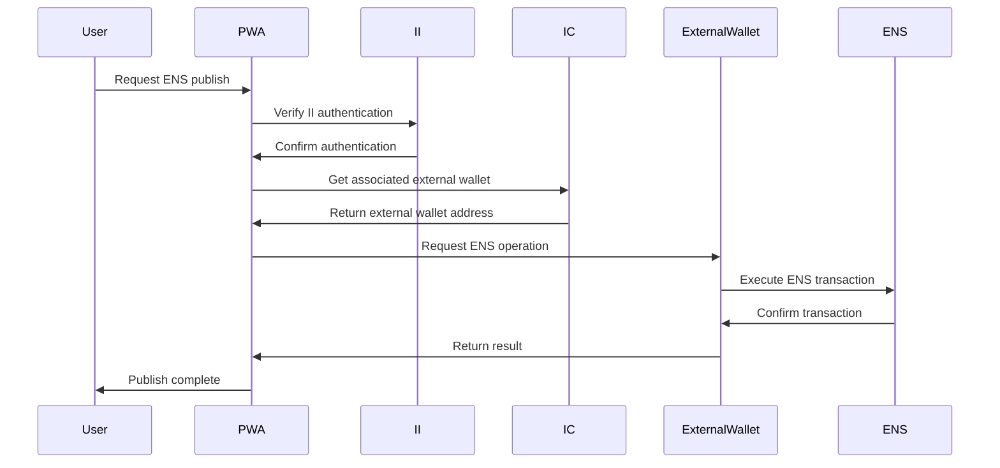

# Wallet Association Architecture

## Overview

The CPP platform needs to associate external Ethereum/Polygon wallet addresses with Internet Identity principals to enable ENS subdomain control and bundle holder functionality. This document outlines the architecture for secure wallet association.

**Note:** This architecture integrates with the [Identity Verification](identity-verification.md) flow and eliminates the need for custom IdP by leveraging Internet Identity Enterprise SSO.

## Problem Statement

### **Smart Contract Control**
- Smart contracts give ENS subdomain control to wallet holders
- Wallet addresses may be external (non-IC generated)
- Need to bridge II authentication with external wallet operations

### **User Experience Requirements**
- Seamless II authentication for mainstream users
- Support for existing external wallets
- Secure association without compromising user autonomy
- **No Custom IdP**: Leverage II Enterprise SSO instead
- **Flexible Onboarding**: Start with II or external wallet
- **NFT Transfer Restrictions**: Cannot transfer until digital assets phase

## Architecture Options

### **Option 1: IC Chain-Key Cryptography**

#### **Implementation**
```typescript
interface ChainKeyWallet {
  ii_principal: string;
  ethereum_address: string; // Generated by IC chain-key
  polygon_address: string;  // Generated by IC chain-key
  ens_control: boolean;     // IC controls ENS subdomain
  created_date: number;
}

// IC generates addresses on user's behalf
async function createChainKeyWallet(ii_principal: string): Promise<ChainKeyWallet> {
  const ethereum_address = await ic_generate_ethereum_address(ii_principal);
  const polygon_address = await ic_generate_polygon_address(ii_principal);
  
  return {
    ii_principal,
    ethereum_address,
    polygon_address,
    ens_control: true,
    created_date: Date.now()
  };
}
```

#### **Benefits**
- **Seamless Integration**: No external wallet needed
- **II Native**: Full integration with Internet Identity
- **Simplified UX**: Users don't need to manage external wallets
- **No Custom IdP**: Leverages II Enterprise SSO

#### **Challenges**
- **IC Dependency**: Vendor lock-in to IC ecosystem
- **Limited Portability**: Addresses tied to IC infrastructure
- **Complexity**: Chain-key cryptography implementation
- **NFT Transfer Restrictions**: Cannot transfer until digital assets phase

### **Option 2: External Wallet Association**

#### **Implementation**
```typescript
interface ExternalWalletAssociation {
  ii_principal: string;
  external_address: string; // User's existing wallet
  association_proof: string; // Cryptographic proof of ownership
  association_date: number;
  expiry_date?: number;     // Optional expiry
  ens_control: boolean;     // External wallet controls ENS
  status: 'active' | 'expired' | 'revoked';
}

// User proves ownership of external wallet
async function associateExternalWallet(
  ii_principal: string,
  external_address: string,
  signature: string,
  message: string
): Promise<ExternalWalletAssociation> {
  // Verify signature matches external address
  const isValidSignature = await verifySignature(
    external_address,
    signature,
    message
  );
  
  if (!isValidSignature) {
    throw new Error("Invalid signature for external wallet");
  }
  
  // Store association in IC
  const association: ExternalWalletAssociation = {
    ii_principal,
    external_address,
    association_proof: signature,
    association_date: Date.now(),
    ens_control: true,
    status: 'active'
  };
  
  await storeWalletAssociation(association);
  return association;
}
```

#### **Benefits**
- **User Autonomy**: Users control their own wallets
- **Existing Compatibility**: Works with existing wallet infrastructure
- **Portability**: Not tied to IC ecosystem
- **ENS Control**: Full control over ENS subdomains
- **Future Transferability**: Can transfer NFTs after digital assets phase

#### **Challenges**
- **Association Complexity**: Requires cryptographic proof
- **Security Considerations**: Managing external wallet connections
- **UX Complexity**: Users need to manage external wallets
- **NFT Transfer Restrictions**: Cannot transfer until digital assets phase

### **Option 3: Hybrid Approach**

#### **Implementation**
```typescript
interface HybridWallet {
  ii_principal: string;
  ic_managed_address: string; // IC-generated but external
  user_delegation: boolean;   // User delegates control to IC
  delegation_proof: string;   // Proof of user delegation
  ens_control: boolean;       // IC controls ENS via delegation
  created_date: number;
}

// IC generates external address but user delegates control
async function createHybridWallet(
  ii_principal: string,
  delegation_signature: string
): Promise<HybridWallet> {
  const ic_managed_address = await ic_generate_external_address(ii_principal);
  
  return {
    ii_principal,
    ic_managed_address,
    user_delegation: true,
    delegation_proof: delegation_signature,
    ens_control: true,
    created_date: Date.now()
  };
}
```

#### **Benefits**
- **Best of Both Worlds**: IC integration + external compatibility
- **User Choice**: Users can choose delegation level
- **Flexibility**: Supports multiple wallet strategies

#### **Challenges**
- **Complex Delegation**: Complex delegation mechanisms
- **Security Complexity**: Managing delegation relationships
- **Implementation Overhead**: More complex than single approach

## Recommended Approach: External Wallet Association

### **Rationale**
- **User Autonomy**: Respects user's existing wallet infrastructure
- **Standards Compliance**: Works with existing Web3 standards
- **Security**: Clear cryptographic proof of ownership
- **Flexibility**: Supports various wallet types and providers
- **No Custom IdP**: Eliminates need for custom IdP by using II Enterprise SSO

## Wallet Association Verification

### **Cryptographic Challenge-Response Verification**

Wallet association requires cryptographic proof of ownership through a challenge-response mechanism:

```typescript
// Wallet association verification interface
interface WalletAssociationVerification {
  challenge: string;
  signature: string;
  wallet_address: string;
  ii_principal: string;
  timestamp: number;
  nonce: string;
}

// Challenge generation and verification
class WalletAssociationVerificationManager {
  public async generateChallenge(
    ii_principal: string,
    wallet_address: string
  ): Promise<WalletAssociationChallenge> {
    const nonce = this.generateNonce();
    const timestamp = Date.now();
    
    // Create challenge message
    const challengeMessage = this.createChallengeMessage({
      ii_principal,
      wallet_address,
      nonce,
      timestamp,
      purpose: 'WALLET_ASSOCIATION'
    });
    
    return {
      challenge: challengeMessage,
      nonce,
      timestamp,
      wallet_address,
      ii_principal,
      expiry: timestamp + (5 * 60 * 1000) // 5 minutes
    };
  }

  public async verifyWalletOwnership(
    challenge: WalletAssociationChallenge,
    signature: string
  ): Promise<boolean> {
    try {
      // Verify challenge hasn't expired
      if (Date.now() > challenge.expiry) {
        throw new Error("Challenge has expired");
      }
      
      // Verify signature matches wallet address
      const isValidSignature = await this.verifySignature(
        challenge.wallet_address,
        challenge.challenge,
        signature
      );
      
      if (!isValidSignature) {
        return false;
      }
      
      // Verify nonce hasn't been used before
      const nonceUsed = await this.checkNonceUsage(challenge.nonce);
      if (nonceUsed) {
        throw new Error("Nonce already used");
      }
      
      // Mark nonce as used
      await this.markNonceAsUsed(challenge.nonce);
      
      return true;
    } catch (error) {
      console.error("Wallet ownership verification failed:", error);
      return false;
    }
  }

  private createChallengeMessage(params: {
    ii_principal: string;
    wallet_address: string;
    nonce: string;
    timestamp: number;
    purpose: string;
  }): string {
    return `Associate wallet ${params.wallet_address} with Internet Identity principal ${params.ii_principal} for ${params.purpose}.\n\nNonce: ${params.nonce}\nTimestamp: ${params.timestamp}\n\nBy signing this message, you confirm that you control this wallet address and authorize the association with your Internet Identity.`;
  }

  private async verifySignature(
    wallet_address: string,
    message: string,
    signature: string
  ): Promise<boolean> {
    try {
      // For Ethereum/Polygon addresses
      const messageHash = ethers.utils.hashMessage(message);
      const recoveredAddress = ethers.utils.recoverAddress(messageHash, signature);
      
      return recoveredAddress.toLowerCase() === wallet_address.toLowerCase();
    } catch (error) {
      console.error("Signature verification failed:", error);
      return false;
    }
  }

  private generateNonce(): string {
    return crypto.randomBytes(32).toString('hex');
  }

  private async checkNonceUsage(nonce: string): Promise<boolean> {
    // Check if nonce has been used before (prevent replay attacks)
    return await this.getFromIC(`nonce_${nonce}`) !== null;
  }

  private async markNonceAsUsed(nonce: string): Promise<void> {
    // Mark nonce as used with expiry
    await this.storeInIC(`nonce_${nonce}`, {
      used: true,
      timestamp: Date.now(),
      expiry: Date.now() + (24 * 60 * 60 * 1000) // 24 hours
    });
  }
}
```

### **Wallet Association Flow with Verification**

```typescript
// Complete wallet association flow with verification
class WalletAssociationFlowManager {
  public async initiateWalletAssociation(
    ii_principal: string,
    wallet_address: string
  ): Promise<WalletAssociationInitiation> {
    // Validate wallet address format
    if (!this.isValidWalletAddress(wallet_address)) {
      throw new Error("Invalid wallet address format");
    }
    
    // Check for existing associations
    const existing = await this.getWalletAssociation(ii_principal);
    if (existing && existing.external_address === wallet_address) {
      throw new Error("Wallet already associated with this II principal");
    }
    
    // Generate challenge
    const challenge = await this.verificationManager.generateChallenge(
      ii_principal,
      wallet_address
    );
    
    return {
      challenge: challenge.challenge,
      nonce: challenge.nonce,
      wallet_address,
      ii_principal,
      expiry: challenge.expiry
    };
  }

  public async completeWalletAssociation(
    ii_principal: string,
    wallet_address: string,
    signature: string,
    nonce: string
  ): Promise<WalletAssociationResult> {
    try {
      // Reconstruct challenge for verification
      const challenge = await this.verificationManager.generateChallenge(
        ii_principal,
        wallet_address
      );
      
      // Verify wallet ownership
      const isVerified = await this.verificationManager.verifyWalletOwnership(
        challenge,
        signature
      );
      
      if (!isVerified) {
        throw new Error("Wallet ownership verification failed");
      }
      
      // Store association
      const association = await this.storeWalletAssociation({
        ii_principal,
        external_address: wallet_address,
        association_proof: signature,
        association_date: Date.now(),
        ens_control: true,
        status: 'active'
      });
      
      return {
        success: true,
        association,
        message: "Wallet successfully associated"
      };
    } catch (error) {
      return {
        success: false,
        error: error.message,
        message: "Wallet association failed"
      };
    }
  }
}
```

### **Security Considerations**

```typescript
// Security measures for wallet association
interface WalletAssociationSecurity {
  challenge_expiry: '5_MINUTES';           // Short expiry to prevent replay
  nonce_uniqueness: 'ENFORCED';            // Prevent replay attacks
  signature_verification: 'CRYPTOGRAPHIC'; // Cryptographic proof required
  association_limit: 'ONE_PER_II';         // One external wallet per II principal
  audit_trail: 'COMPREHENSIVE';            // Track all association attempts
}

// Security implementation
class WalletAssociationSecurityManager {
  public async validateAssociationRequest(
    ii_principal: string,
    wallet_address: string
  ): Promise<ValidationResult> {
    const validations = [
      this.validateWalletAddress(wallet_address),
      this.validateIIPrincipal(ii_principal),
      this.checkAssociationLimit(ii_principal),
      this.checkRateLimit(ii_principal)
    ];
    
    const results = await Promise.all(validations);
    const failures = results.filter(r => !r.valid);
    
    return {
      valid: failures.length === 0,
      errors: failures.map(f => f.error)
    };
  }

  private async checkAssociationLimit(ii_principal: string): Promise<ValidationResult> {
    const existingAssociations = await this.getAssociationsForII(ii_principal);
    
    if (existingAssociations.length >= 1) {
      return {
        valid: false,
        error: "II principal already has an associated wallet"
      };
    }
    
    return { valid: true };
  }

  private async checkRateLimit(ii_principal: string): Promise<ValidationResult> {
    const recentAttempts = await this.getRecentAssociationAttempts(ii_principal);
    
    if (recentAttempts.length >= 5) {
      return {
        valid: false,
        error: "Too many association attempts. Please wait before trying again."
      };
    }
    
    return { valid: true };
  }
}
```

## Integration with Identity Verification

The wallet association process is integrated into the KYC flow (see [Identity Verification](identity-verification.md)):

**Note:** For users without existing DIDs, KYC results are stored temporarily until NFT issuance and DID creation. Wallet association occurs after DID creation.

```typescript
// Integration points with identity verification
interface IdentityVerificationIntegration {
  kyc_completion: 'TRIGGERS_WALLET_OPTIONS';     // KYC completion offers wallet options
  wallet_association: 'OPTIONAL_POST_KYC';       // Wallet association is optional after KYC
  ii_managed_fallback: 'AVAILABLE_IF_NO_EXTERNAL'; // II-managed wallet if no external
  nft_transfer_policy: 'RESTRICTED_UNTIL_DIGITAL_ASSETS'; // Transfer restrictions
}

// Flow integration
class IdentityWalletIntegration {
  public async handlePostKYCWalletOptions(
    userDID: string,
    ii_principal: string,
    kycCompleted: boolean
  ): Promise<WalletAssociationFlow> {
    if (!kycCompleted) {
      throw new Error("KYC must be completed before wallet association");
    }
    
    // Check if user has DID (required for wallet association)
    if (!userDID) {
      throw new Error("DID must be created before wallet association");
    }
    
    // Check existing association
    const existing = await this.getWalletAssociation(ii_principal);
    if (existing) {
      return { type: 'EXISTING', association: existing };
    }
    
    // Offer wallet association options
    return {
      type: 'OPTIONS',
      options: await this.getWalletOptions(),
      recommended: 'EXTERNAL_WALLET' // Recommend external for ENS control
    };
  }

  public async handleNFTIssuanceWalletCollection(
    sessionId: string,
    ii_principal: string
  ): Promise<WalletCollectionResult> {
    // For users without existing DIDs, collect wallet during NFT issuance
    return {
      type: 'COLLECT_WALLET_FOR_NFT',
      session_id: sessionId,
      message: "Please provide a wallet address for NFT issuance and DID creation"
    };
  }
}
```

## Implementation Architecture

### **Association Flow**


### **ENS Publishing Flow**


## Security Implementation

### **Association Verification**
```typescript
// Verify external wallet ownership
async function verifyWalletOwnership(
  ii_principal: string,
  external_address: string,
  signature: string,
  message: string
): Promise<boolean> {
  try {
    // Verify signature matches external address
    const isValidSignature = await verifySignature(
      external_address,
      signature,
      message
    );
    
    if (!isValidSignature) {
      return false;
    }
    
    // Check for existing associations
    const existing = await getWalletAssociation(ii_principal);
    if (existing && existing.external_address !== external_address) {
      throw new Error("II principal already associated with different wallet");
    }
    
    return true;
  } catch (error) {
    console.error("Wallet ownership verification failed:", error);
    return false;
  }
}

// Store association securely
async function storeWalletAssociation(association: ExternalWalletAssociation): Promise<void> {
  // Encrypt sensitive data before storage
  const encrypted_association = await encryptAssociation(association);
  
  // Store in IC with audit trail
  await storeInIC({
    key: association.ii_principal,
    value: encrypted_association,
    audit_trail: {
      action: 'wallet_association',
      timestamp: Date.now(),
      ii_principal: association.ii_principal
    }
  });
}
```

### **Association Management**
```typescript
// Revoke wallet association
async function revokeWalletAssociation(
  ii_principal: string,
  revocation_signature: string
): Promise<boolean> {
  const association = await getWalletAssociation(ii_principal);
  
  if (!association) {
    throw new Error("No wallet association found");
  }
  
  // Verify revocation signature from associated wallet
  const isValidRevocation = await verifySignature(
    association.external_address,
    revocation_signature,
    `Revoke association for II principal ${ii_principal}`
  );
  
  if (isValidRevocation) {
    await updateAssociationStatus(ii_principal, 'revoked');
    return true;
  }
  
  return false;
}

// Check association expiry
async function checkAssociationExpiry(ii_principal: string): Promise<boolean> {
  const association = await getWalletAssociation(ii_principal);
  
  if (!association) {
    return false;
  }
  
  if (association.expiry_date && Date.now() > association.expiry_date) {
    await updateAssociationStatus(ii_principal, 'expired');
    return false;
  }
  
  return association.status === 'active';
}
```

## PWA Integration

### **Wallet Association UI**
```typescript
// PWA component for wallet association
interface WalletAssociationProps {
  ii_principal: string;
  onAssociationComplete: (association: ExternalWalletAssociation) => void;
}

const WalletAssociation: React.FC<WalletAssociationProps> = ({
  ii_principal,
  onAssociationComplete
}) => {
  const [externalAddress, setExternalAddress] = useState('');
  const [isAssociating, setIsAssociating] = useState(false);
  
  const handleAssociation = async () => {
    setIsAssociating(true);
    
    try {
      // Request signature from user's wallet
      const message = `Associate wallet ${externalAddress} with II principal ${ii_principal}`;
      const signature = await requestWalletSignature(externalAddress, message);
      
      // Verify and store association
      const association = await associateExternalWallet(
        ii_principal,
        externalAddress,
        signature,
        message
      );
      
      onAssociationComplete(association);
    } catch (error) {
      console.error("Association failed:", error);
    } finally {
      setIsAssociating(false);
    }
  };
  
  return (
    <div>
      <input
        type="text"
        placeholder="Enter external wallet address"
        value={externalAddress}
        onChange={(e) => setExternalAddress(e.target.value)}
      />
      <button onClick={handleAssociation} disabled={isAssociating}>
        {isAssociating ? 'Associating...' : 'Associate Wallet'}
      </button>
    </div>
  );
};
```

### **ENS Publishing Integration**
```typescript
// PWA service for ENS operations
class ENSService {
  async publishContent(
    ii_principal: string,
    ens_subdomain: string,
    content_hash: string
  ): Promise<boolean> {
    try {
      // Verify II authentication
      const isAuthenticated = await verifyIIAuthentication(ii_principal);
      if (!isAuthenticated) {
        throw new Error("II authentication required");
      }
      
      // Get associated external wallet
      const association = await getWalletAssociation(ii_principal);
      if (!association || association.status !== 'active') {
        throw new Error("No active wallet association found");
      }
      
      // Publish via external wallet
      return await publishViaExternalWallet(
        association.external_address,
        ens_subdomain,
        content_hash
      );
    } catch (error) {
      console.error("ENS publishing failed:", error);
      return false;
    }
  }
}
```

## Implementation Timeline

### **Phase 1: Foundation**
1. Implement wallet association verification
2. Create secure storage for associations
3. Build basic PWA integration

### **Phase 2: ENS Integration**
1. Implement ENS publishing via external wallets
2. Create PWA bridge for ENS operations
3. Add association management UI

### **Phase 3: Advanced Features**
1. Add association expiry and renewal
2. Implement revocation mechanisms
3. Create audit trail and monitoring

### **Phase 4: Optimization**
1. Add caching for association lookups
2. Implement batch operations
3. Add performance monitoring

## Security Considerations

### **Association Security**
- **Cryptographic Proof**: Require valid signature for association
- **Unique Associations**: One external wallet per II principal
- **Revocation**: Allow users to revoke associations
- **Audit Trail**: Track all association operations

### **ENS Security**
- **Authentication**: Verify II authentication before ENS operations
- **Authorization**: Verify active wallet association
- **Transaction Signing**: Use associated external wallet for transactions
- **Error Handling**: Graceful handling of wallet connection issues

### **Data Protection**
- **Encryption**: Encrypt association data in IC storage
- **Access Control**: Limit access to association data
- **Privacy**: Minimize data collection and retention
- **Compliance**: Ensure GDPR compliance for association data

This architecture provides a secure and flexible way to associate external wallets with Internet Identity while maintaining user autonomy and enabling ENS subdomain control for bundle holders. 