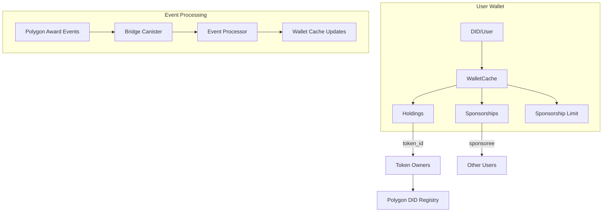

# Cool Planet Platform: Wallet Cache & Sponsorship Ledger

**Purpose:**  
To provide a scalable, query-efficient IC-native data structure for the CPP PWA to display:
- What NFTs/bundles a user holds (via donation or sponsorship)
- What a user has sponsored (to whom)
- What a user has left to sponsor (remaining sponsorship capacity)

---

## 1. Problem Context

- The NFT/bundle tree is extremely large (millions of nodes).
- The Polygon DID registry only contains sparse entries: who holds what, and who sponsored whom.
- The PWA must efficiently answer, for any user:
  - What do I own (and who sponsored me if applicable)?
  - Who did I sponsor, and what did they receive?
  - What is my remaining sponsorship capacity?

---

## 2. Requirements

- **Sparse Representation:** Only store actual holdings/sponsorships, not the full tree.
- **Efficient Queries:** Fast lookup by user (DID/wallet), both for holdings and sponsorships.
- **Sponsorship Chain:** Track both direct and indirect sponsorships (if needed).
- **Remaining Capacity:** Track how many more bundles a user can sponsor (if applicable).
- **Sync with Polygon:** Reflect on-chain state, but allow for IC-side caching/indexing for performance.

---

## 3. Data Structure Design

### A. Core Types

```motoko
type DID = Text;         // Decentralized Identifier (user)
type TokenId = Nat;      // NFT/Bundle ID

// What a user holds (directly)
type Holding = {
  token_id: TokenId,
  acquired_via: { #donation; #sponsorship: DID }, // How it was acquired
  timestamp: Nat64,
};

// What a user has sponsored
type Sponsorship = {
  sponsoree: DID,
  token_id: TokenId,
  timestamp: Nat64,
};

// User wallet cache entry
type WalletCache = {
  holdings: [Holding],         // All NFTs/bundles held
  sponsored: [Sponsorship],    // All sponsorships made
  sponsorship_limit: Nat,      // Max allowed to sponsor
  sponsorship_used: Nat,       // How many already sponsored
};
```

### B. IC Canister Storage

```motoko
// Main mapping: DID -> WalletCache
stable var wallet_cache: TrieMap<DID, WalletCache> = TrieMap();

// Reverse mapping: TokenId -> Owner DID (for quick lookup)
stable var token_owners: TrieMap<TokenId, DID> = TrieMap();

// Track last processed block for event sync
stable var last_processed_block: Nat = 0;
```

### C. Query Patterns

- **Get all holdings for a user:** `wallet_cache.get(user_did).holdings`
- **Get all sponsorships for a user:** `wallet_cache.get(user_did).sponsored`
- **Get remaining sponsorships:** `wallet_cache.get(user_did).sponsorship_limit - sponsorship_used`
- **Get owner of a token:** `token_owners.get(token_id)`

---

## 4. Sponsorship Flow

1. **Donation:**  
   - Add new `Holding` to user's `holdings`
   - Update `token_owners`

2. **Sponsorship:**  
   - Add new `Sponsorship` to sponsor's `sponsored`
   - Add new `Holding` to sponsoree's `holdings` (acquired_via = #sponsorship)
   - Increment sponsor's `sponsorship_used`
   - Update `token_owners`

---

## 5. IC vs. Graph Database

- **IC-native approach:**  
  - Pros: No external dependencies, atomic updates, privacy, on-chain consistency, can be extended for notifications.
  - Cons: No native graph traversal, but sponsorship chains are shallow and can be handled with indexed queries.

- **Graph DB (e.g., The Graph):**  
  - Pros: Powerful for deep, complex queries and analytics.
  - Cons: Extra infra, off-chain, privacy concerns, sync lag.

**Recommendation:**  
Use the IC-native structure for all real-time PWA queries and user dashboards. Optionally, export to a graph DB for analytics or deep history.

---

## 6. Example: User Dashboard Queries

- **"What do I own?"**  
  → List all `holdings` for the user's DID.

- **"Who have I sponsored?"**  
  → List all `sponsored` entries for the user's DID.

- **"What can I still sponsor?"**  
  → `sponsorship_limit - sponsorship_used`

- **"Who owns token X?"**  
  → `token_owners.get(token_id)`

---

## 7. Syncing with Polygon

### Event Processing Strategy

**Smart Contract Events from EinsteinNFT.sol:**
```solidity
// Main award event - covers both donations and sponsorships
event Award(
    address from,             // who initiated the award
    address to,               // recipient
    bytes32 did,              // awarded DID
    bytes32 indexed orgDid,   // org DID
    bytes32 adminDid,         // admin einstein DID
    uint256 indexed startIndex,
    uint256 indexed endIndex
);

// Additional events for contract state changes
event DigitalAssetPriceUpdated(uint256 newPrice);
event DonationConfigSet(PriceType priceType, uint256 amount, address priceFeed, string currencySymbol);
event ConvertedToDigitalAsset(address royaltyReceiver, uint256 royaltyBasisPoints);
```

**Event Processing Flow:**
```motoko
type PolygonEvent = {
  event_type: { #award; #digital_asset_price_updated; #donation_config_set; #converted_to_digital_asset },
  block_number: Nat,
  transaction_hash: Text,
  from_address: Text,
  to_address: Text,
  did: Text,
  org_did: ?Text,
  admin_did: ?Text,
  start_index: Nat,
  end_index: Nat,
  timestamp: Nat64,
};

// Process new events from Polygon
public shared({caller}) func processPolygonEvents(events: [PolygonEvent]) : async Bool {
  // Verify caller is authorized (e.g., bridge canister)
  if (not isAuthorized(caller)) return false;
  
  for (event in events.vals()) {
    switch (event.event_type) {
      case (#award) {
        await processAwardEvent(event);
      };
      case (#digital_asset_price_updated) {
        await processDigitalAssetPriceUpdated(event);
      };
      case (#donation_config_set) {
        await processDonationConfigSet(event);
      };
      case (#converted_to_digital_asset) {
        await processConvertedToDigitalAsset(event);
      };
    };
  };
  
  last_processed_block := events[events.size() - 1].block_number;
  true
};
```

**Processing Functions:**
```motoko
private func processAwardEvent(event: PolygonEvent) : async () {
  let from_did = await getDIDFromAddress(event.from_address);
  let to_did = await getDIDFromAddress(event.to_address);
  
  // Determine if this is a donation (from == owner) or sponsorship (from != owner)
  let is_donation = event.from_address == contract_owner;
  
  if (is_donation) {
    // Add to recipient's holdings as donation
    let to_cache = wallet_cache.get(to_did) ? {
      holdings = [],
      sponsored = [],
      sponsorship_limit = 0,
      sponsorship_used = 0,
    };
    let holding = {
      token_id = event.start_index, // Use start_index as token_id for einsteins
      acquired_via = #donation,
      timestamp = event.timestamp,
    };
    to_cache.holdings := Array.append(to_cache.holdings, [holding]);
    wallet_cache.put(to_did, to_cache);
    
    // Update token ownership
    token_owners.put(event.start_index, to_did);
  } else {
    // This is a sponsorship - add to sponsor's sponsored list
    let from_cache = wallet_cache.get(from_did) ? {
      holdings = [],
      sponsored = [],
      sponsorship_limit = 0,
      sponsorship_used = 0,
    };
    let sponsorship = {
      sponsoree = to_did,
      token_id = event.start_index,
      timestamp = event.timestamp,
    };
    from_cache.sponsored := Array.append(from_cache.sponsored, [sponsorship]);
    from_cache.sponsorship_used := from_cache.sponsorship_used + 1;
    wallet_cache.put(from_did, from_cache);
    
    // Add to sponsoree's holdings as sponsorship
    let to_cache = wallet_cache.get(to_did) ? {
      holdings = [],
      sponsored = [],
      sponsorship_limit = 0,
      sponsorship_used = 0,
    };
    let holding = {
      token_id = event.start_index,
      acquired_via = #sponsorship(from_did),
      timestamp = event.timestamp,
    };
    to_cache.holdings := Array.append(to_cache.holdings, [holding]);
    wallet_cache.put(to_did, to_cache);
    
    // Update token ownership
    token_owners.put(event.start_index, to_did);
  }
  
  // Handle org DID if present
  if (event.org_did != null) {
    // Store org relationship in separate mapping if needed
    // org_did -> [member_dids]
  }
};
```

### Bridge Canister Architecture

**Polygon Event Listener:**
- Monitor `EinsteinNFT.sol` contract events via web3 provider
- Focus on `Award` events which capture all NFT/bundle awards and sponsorships
- Batch events and send to IC for processing
- Handle reorgs and ensure event ordering
- Retry failed event processing

**Event Processing Guarantees:**
- **Idempotency:** Same event processed multiple times = same result
- **Ordering:** Events processed in block order
- **Consistency:** IC cache always reflects Polygon state
- **Recovery:** Can replay events from any block number

**Key Insight:** The `Award` event is comprehensive and covers both:
- **Donations:** When `from` address is the contract owner
- **Sponsorships:** When `from` address is a user (sponsor)

This single event type eliminates the need to track separate mint/transfer events and provides all the information needed to maintain the wallet cache.

---

## 8. Extensibility

- Add fields for bundle metadata, sponsorship messages, etc.
- Add hooks for notifications (e.g., "You received a sponsorship!").
- Support for multi-chain (Polygon, ICP-native) by extending `Holding` and `TokenId` types.

---

## 9. Security & Privacy

- Only expose sponsorship/holding data to the user or with explicit consent.
- Use canister access controls for sensitive queries.

---

## 10. Diagram



---

## 11. Sponsorship UX Pattern Tracking

### **Sponsorship Pattern Analysis**

The wallet cache tracks sponsorship patterns to optimize UX and enable advanced features:

```motoko
// Sponsorship pattern tracking
type SponsorshipPattern = {
  #direct_selection;    // User selected specific NFT
  #number_based;        // User sponsored by number/range
};

type SponsorshipRecord = {
  sponsoree: DID,
  token_id: TokenId,
  pattern: SponsorshipPattern,
  timestamp: Nat64,
};

// Track sponsorship patterns for UX optimization
stable var sponsorship_patterns: TrieMap<TokenId, SponsorshipPattern> = TrieMap();
```

### **Sequential vs. Ad-hoc Sponsorship Tracking**

The system tracks whether sponsorships are sequential or ad-hoc to determine UX pattern availability:

```motoko
// Sequential sponsorship tracking
type SequentialSponsorshipStatus = {
  user_did: DID,
  is_sequential: Bool,
  last_sponsored_token: ?TokenId,
  sponsorship_count: Nat,
};

// Track sequential sponsorship status
stable var sequential_sponsorship_status: TrieMap<DID, SequentialSponsorshipStatus> = TrieMap();

// Check if user can use number-based sponsorship
public shared({caller}) func canUseNumberBasedSponsorship(user_did: DID) : async Bool {
  let status = sequential_sponsorship_status.get(user_did);
  switch (status) {
    case (?existing_status) {
      // User has existing sponsorships - check if they're sequential
      return existing_status.is_sequential;
    };
    case (null) {
      // New user - can use number-based sponsorship
      return true;
    };
  };
};

// Update sponsorship pattern tracking
private func updateSponsorshipPattern(
  sponsor_did: DID,
  token_id: TokenId,
  pattern: SponsorshipPattern
) : () {
  // Record the pattern for this token
  sponsorship_patterns.put(token_id, pattern);
  
  // Update sequential sponsorship status
  let current_status = sequential_sponsorship_status.get(sponsor_did);
  switch (current_status) {
    case (?status) {
      let is_sequential = switch (status.last_sponsored_token) {
        case (?last_token) {
          // Check if this token follows sequentially
          token_id == last_token + 1;
        };
        case (null) {
          // First sponsorship - always sequential
          true;
        };
      };
      
      let new_status: SequentialSponsorshipStatus = {
        user_did = sponsor_did,
        is_sequential = is_sequential and status.is_sequential,
        last_sponsored_token = ?token_id,
        sponsorship_count = status.sponsorship_count + 1,
      };
      
      sequential_sponsorship_status.put(sponsor_did, new_status);
    };
    case (null) {
      // First sponsorship for this user
      let new_status: SequentialSponsorshipStatus = {
        user_did = sponsor_did,
        is_sequential = true,
        last_sponsored_token = ?token_id,
        sponsorship_count = 1,
      };
      
      sequential_sponsorship_status.put(sponsor_did, new_status);
    };
  };
};
```

### **Phased Implementation Strategy**

The sponsorship UX follows a phased approach to balance simplicity with advanced features:

#### **Phase 1: Direct Sub-Bundle Selection (Initial Implementation)**
- **Pattern**: Direct selection of specific NFTs/sub-bundles
- **Implementation**: Simple, straightforward UX
- **Smart Contract**: Uses existing `sponsor()` function
- **Advantages**: 
  - Simple to implement
  - No complex allocation logic
  - Works with existing smart contract
  - Clear user intent

#### **Phase 2: Number-Based Sponsorship (Future Enhancement)**
- **Pattern**: Sponsoring by number/range (e.g., "Sponsor 5 NFTs")
- **Implementation**: Complex allocation logic
- **Smart Contract**: Requires adaptation of `award()` logic
- **Advantages**:
  - More efficient for large sponsorships
  - Better UX for bulk operations
  - Aligns with initial award patterns

#### **Key Implementation Details**

```motoko
// Sequential sponsorship enforcement
public shared({caller}) func enforceSequentialSponsorship(
  user_did: DID,
  requested_range: {start: TokenId, end: TokenId}
) : async Bool {
  let status = sequential_sponsorship_status.get(user_did);
  switch (status) {
    case (?existing_status) {
      if (not existing_status.is_sequential) {
        return false; // Cannot use number-based sponsorship
      };
      
      // Check if requested range is sequential with last sponsorship
      switch (existing_status.last_sponsored_token) {
        case (?last_token) {
          return requested_range.start == last_token + 1;
        };
        case (null) {
          return true; // First sponsorship
        };
      };
    };
    case (null) {
      return true; // New user can use sequential sponsorship
    };
  };
};

// Ad-hoc sponsorship warning system
public shared({caller}) func warnAdhocSponsorship(user_did: DID) : async Text {
  let status = sequential_sponsorship_status.get(user_did);
  switch (status) {
    case (?existing_status) {
      if (existing_status.is_sequential and existing_status.sponsorship_count > 5) {
        return "Warning: Ad-hoc sponsorship will preclude future number-based sponsorship options. Consider sequential sponsorship for better UX.";
      };
    };
    case (null) {
      return ""; // No warning for new users
    };
  };
  return "";
};
```

---

**See also:**  
- [frontend-architecture.md](./frontend-architecture.md) for how this cache is used in the PWA
- [portfolio-dashboard.md](./portfolio-dashboard.md) for wallet cache integration and sponsorship management
- [security.md](./security.md) for access control and privacy
- [platform-comparison.md](./platform-comparison.md) for IC vs. external graph DB tradeoffs 