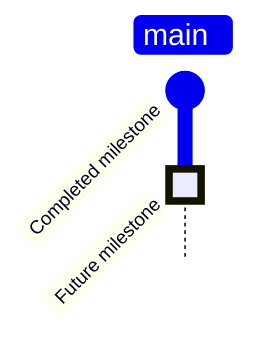

# Project Timeline

Below is a diagram of Project milestones (called commits in the source code).  These are in (anticipated) chronological order and organised into lanes for the different FTI entities and projects.  Note that none of the streams are expected to end, but the depiction only extends to the last milestone we define in the graph.

## GitGraph Convention
Our project timeline uses the following conventions in the Mermaid GitGraph:
- Regular commits represent completed work items
- Commits marked with `type: HIGHLIGHT` represent planned future work
- Tags (e.g., "2024") represent significant milestone dates

The timeline below shows both historical achievements and planned future work, with highlighted items indicating our upcoming focus areas.

TODO: Rename main branch to FTI (current graph limitation)

## Current Focus Areas
We are currently focused on two major phases:

### NFT Implementation
Highlighted items in the NFT branch represent our immediate technical priorities:
- Scaling our Digital Assets generation system
- Smart Contract scalability improvements
- Digital Assets artwork finalization
- Testing deployment at small scale
- Development of navigation/award SDK
- Full-scale NFT deployment (2.9M NFTs)
- Integration with Venly wallet system
- Automated onboarding workflows

### Platform Integration
Highlighted items across CPF, CPP, and NFT branches show our integration priorities:
- SSO implementation with Okta
- Automated donor onboarding
- MightyNetworks platform integration
- Marketing campaign deployment

See [TESTING.md](./TESTING.md) for detailed testing requirements and implementation plans for these focus areas.

